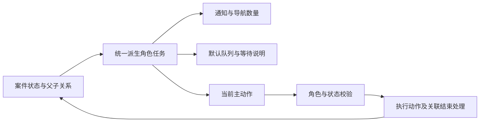

# MVP-P0 v0.2.0 PM 复评与下一轮修改清单

2026-09-13｜评估对象：已发布 `v0.2.0-mvp-p0`｜代码提交 `7bd90b26ab9ac0053c3dd95e472bdd45b9a4b5e9`｜PRD V1.3。

**状态更新（2026-09-13）：N01—N04 已在 v0.2.2 修复，N05/N06 已在 v0.2.1 修复。本报告保留 v0.2.0 的历史复现依据；现行规则以 PRD V1.7 为准。** 上一轮 R01—R16 的实施与 38 项通过记录见 [v0.2.0 验收](版本迭代与验收-v0.2.0.md)。新发现是扩展组合路径与界面恢复检查的结果，不能以已有回归通过推导所有组合均无漏洞。

## 1. 判断与方法

三角色、七模块和 16 指标 / 10 类规则的 MVP 范围合理。复核、逐项处置、整改补样、申诉改判、规则资源发布与报表已具备可演示的核心链路。下一轮无需再删申诉整改、资源或报表，也没有证据支持下放主管最终职责。

仍有两类断点：业务对象结束与附属任务清理没有完全统一；待办、详情和表单恢复各自派生状态，少数条件下出现“有待办却不能做”“存了草稿却读不回”“列表换页而操作对象未换”。建议围绕这两类问题做小范围收敛。

采用 pm-skills 的 intended-vs-implemented 与 strategy-red-team：先对照现行 PRD，再读执行分支，最后以可重复操作验证。本轮按高保真原型要求评价功能和操作责任，不把本地状态、角色切换器或预设模型视为生产缺陷。

本轮证据：

- 发布目录类型检查、lint、38 项业务回归、MVP 验证和生产构建通过；5001 已启动该构建，新上下文首屏未捕获 pageerror / console error。此范围不等于整站全过程零错误。
- 发布后新增 3 个独立内存业务复现场景，3 个均确认存在问题。另通过浏览器实际操作确认 N03—N06。没有改写用户原浏览器上下文；使用单独临时上下文。
- [业务复现 JSON](评估证据/v0.2.0/postrelease-audit.json)、[可重跑脚本](评估证据/v0.2.0/postrelease-audit.mjs)、[浏览器操作结果](评估证据/v0.2.0/postrelease-ui.json)。脚本断言的是本标签问题存在，属于历史诊断证据，不能纳入“修复通过”测试。
- 浏览器测试中一次定位使用了显示文字“材料说明”，而实际可访问名称为“处理说明”；另一次匹配隐藏页面，修正定位后继续。本报告不把自动化定位失败误列为业务缺陷。

## 2. 修改清单

优先级代表下一轮原型迭代顺序。共 **6 项：1 项 P0、3 项 P1、2 项 P2**。

| 编号 | 优先级 | 已确认的问题 | 建议修改 | 完成验收 |
| --- | --- | --- | --- | --- |
| N01 | P0 | 申诉改判终止整改，未完成整改补件仍显示待办，坐席提交报“整改已结束” | 统一整改终止操作，同步结束失效补件、撤销待办、记录原因 | 补样中发起申诉，误报/证据不足改判后，无残留可操作补件；历史仍可看 |
| N02 | P1 | 申诉核查补证等待坐席时，主管核查待办仍存在，进入却无可办动作 | 核查待办同时判断父申诉阶段；待补与待核对分别归坐席和主管 | 主管发补证后无虚假核查待办；坐席回件后仅出现实际接收入口 |
| N03 | P1 | 通话中提醒进入坐席通知，却被默认列表排除 | 在坐席当前模块内纳入实时提醒，类型与结果分层；数量共用数据集 | 通话中收到提醒后，通知、入口角标、默认队列一致，可读与反馈 |
| N04 | P1 | 验收草稿写入状态后，重新保存或提交表单仍为空 | 验收保存/提交共用表单，从当前轮次/标准的草稿恢复内容 | 保存、关闭、刷新、再开或提交都能恢复；标准变化时保留旧草稿并提示核对 |
| N05 | P2 | 选择第 1 页记录后翻到第 2 页，详情和动作仍对应第 1 页记录，无选中行 | 普通翻页同步选择本页首条并更新 URL；关联跳转返回单独保留上下文 | 下一页/上一页/改每页条数后，选中行、详情编号、动作目标一致；原返回场景不退化 |
| N06 | P2 | 通话开始日期晚于结束日期仍显示普通空结果，并可导出空 CSV | 与报表复用日期区间校验；错误字段就近提示，暂不执行查询/导出 | 反向日期显示明确错误，改正后恢复查询；真正零结果仍使用空状态 |

## 3. 逐项依据与最小改法

### N01：终止整改要同时结束失效补件

已修复于 v0.2.2，见 [本轮验收](生命周期迭代与验收-v0.2.2.md)。下文保留原诊断与建议，不作为仍未实现的声明。

**意图**：PRD §7.10 / D02 的误报或证据不足改判须终止旧整改并保留历史；V1.3 要求等待他人不计个人任务。终止后的旧任务不应继续向坐席要材料。

**复现**：WO-1039 确认并创建需 2 通样例的整改 → 坐席先提交 1 通 → 质检员选择样例不足形成待补件 → 坐席对来源结论申诉 → 主管受理并改判误报。整改已是 `terminated`，补件仍是 `pending`，坐席待办中仍有该整改且显示回复动作，提交报“整改已结束”。N01 JSON 可重现，不是材料不足的正常阻断。

**代码依据**：[申诉终止分支](../../lib/workflow.ts#L1267) 只改整改状态，没有结束以整改为 target 的补件；[个人待办](../../lib/workflow.ts#L1766) 先命中子补件就返回 true；[回复校验](../../lib/workflow.ts#L1330) 又拒绝终止整改。普通补证改判已有清理分支，但申诉裁定没有复用，形成路径差异。

**改法**：提取一个共享的整改终止动作，接收原因、来源结论及时间，同时处理暂停历史、未完成补件和版本号。补件标记“随整改终止”，保留原要求/回复和执行记录，不伪装成已正常验收。待办计算先排除终止父任务；历史补件只读。

**回归范围**：待回复与已回复待接收两种补件 × 误报与证据不足两种裁定；均不能残留可操作待办。维持裁定须继续原补件，不应误清理。

### N02：申诉补证期间的核查不是主管待办

已修复于 v0.2.2，见 [本轮验收](生命周期迭代与验收-v0.2.2.md)。下文保留原诊断与建议，不作为仍未实现的声明。

**意图**：PRD V1.3“申诉核查补证由本人坐席执行，先回主管，再回原质检员”，同时“等待他人不计个人任务”。

**复现**：AP-1033 受理并分派 Q02 → Q02 申请补证 → 主管在核查单下发补证。此时父申诉 `supplement`，子补件 target 为 AP-1033；原核查单仍是 supervisor。主管 `isTodo(review)=true`，但 `actions(review)=[]`。

**代码依据**：[动作入口](../../lib/workflow.ts#L502) 检查父申诉待补阶段并返回空；[needsWork](../../lib/workflow.ts#L1766) 只查 target 为当前核查单的补件，没有查关联父申诉。两个派生规则未覆盖同一关系。

**改法**：从“当前阶段、当前执行人、父案件等待原因”统一派生角色任务。未回复时主管在进行中看到“等待坐席补证”，不计需我处理；回复后主管只有一个接收补件待办，接收后才恢复质检员核查待办。不要简单将 `actions.length > 0` 当待办条件，否则转派/延期等维护动作仍会制造待办。

### N03：坐席实时提醒需要稳定的任务入口

已修复于 v0.2.2，见 [本轮验收](生命周期迭代与验收-v0.2.2.md)。下文保留原诊断与建议，不作为仍未实现的声明。

**意图**：PRD §7.8 保留通话中提醒、已读与执行反馈；V1.3 以个人任务组织操作。

**复现**：主管对进行中的 F-1041 发送提醒，切换周敏。通知数据包含 F-1041，能通过通知打开处理；质检工单默认列表只含 3 条正式结论，实时提醒不在“待知悉/全部结果”中。提醒可经通知找到，但不能从常驻队列找到。见 [坐席页面截图](评估证据/v0.2.0/agent-reminder.png)。

**代码依据**：[坐席列表](../../components/workspace.tsx#L130) 仅取 `latest(f)` 存在的问题；[needsRead](../../lib/workflow.ts#L1763) 已将未读提醒计入通知，因此同一人两个入口口径不同。

**改法**：保持坐席现有三个导航入口，将“质检工单”的坐席文案收敛为“我的质检”；模块内显示“待我处理 / 全部”，用“通话提醒 / 质检结果”区分内容。未读提醒置顶；读后是否仍待反馈，按提醒执行阶段决定，不能仅用未读标识代替执行任务。正式结果仍保留知悉与申诉。此命名和组织方式属于文末 B01 待确认方案。

### N04：验收草稿保存了，但表单没有恢复

已修复于 v0.2.2，见 [本轮验收](生命周期迭代与验收-v0.2.2.md)。下文保留原诊断与建议，不作为仍未实现的声明。

**意图**：PRD §7.11 允许质检员保存验收草稿；用户保存后应能继续同轮工作。

**浏览器复现**：陈佳在 REC-1034 提交样例 → 赵宁保存“已核对第一段说明，待继续检查第二个样例” → 重新打开“保存验收草稿”和“提交验收意见”。两个输入框都为空，读取本地记录的 draft 却有原文。见 [截图](评估证据/v0.2.0/draft.png) 和浏览器 JSON。

**代码依据**：[表单默认值](../../components/action-form.tsx#L54) 将 note 初始化为空；isRemedy 只恢复目标、标准、样例要求和负责人，没有恢复 draft。该问题独立于已修好的“复核意见”草稿。

**改法**：同一个验收表单提供“保存草稿 / 提交意见”。草稿记录绑定整改轮次、标准版本与保存人，默认恢复；标准或轮次变化时将旧草稿标注为参考，保留输入并要求核对，不静默套用，也不直接清空。检验保存后刷新和标准变化两条路径。

### N05：翻页与当前操作对象要同步

已修复于 v0.2.1：翻页清除旧焦点并选择本页首条，详情与当前选择一致；通话详情返回保留筛选与页码。

**意图**：PRD V1.3 要求清楚的当前任务和关联跳转返回上下文。这里是新检查的普通翻页路径，不是上一轮已验证的“打开通话再返回第 2 页”。

**浏览器复现**：主管全部候选，第 1 页点击 F-1041，然后下一页。列表已换成 F-1040 等五条，右侧仍显示 F-1041，URL 仍带 F-1041，本页选中行数为 0。仍可操作上一页对象，会增加判断负担。见 [截图](评估证据/v0.2.0/pagination.png)。

**代码依据**：[selectedId](../../components/workspace.tsx#L170) 优先使用全量 all 中的 focus；[分页回调](../../components/workspace.tsx#L510) 只更新页码。不能以“详情编号仍显示”视为整个列表上下文一致。

**改法**：普通翻页选择新页首条，更新 focus、selection 和 URL；真正的“查看关联对象”走单独来源上下文，返回时恢复原页、原选中项、滚动和详情 Tab。两类跳转规则分开实现，但共用详情组件。文末 B02 列出取舍。

### N06：无效日期不能等同没有业务数据

已修复于 v0.2.1：倒置日期就近提示并禁用导出，提供交换日期动作；改正后恢复查询。

**浏览器复现**：通话记录输入开始 2026-09-20、结束 2026-09-01，页面无错误提示，显示“没有符合条件的记录”，导出按钮可用。见 [截图](评估证据/v0.2.0/dates.png)。

**代码依据**：[日期字段](../../components/workspace.tsx#L284) 无区间约束，筛选直接同时比较上下界；同项目 [报表](../../components/report-page.tsx#L84) 已有开始晚于结束的提示。这是同一产品的交互一致性问题，PRD 没有逐字定义错误文案，不将其夸大成统计逻辑错误。

**改法**：共用日期校验函数，字段下明确提示，暂不应用无效条件和导出；改正后更新结果。空日期仍允许不限范围，真零结果与输入错误使用不同反馈。

## 4. 流程和架构收敛建议

保留 Call → Finding → Review → ConclusionVersion，以及与结论关联的 Appeal、Remedy；补件仍是具体案件的子任务。问题不在需要增加更多实体或更多菜单，而在同一关系有多处判断。

建议新增两处共享逻辑：

1. **业务结束处理**：结论改判 → 更新对应整改 → 结束失效补件 → 同步通知/计时/历史。所有改变结论的入口调用相同逻辑（解决 N01）。
2. **角色任务派生**：同一函数返回当前执行人、等待原因、主动作、所属入口、是否计待办；导航、通知和列表共同使用（解决 N02、N03）。表单只负责输入与恢复，执行层继续保留独立校验。

| 角色 | 下一轮入口建议 | 当前核心责任保留 |
| --- | --- | --- |
| 主管 | 待分诊、待确认、待裁定/结案；等待补件归进行中 | 最终结论、申诉裁定、整改结案、规则资源发布 |
| 质检员 | 需我核查 / 需我验收，等待补件不计办理任务 | 证据意见、主动申请补证、材料验收 |
| 坐席 | 我的质检内提醒与结果；申诉整改内本人任务 | 提醒已读和反馈、结果知悉与申诉、整改与补件 |

规则资源的业务化差异、历史只读与精简报表方向继续沿用。下一轮不用增加流程审批层级、组织树或新角色。

## 5. 关键假设复核

按对核心链路的影响、已有反例和验证成本排序。没有真实用户发生频率，以下排序不声称统计概率。

| 假设及成立理由 | 失效条件 | 本轮证据 | 最小验证和停止条件 |
| --- | --- | --- | --- |
| 一个正式结论入口能保持后续关系一致 | 某裁定分支终止父任务却留下可操作子任务 | N01 | 遍历两种补件状态与两种终止裁定；出现任何残留待办则不接受这一轮结束处理 |
| 个人默认队列能减少查找 | 已有任务没有进入队列，或队列中没有可办动作 | N02、N03 | 逐角色交接一个完整案件，核对通知/角标/队列；任一交接漏项或重复待办即回改任务派生 |
| 保存及来源保留能支持中断后继续 | 草稿为空或列表位置改变但动作仍对应旧对象 | N04、N05 | 保存刷新、翻页、关联跳转返回各一次；任一路径丢失输入/对象不一致即不接受表单与导航改法 |
| 三角色并由主管最终确认足够简单 | 主管重复确认明显拖慢演示且没有决策价值 | 本轮没有真实用户操作时间或访谈证据，不能认定已失效 | 用一条含申诉和整改案例请评审者连续操作，记录每次需要重新判断之处；仅重复抄写则先合并输入，不自动下放角色权限 |

## 6. 待用户确认的建议方案

N01—N06 的功能修复已完成。B02 已在 v0.2.1 按普通翻页同步首条实现，B03 已在本轮按完整草稿恢复实现。B01 的模块改名仍未采纳，现行名称保持“质检工单”，模块内增加通话提醒分组；执行反馈仍为可选。

| 决策 | 推荐方案 | 替代与影响 |
| --- | --- | --- |
| B01 坐席提醒入口 | 在现有模块内使用“我的质检”，合并待办入口，以提醒/结果类型区分；不加第四个坐席导航 | 保留“质检工单”名称，仅增加提醒分组，改动更小但角色语言仍偏内部流程 |
| B02 翻页详情 | 翻页自动选当前页首条；关联对象查看与返回独立保存上下文 | 固定当前详情直到主动选新行，但必须突出“当前详情不在本页”，更适合并排比对，当前 MVP 没有此明确需求 |
| B03 验收草稿 | 保存/提交同表单，草稿绑定轮次和标准，变化时保留参考并提示核对 | 只恢复一段 note，修补更小，但无法清楚解释标准改变后草稿是否仍适用 |

仅 B01 模块改名仍可由用户后续决定，建议暂保留现名观察使用反馈。旧发布标签 v0.2.0-mvp-p0 保持不动。
