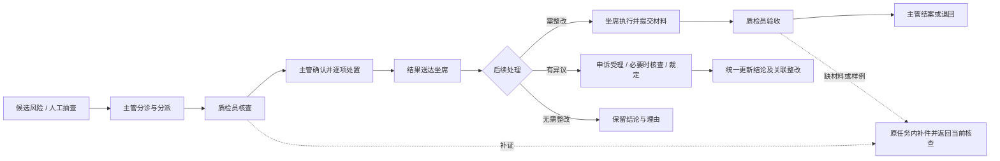

# MVP-P0 功能、逻辑与 UI 评估及修改清单

初评：2026-09-12｜最新复核：2026-09-13｜评估基线：`v0.1.0-mvp-p0` / `6f89f5a`｜对照文档：PRD V1.2。

状态：历史评估，R01—R16 已按用户授权在 v0.2.0 实施；C01—C03 采用推荐方案，详见 [本轮验收](版本迭代与验收-v0.2.0.md)。以下保留当时问题与判断。本报告不改变已经采纳的 D01—D05；需要新的产品取舍集中在最后。范围为高保真交互原型。

## 1. 结论与评估依据

现有三角色、七模块、16 项指标 / 10 类规则的收缩方向成立。主要问题是：底层对象已经分开，但页面没有充分按角色任务组织；少数异常路径尚未闭合；同一问题的结论、证据和后续处理之间仍有断点。

建议下一版围绕“默认进入自己的待办、同一问题连续处理、每个阶段一个明确主动作”改进。申诉与整改、业务资源、质量报表继续保留；七模块的数量本身不是当前主要障碍。

评估采用 pm-skills 的 intended-vs-implemented、strategy-red-team、test-scenarios 方法：以文档要求提出假设，以代码和操作取证，再给出最小改法与验收条件。这里将其用于产品流程与交互核对，不把模拟模型、本地存储或角色切换器列为生产缺陷。

本轮检查：

- 当前 PRD、三份 Mermaid 图源、实现与验收记录，以及来源快照中界面约束、指标分工和旧问题处理原则；历史完整版不作为新增 MVP 功能承诺。
- `app/page.tsx`、四个业务组件、共享 UI、workflow/store/reports 与样例及测试代码。
- 在 5001 原型实际查看主管、质检员、坐席入口，预警分派、复核、申诉受理表单和七模块界面；核对窄屏与 1440px 桌面布局。业务动作的异常复现使用独立内存样例，未改用户浏览器中的案件数据。
- 原有 **24 项工作流测试通过**。另外构造 **9 个边界场景，均复现了问题**。这两组结果不能合称“33 项验收通过”。

证据：[复现结果](评估证据/PM评估复现-20260912.json)、[复现脚本](评估证据/PM评估复现-20260912.mjs)。脚本用于重现此版本已知问题，断言的是问题存在，不能作为后续修复的通过门槛。

### 2026-09-13 当前版本复核

代码仍为 `6f89f5a`，本次重跑原有 24 项测试全部通过；在独立内存样例中再次复现 E01—E09，确认本清单的 16 项建议仍适用于当前版本。新复现结果保留了样例时钟与实际复核时间：[2026-09-13 复现记录](评估证据/PM评估复现-20260913.json)。本轮只更新评估文档和证据，不实施代码修改。

浏览器使用独立临时上下文走查三个角色、规则、报表与复核表单，未重置或改写用户现有演示数据。当前页面再次确认：质检员默认全部工单，主按钮为保存草稿；坐席导航有 3 条待知悉结果，但结果页“我的待办”为 0；申诉等待期间突出撤回操作；不相关规则显示静默阈值；概览为 12 张指标卡，申诉整改为 25 张卡。390px 抽查页面没有横向溢出，复核弹窗可用 Escape 关闭，这些已具备的行为应保留。

截图证据：[质检员入口](评估证据/20260913/inspector.png)、[坐席入口](评估证据/20260913/agent.png)、[复核表单](评估证据/20260913/review-form.png)、[申诉整改报表](评估证据/20260913/reports.png)。

为什么已有测试通过仍需修改：例如 [T06 测试](/Users/hpl/Desktop/语音B端产品/质检-mvp-p0/scripts/workflow.test.mjs:143) 检查了补件回复和失败退回，却没有验证“补足样例后验收通过”；E02 补查此路径才暴露 R01。因此后续修复应以完整业务结果作为验收条件，不能仅检查动作被允许或子任务变为已提交。

本次重点检验以下四个假设，顺序依据流程中断或错误判断的影响、当前版本已出现的反例、以及复现成本确定。样例复现不代表真实用户发生频率。

| 顺序 | 原设计假设及合理性 | 何时失效 | 本轮证据 | 最小修复验收 |
| --- | --- | --- | --- | --- |
| 1 | 通用补件能覆盖不同业务，减少重复功能 | 补件已回复，但原验收仍拿不到必需样例 | E02；R01 | 同轮次从 1/2 补至 2/2，能通过验收并交主管 |
| 2 | 独立申诉与补证均能支持纠错 | 一条路径改了结论，另一条路径无法退出，整改持续暂停 | E05；R03 | 申诉中新证据回当前案件；撤回、维持、改判均能完成关联更新 |
| 3 | 结论版本和操作日志足以追溯判断 | 主管实际选用的证据未存入该版结论 | E03；R04 | 新旧版本分别定位当时采用的证据 |
| 4 | 统一队列和通用按钮能简化三角色操作 | 用户看见不匹配的待办数量，或被突出引导保存/撤回而非完成当前工作 | 三角色浏览器走查；R10—R12 | 三角色从默认入口找到当前任务并完成下一步；角标与对应列表一致 |

以上验证支持“保留业务分工，收敛任务入口与操作面板”的方向。没有真实评审者操作数据，暂不判断主管最终确认是否造成实际瓶颈；该职责是否下放仍作为文末 C02 的产品选择。

## 2. 修改清单总览

P0/P1/P2 表示本次原型迭代顺序，不代表生产故障等级。共 **16 项：4 项 P0、10 项 P1、2 项 P2**。

| 编号 | 优先级 | 问题与影响 | 建议修改 | 证据性质 |
| --- | --- | --- | --- | --- |
| R01 | P0 | 整改缺样例时只能补文字，补不了新样例，无法继续验收 | 补件复用材料表单，追加样例并回到原验收轮次 | E02 已复现 |
| R02 | P0 | 可将补件分给看不到该通话的另一坐席，任务无人可办 | 只允许选择能执行该补件的人，保存时再次校验 | E01 已复现 |
| R03 | P0 | 申诉处理中可从问题补证入口改结论，使申诉和暂停整改卡住 | 同一问题只允许一条正式结论变更路径；申诉期间新证据回当前申诉 | E05 已复现 |
| R04 | P0 | 主管新选的证据未存入结论版本，页面仍高亮旧证据 | 每版结论保存独立证据快照，区分机器命中、复核意见和裁定依据 | E03 已复现 |
| R05 | P1 | 整改失败退回清空上一轮材料，历史不完整 | 按轮次保存材料、样例、标准与验收结果 | E04 已复现 |
| R06 | P1 | 退回时改期限会丢失已经发生的逾期 | 统一期限变更入口，先记旧期限与逾期，再写新期限 | E07 已复现 |
| R07 | P1 | 多问题不能分别决定整改；提示关联已有问题却没有入口 | 逐问题选择后续处置，增加已有问题关联 | 代码差异 + E06 |
| R08 | P1 | 通话未结束也能完成事后复核并送达正式结论 | 通话中可提醒、预分派和存草稿；结束后才正式提交与确认 | E09 已复现 |
| R09 | P1 | 质检员缺少补证申请，只能先提交意见再等主管处理 | 复核面板直接申请补证，主管协调，补齐回原任务 | UI + E08 |
| R10 | P1 | 默认全部列表、角标与我的待办口径不一致 | 角色默认待办；任务、待阅、等待他人分开计算 | 浏览器 + 代码 |
| R11 | P1 | 申诉、整改、补件及状态混在同一排 Tab，找任务困难 | 类型与处理状态分层；补件嵌入所属案件，保留个人待办提醒 | 浏览器 + PRD 差异 |
| R12 | P1 | 保存/撤回等被突出为主按钮，重复填说明，多次弹窗 | 按阶段指定主动作；合并编辑与提交表单，减少无意义确认 | 浏览器 + 代码 |
| R13 | P1 | 查看样例、关联案件和返回原队列需要反复寻找 | 同一问题共享详情，样例可点开，保留来源及返回上下文 | 浏览器 + 代码 |
| R14 | P2 | 通话记录缺少约定的日期、班组、坐席等查询条件 | 补齐常用筛选，低频条件折叠，查询条件可一键清除 | PRD 与界面差异 |
| R15 | P1 | 不相关参数、JSON 和不完整差异影响规则资源理解 | 按规则显示相关字段，用业务语言展示完整发布差异 | 浏览器 + 代码 |
| R16 | P2 | 报表 12/25 张指标卡平铺，不同时间口径混读 | 核心指标与状态明细分层，当前快照与期间结果分区 | 浏览器 + 代码 |

## 3. 逐项依据、改法与验收

### R01：补样例必须能补到原整改任务

**意图**：PRD §7.11 要求“补齐材料后回到本轮验收”。

**实际**：需要 2 通，先提交 1 通，质检员选择样例不足后，坐席只能生成样例或在补件里写文字；原整改处于待验收，没有提交材料动作。补件 `reply` 仅保存文本，新增样例编号不会写入整改材料。接收补件后仍因样例数不足无法通过。见 [workflow.ts:532](/Users/hpl/Desktop/语音B端产品/质检-mvp-p0/lib/workflow.ts:532)、[workflow.ts:1261](/Users/hpl/Desktop/语音B端产品/质检-mvp-p0/lib/workflow.ts:1261)、[workflow.ts:1366](/Users/hpl/Desktop/语音B端产品/质检-mvp-p0/lib/workflow.ts:1366)，E02。

**改法**：在该整改的“待补材料”区域直接显示说明、样例选择与附件；一次提交关联到原任务、原轮次并完成补件回复。质检员继续原轮次验收，主管不用接收整改补件。暂停时允许追加材料，保持暂停阶段。

**验收**：1/2 通 → 要求补样 → 坐席追加第 2 通 → 原任务显示 2/2 → 质检员可验收；不新建整改，不借助申诉或退回绕路。

### R02：可选执行人必须与任务可见范围一致

**意图**：PRD §7.2 规定坐席“仅本人通话”，补件执行人应能执行对应子任务。

**实际**：F-1041 属于周敏，却能分派陈佳补件；陈佳看不到补件，也无待办。人员选择包含所有人，保存只检查人存在。见 [action-form.tsx:286](/Users/hpl/Desktop/语音B端产品/质检-mvp-p0/components/action-form.tsx:286)、[workflow.ts:325](/Users/hpl/Desktop/语音B端产品/质检-mvp-p0/lib/workflow.ts:325)、[workflow.ts:851](/Users/hpl/Desktop/语音B端产品/质检-mvp-p0/lib/workflow.ts:851)，E01。

**改法**：默认本人坐席，其他可选项只包括有任务范围的质检员与主管。前端候选和动作校验共用一个可执行人员集合。不要为完成补件而开放另一坐席的通话。

**验收**：陈佳不出现在周敏通话的补件选择中；构造同类命令也被拒绝；合法执行人立即看到补件入口。

### R03：申诉和问题补证不能同时改同一结论

**意图**：PRD §7.10/§7.11 要求裁定保留历史并同步恢复或终止整改。

**实际**：AP-1033 未办结时，主管仍能在原问题“登记补证跟进 → 关闭候选”，生成 V2。申诉仍绑定 V1，此后撤回/受理/裁定报“结论版本已变化”，整改仍暂停。见 [workflow.ts:468](/Users/hpl/Desktop/语音B端产品/质检-mvp-p0/lib/workflow.ts:468)、[workflow.ts:932](/Users/hpl/Desktop/语音B端产品/质检-mvp-p0/lib/workflow.ts:932)、[workflow.ts:1151](/Users/hpl/Desktop/语音B端产品/质检-mvp-p0/lib/workflow.ts:1151)，E05。

**改法**：有效申诉期间，新证据进入当前申诉；原问题不允许另外送达新结论。统一由正式结论变更函数完成版本、申诉、整改、通知和统计更新。无申诉的普通补证也通过此入口处理后续关系。

**验收**：进行中申诉期间无法从其他页覆盖结论；补证、撤回、维持及改判后，关联任务均有合法出口，不遗留无从解除的暂停。

### R04：保存主管真正使用的证据

**意图**：PRD §7.9 要求改变质检意见须记录理由和证据，§7.4 要求逐项结论版本可追溯。

**实际**：主管改选第 4 段确认结论，页面仍高亮第 3 段；`Conclusion` 无证据字段，确认时只校验证据，不保存到新结论；原质检意见仍引用旧片段。关闭候选和申诉裁定也使用这类仅校验路径。见 [workflow.ts:73](/Users/hpl/Desktop/语音B端产品/质检-mvp-p0/lib/workflow.ts:73)、[workflow.ts:832](/Users/hpl/Desktop/语音B端产品/质检-mvp-p0/lib/workflow.ts:832)、[workflow.ts:1039](/Users/hpl/Desktop/语音B端产品/质检-mvp-p0/lib/workflow.ts:1039)、[workspace.tsx:1123](/Users/hpl/Desktop/语音B端产品/质检-mvp-p0/components/workspace.tsx:1123)，E03。

**改法**：每版结论保存判断、说明、证据片段和引用版本；保留原机器命中与质检员意见。详情默认展示当前正式结论依据，可切换原始命中和历史结论。

**验收**：主管选择与 AI 不同的证据后，详情和回听定位显示新证据；切回旧版仍显示旧证据；申诉能看见被申诉版本的真实依据。

### R05：整改按轮次保留材料

**意图**：PRD §7.2 要求历史“不能直接覆盖”，§7.11 要求保留每次补件和验收记录。

**实际**：失败退回时 `r.materials = []`；虽然验收意见有历史，上一轮材料和样例关联被清除。日志只保留操作文字，不能还原样例集合。见 [workflow.ts:1399](/Users/hpl/Desktop/语音B端产品/质检-mvp-p0/lib/workflow.ts:1399)、[workspace.tsx:753](/Users/hpl/Desktop/语音B端产品/质检-mvp-p0/components/workspace.tsx:753)，E04。

**改法**：使用轮次集合保存材料与验收，开启新轮次时新建空材料集合，历史只读折叠。验收默认核对当前轮次，旧样例若复用应明确标记。

**验收**：第 1 轮失败后，第 2 轮可重新提交，同时能展开查看第 1 轮材料、样例、失败依据和当时标准。

### R06：任何期限变更都保留原事实

**意图**：PRD §7.14 要求保留原期限、有效期限、每次调整和首次逾期。

**实际**：明确的“调整期限”会保留逾期；“退回复核”等路径直接覆盖期限，末尾再判断新期限，旧期限已经逾期的事实可能丢失。E07 在旧期限 1 分钟后退回，`firstOverdueAt` 仍为空。见 [workflow.ts:1030](/Users/hpl/Desktop/语音B端产品/质检-mvp-p0/lib/workflow.ts:1030)、[workflow.ts:1427](/Users/hpl/Desktop/语音B端产品/质检-mvp-p0/lib/workflow.ts:1427)、[workflow.ts:1655](/Users/hpl/Desktop/语音B端产品/质检-mvp-p0/lib/workflow.ts:1655)。

**改法**：各类退回、受理、转派、人工调整和暂停恢复统一记录变更前后的期限、原因与时间；先捕获旧期限逾期，再变更。界面明确显示北京时间，不混用裸 ISO 字符串。

**验收**：到期后退回或转派，即使新期限在未来，曾逾期仍保留；明细与 CSV 可还原每次变更。

### R07：一通多问题需要真正的逐项处置

**意图**：PRD §7.4/§7.6 要求同一事实一个问题编号、每个成立问题指定后续去向。

**实际**：表单只有一个 `remedy`、目标、标准、期限与负责人，应用于全部成立问题；不能 A 无需整改、B 下发整改。人工发现重名时提示“请关联已有问题”，但可用动作中没有关联入口。见 [action-form.tsx:481](/Users/hpl/Desktop/语音B端产品/质检-mvp-p0/components/action-form.tsx:481)、[workflow.ts:956](/Users/hpl/Desktop/语音B端产品/质检-mvp-p0/lib/workflow.ts:956)、[workflow.ts:1062](/Users/hpl/Desktop/语音B端产品/质检-mvp-p0/lib/workflow.ts:1062)，E06。

**改法**：每个问题独立指定结论与去向；提供“沿用上一项要求”减少输入。登记人工发现时先展示同通话已有问题，可关联或确认是新的事实；同标题校验只作提示，不承担事实去重的全部职责。

**验收**：一单两项成立，一项无需整改、一项下发，只产生 1 件整改；人工确认已有自动问题沿用同一问题 ID，人工补充来源不进入新的自动误报分母。

### R08：正式事后结论需要完整通话证据

**意图**：PRD §7.8 和主流程先结束、封存证据，再进入事后复核。

**实际**：F-1041 仍通话中时可转人工复核、提交意见并确认正式结论；无结束状态校验。见 [workflow.ts:459](/Users/hpl/Desktop/语音B端产品/质检-mvp-p0/lib/workflow.ts:459)、[workflow.ts:927](/Users/hpl/Desktop/语音B端产品/质检-mvp-p0/lib/workflow.ts:927)、[workflow.ts:984](/Users/hpl/Desktop/语音B端产品/质检-mvp-p0/lib/workflow.ts:984)，E09。

**改法**：通话中保留提醒、预分派和草稿；正式提交/确认前校验通话已结束。结束事件复用原分派与草稿，避免多一次主管操作。已经明确可关闭的候选仍按 PRD 允许误报/证据不足出口，不混成正式违规结论。

**验收**：未结束不送达正式成立结论、不下发人员整改；结束后同一任务可继续，且不重复建单。

### R09：质检员能直接说明缺什么证据

**意图**：PRD §7.9 要求材料不足时提出缺项、执行人、期限，由主管协调。

**实际**：WO-1038 的质检员只有保存草稿/提交意见。要进入补证，必须先给出意见等主管操作，容易将“尚需核查”误解为已经完成复核。见 [workflow.ts:500](/Users/hpl/Desktop/语音B端产品/质检-mvp-p0/lib/workflow.ts:500)，E08，浏览器已核对。

**改法**：复核面板增加“申请补证”，只填缺项与建议来源；保留草稿，主管在原工单确认执行人和期限，补齐回原质检员。申诉补件继续经主管，遵循现行决定。

**验收**：缺 IVR 记录时，质检员能直接申请，无须先提交最终判断；各阶段显示明确等待对象。

### R10：待办与默认入口统一

**意图**：PRD §7.1 指定主管待分诊、质检员我的待办、坐席我的待办。

**实际**：所有 Workspace 默认 `all`。周敏“质检工单”角标 3，但页内“我的待办 0”；角标计算待知悉结果，列表仅按主责任人过滤。主管预警页显示等待处理 7，预警导航角标 5，前者包含已转复核的问题，后者按复核工单计。暂停整改也可能成为坐席默认待办。见 [workspace.tsx:109](/Users/hpl/Desktop/语音B端产品/质检-mvp-p0/components/workspace.tsx:109)、[workspace.tsx:163](/Users/hpl/Desktop/语音B端产品/质检-mvp-p0/components/workspace.tsx:163)、[workflow.ts:1669](/Users/hpl/Desktop/语音B端产品/质检-mvp-p0/lib/workflow.ts:1669)。

**改法**：建立统一任务摘要，分别计算“需办理、待知悉、等待他人、暂停”。角色首次进入默认需办理队列；坐席结果用“待知悉/全部结果”，不套待复核/待主管/已办结空分类。角标、列表、通知按同一范围计数；优先逾期、紧急、临期，再按时间排序。

**验收**：点击角标看到同一组记录；无待办不默认突出撤回申诉；暂停记录仅在确实有补件动作时进入需办理队列。

### R11：将案件类型与状态拆成两层

**意图**：PRD §7.1 定义申诉、整改两个业务 Tab，各有待办/全部/已结束筛选。

**实际**：“全部事项、我的待办、申诉、整改、补件”在同一排，混合类型与状态。用户不能直接组合“我的 + 待补充申诉”。通用状态把整改待接收显示为待处理、补件已提交显示为待受理，容易误解。见 [workspace.tsx:139](/Users/hpl/Desktop/语音B端产品/质检-mvp-p0/components/workspace.tsx:139)、[workflow.ts:374](/Users/hpl/Desktop/语音B端产品/质检-mvp-p0/lib/workflow.ts:374)。

**改法**：一级为申诉/整改，二级为需我处理/进行中/已结束，类型专属状态作为筛选；补件作为所属案件的一段，个人待办可直接定位该段。展示“待我补充/待主管核对/待质检验收”等动作语言，暂停独立标记。

**验收**：任何补件都能看见原案、缺项和下一接收人；不会把补件提交误读为新申诉受理。案件不因收到补件而多算一件主业务案件。

### R12：把主要动作和填写负担降下来

**意图**：当前设计要求突出当前动作，并让证据与操作容易对照。

**实际**：主按钮按动作数组第一项决定，质检员突出保存草稿，坐席待主管受理时突出撤回申诉，主管整改面板可能突出修改标准。保存草稿和提交是两套弹窗；已有逐项判断依据，仍要求额外填写至少 4 字处理说明；确认知悉、接收整改也要打开弹窗。见 [workspace.tsx:984](/Users/hpl/Desktop/语音B端产品/质检-mvp-p0/components/workspace.tsx:984)、[action-form.tsx:174](/Users/hpl/Desktop/语音B端产品/质检-mvp-p0/components/action-form.tsx:174)、[action-form.tsx:805](/Users/hpl/Desktop/语音B端产品/质检-mvp-p0/components/action-form.tsx:805)。桌面首屏上方说明与统计占较多空间，实际转写和处理内容被向下挤。

**改法**：按对象阶段定义“提交复核/提交材料/提交验收/确认结案”等主动作；草稿为次要动作，撤回/转派/延期放更多。用一个可对照证据的处理面板承接保存与提交；逐项依据足够时不再强制重复说明，改判/退回等确需理由时保留。知悉/接收可直接操作。压缩页头宣传说明与重复统计，默认折叠技术版本。

**验收**：每个阶段一个主要业务动作；保存和提交共用当前输入；无多余说明字段；在桌面能同时看到关键证据与处理入口，窄屏动作可方便到达。

### R13：案件内连续处理并能回到原位置

**意图**：PRD §7.1 要求返回保留筛选、分页和选中项，§7.7 要求不同入口访问同一证据。

**实际**：队列点击通过对象类型重新选择模块；跳转使用 `replaceState`，浏览器返回无法逐步回到上一业务位置。整改材料中的样例只是文本 ID，用户需到通话记录手动搜索。关联事项按整通电话聚合，兄弟问题和本问题后续混在一起。见 [app/page.tsx:97](/Users/hpl/Desktop/语音B端产品/质检-mvp-p0/app/page.tsx:97)、[workspace.tsx:69](/Users/hpl/Desktop/语音B端产品/质检-mvp-p0/components/workspace.tsx:69)、[workspace.tsx:617](/Users/hpl/Desktop/语音B端产品/质检-mvp-p0/components/workspace.tsx:617)、[workspace.tsx:759](/Users/hpl/Desktop/语音B端产品/质检-mvp-p0/components/workspace.tsx:759)。

**改法**：保留各模块队列，在共享问题详情中切换证据、结论、申诉、整改和记录；区分“本问题关联”与“同通话其他问题”。样例链接打开对应新通话，可返回原验收；导航保存来源队列、条件、页码、选中项和阅读位置。

**验收**：从筛选后第 2 页进入案件 → 看申诉/样例 → 返回，仍是原位置；验收无需复制样例 ID；多问题不串证据。

### R14：通话查询补齐常用维度

**意图**：PRD §7.1/§7.7 约定日期、业务、班组、坐席、检测状态筛选。

**实际**：通话列表只有搜索与业务筛选，处理异常 Tab 只能覆盖一部分检测状态。搜索仅覆盖当前实体编号、标题、坐席名。见 [workspace.tsx:181](/Users/hpl/Desktop/语音B端产品/质检-mvp-p0/components/workspace.tsx:181)、[workspace.tsx:280](/Users/hpl/Desktop/语音B端产品/质检-mvp-p0/components/workspace.tsx:280)。

**改法**：常显日期、业务、坐席，班组与检测状态放展开筛选；搜索支持通话编号和问题/工单编号；显示生效条件与清除入口。不要为原型增加高级查询编排器。

**验收**：可查询某坐席指定日期的失败通话；零结果可清空条件；导出与当前筛选一致。

### R15：规则与资源按业务含义呈现

**意图**：D05 固定三类开放字段，PRD §7.12/§7.13 要求差异和影响可核对。

**实际**：隐私、关键词等规则和证据区域都显示静默阈值 15 秒；发布弹窗直接展示 RuleVersion JSON。资源差异主要比较 content，范围、适用角色、例外变化未完整对照；新资源的发布影响弹窗只查已生效引用，遗漏草稿中选择的引用规则。历史版本下仍展示维护当前版本的动作，操作对象不够明确。见 [workspace.tsx:1155](/Users/hpl/Desktop/语音B端产品/质检-mvp-p0/components/workspace.tsx:1155)、[strategy.tsx:257](/Users/hpl/Desktop/语音B端产品/质检-mvp-p0/components/strategy.tsx:257)、[strategy.tsx:309](/Users/hpl/Desktop/语音B端产品/质检-mvp-p0/components/strategy.tsx:309)、[action-form.tsx:771](/Users/hpl/Desktop/语音B端产品/质检-mvp-p0/components/action-form.tsx:771)。

**改法**：规则只呈现语义相关字段；发布比较改成“字段—原值—新值”，包括内容、范围、角色、例外、引用。草稿引用纳入影响清单；查看历史时只读，显式点击“编辑当前版本”进入维护。新增资源移到列表标题区，保存动作放入编辑器。

**验收**：隐私规则不出现静默参数；改例外也能看到差异；新资源选择的所有引用规则都出现在发布预览；历史查看不会被误认为编辑历史。

### R16：报表让主管快速看懂并追查

**实际**：概览 12 张卡，申诉整改视图 25 张卡同级平铺，含期间数量、当前积压、暂停和历史记录。已有文字区分时间口径，仍难扫描；部分下钻状态可能显示 `executing/supervisor/pending` 等代码，最早期限显示 ISO 文本。见 [report-page.tsx:33](/Users/hpl/Desktop/语音B端产品/质检-mvp-p0/components/report-page.tsx:33)、[report-page.tsx:176](/Users/hpl/Desktop/语音B端产品/质检-mvp-p0/components/report-page.tsx:176)、[report-page.tsx:352](/Users/hpl/Desktop/语音B端产品/质检-mvp-p0/components/report-page.tsx:352)、[reports.ts:234](/Users/hpl/Desktop/语音B端产品/质检-mvp-p0/lib/reports.ts:234)。

**改法**：概览先展示通话量、检测成功占比、确认问题、误报占比四项，执行状态用一条分布和明细表。申诉整改分“当前待处理”与“所选期间结果”，暂停/曾逾期作为其中标记，不同级相加。全部状态中文化，指标标注单位，保留分母、下钻和 CSV；无新数据不增加趋势、综合评分或排名。

**验收**：不展开可回答“现在积压多少、最急哪类、本期办结如何”；日期控件明确适用哪一区；展开后仍能核对所有既有统计。

## 4. 建议的角色操作与页面架构

| 角色 | 默认看到什么 | 核心操作 | 少做什么 |
| --- | --- | --- | --- |
| 主管 | 待分诊；工单待确认；申诉待受理/裁定；整改待结案/退回 | 分派、确认、裁定、调整与结案 | 重复阅读/填写同一意见、单独点接收材料再另开处理表单 |
| 质检员 | 我的复核、申诉核查、整改验收 | 对照证据提交意见，必要时申请补证 | 在多个模块寻找原结论、复制样例编号、先提交判断才能申请资料 |
| 坐席 | 待知悉结果、待执行整改、待我补件 | 理解要求、申诉、补材料、提交整改 | 看空的主管状态分类、进入等待案件却被突出引导撤回 |

推荐导航保留七模块，入口内收敛：

```text
质检作业
├─ 风险预警：待分诊 / 跟进中 / 已转复核 / 已关闭
├─ 质检工单：我的待办 / 进行中 / 已完成
│  └─ 主管优先待确认；质检员优先待复核；坐席呈现待知悉/全部结果
├─ 申诉与整改：申诉 / 整改
│  └─ 每类都有需我处理 / 进行中 / 已结束；补件内嵌原案
└─ 通话记录：查询、证据、关联问题
策略与资源
├─ 质检规则：10 类规则，16 项目录仍可查看
└─ 业务资源：词库 / 知识 / SOP
分析
└─ 质量报表：概览 / 问题分布 / 坐席班组 / 申诉整改
```

共享问题详情先回答四件事：发生了什么、现在结论是什么、等待谁做什么、相关申诉/整改进展。复核、申诉、整改依然是独立记录，统一详情仅组合它们，不另增一套案件状态。



申诉有效提交立即暂停关联整改；申诉补件先回主管，整改补件回验收质检员。这些现行差别应由系统处理，用户不用学习一套独立的补件系统。

代码按实际业务职责逐步整理即可：共享待办查询、统一结论变更、统一期限变更、轮次记录、按任务类型的处理面板。仍保留本地前端状态，不为此增加后端服务、审批平台或通用流程引擎。重构应跟随本轮问题修复，不单为减少文件行数重写整个项目。

## 5. 实施与验收顺序

1. **先闭合流程与记录**：R01—R09。将 9 个问题复现改为期望正确行为的测试，补充多问题分别处置、原版本证据回看、补证与申诉冲突场景。
2. **再收敛角色操作**：R10—R13。统一待办、状态与详情，合并重复表单；完成三个角色各一条实际主流程与两条异常路径。
3. **最后优化查询与策略报表**：R14—R16。保持既有指标分工和统计口径，补查询、发布差异和展示层次。

关键验收场景：

| 场景 | 角色/步骤 | 通过条件 |
| --- | --- | --- |
| 主线 | 主管分派 → 质检员复核 → 主管确认 → 坐席整改 → 质检员验收 → 主管结案 | 每步只有清楚的责任与下一动作，无额外孤立待办 |
| 补样 | 提交 1/2 通 → 样例不足 → 坐席补齐 → 验收 | 同任务同轮次变为 2/2，可正常继续 |
| 申诉冲突 | 申诉中提交新证据并尝试从原问题改结论 | 引导当前申诉；原版本不被其他入口覆盖 |
| 逐项处置 | 一通两项风险：A 无需整改、B 需整改 | 保留两项结论，只建 B 的整改 |
| 证据改判 | 主管选择与原复核不同的证据 | 新旧结论各自能定位正确片段 |
| 失败与逾期 | 第一轮失败，已逾期后退回 | 第一轮材料与首次逾期均可查 |
| 角色与返回 | 角标进入 → 处理/查样例 → 返回 | 数量对应，筛选、分页、选中项和阅读位置恢复 |

没有真实使用数据，不宣称效率提升百分比。可用三位代表角色的评审者各完成一个任务，观察是否理解待办、能否找到下一步、是否需重复输入；先记录实际表现，再决定是否继续缩减步骤。

## 6. 竞品参考与保留的合理设计

追一 See 官方说明包括人工补充检测点、会话分析和下钻追溯；可支持本项目保留人工判断与可追溯证据，不说明其采用与本项目相同的角色或流程。[追一 See 官方介绍](https://zhuiyi.ai/product/see)。

智齿 2020 年的官方申诉说明包含线上申诉、审核、重检、历史追溯，以及按企业情况选用一/二级流程；可参考其减少重复审批的思路。这是历史功能说明，不据此声称当前产品版本或银行必须采用某个审批制度。[智齿质检申诉官方说明](https://blog.sobot.com/article/764/view.html)。

本轮认为应保留：三角色分工；候选与正式结论分开；误报、证据不足与成立分开；无需整改出口；有效申诉暂停及裁定联动；按问题统计、按通话去重；历史规则资源版本；16/10 目录映射。这些设计已经合理，优化重点是让用户更少绕路。

## 7. 最后供用户确认的取舍

以下都是产品选择，不是已经批准的改动。建议优先采用各项推荐方案；R01—R09 的明确缺口不依赖这些范围选择。

| 决策 | 推荐方案 | 备选与代价 | 最小验证与改变建议的条件 |
| --- | --- | --- | --- |
| C01 导航是否继续收缩 | **保留七模块，合并问题详情，补件内嵌**；不新增第八个工作台 | 将风险预警与质检工单合为“质检处理”；少一个入口，但要重新解释实时提醒与事后任务关系 | 让主管找到待分诊、待确认两项任务；若在不同入口反复寻找，再考虑合并导航 |
| C02 主管是否仍确认每次最终结论和整改结案 | **保留已批准的最终确认职责，先消除重复输入和中间确认** | 低风险由质检员直接生效、主管仅异常介入；交接更少，但改变当前责任矩阵，需先定义哪些结论可直接生效 | 用混合风险样例走查主管确认；如果确认始终仅机械重复且业务方接受授权，再讨论分级放权，不先增加策略配置 |
| C03 申诉受理能否与下一动作合成一次提交 | **提供“受理并分派核查”“受理并直接裁定”**，仍记录受理与分派/裁定两个事件；保留补件/不受理 | 保持受理后再分派或裁定两个表单；阶段更显式，但主管重复操作 | 让主管处理一件资料充分、一件需核查、一件缺资料的申诉；若合并入口导致误选，则改成同面板两步引导 |

采纳后，在新迭代分支实施并同步更新 PRD、三份图源和验收记录；本次评估不覆盖或改写已发布的首版标签。
