# Moss Quality｜银行语音质检 · 6001 产品需求与研发交付

交付核对：2026-09-23｜PRD 6001-R5。本文定义当前目标需求，以 7.9 的 16 项指标表及通用策略字段为配置依据。本地原型用于交互演示，线上入口与固定提交用于核对已部署界面。真实鉴权、检测、存储及通知服务待联调；本次仅修订文档。

**当前资产入口**

[线上原型｜Moss Quality · 已部署演示入口](https://bank-voice-qc-6001.vercel.app/)

[GitHub｜银行语音质检 · 私有代码仓库](https://github.com/h-pl/bank-voice-qc-mvp-p0)

[GitHub｜已发布代码快照 · 8e5eced](https://github.com/h-pl/bank-voice-qc-mvp-p0/commit/8e5eced72343aa0e5e7dc239d35201d67759602d)

[目录参考｜MVP-P0-Compromise PRD · 仅参考组织结构](https://acnc6zeentra.feishu.cn/docx/S9zbdxp89oGfXYxKWkTc22QAnef)

[验收资料｜已发布快照对应记录 · 不代表本次需求验收](https://github.com/h-pl/bank-voice-qc-mvp-p0/blob/8e5eced72343aa0e5e7dc239d35201d67759602d/docs/reviews/6001迭代实施与验收-20260920.md)

设计资产：未提供与本次需求一致的独立 Figma 研发稿。保留的界面截图仅说明通用交互与报表呈现；策略配置及业务流程以本文章节为准。私有代码仓库需访问权限。

**阅读与研发导航**

[1 概要](https://acnc6zeentra.feishu.cn/docx/HfCadGmEroohoOx1qikcA2yAnfh#doxcnffRgv0r3U9VLx8zM30qKpd) · [2 协作分工](https://acnc6zeentra.feishu.cn/docx/HfCadGmEroohoOx1qikcA2yAnfh#doxcnzHtgyxt84QrovovIELHtqf) · [3 背景与交付范围](https://acnc6zeentra.feishu.cn/docx/HfCadGmEroohoOx1qikcA2yAnfh#doxcncaJAc7GSTosc7lISfzkuih) · [4 目标与验收结果](https://acnc6zeentra.feishu.cn/docx/HfCadGmEroohoOx1qikcA2yAnfh#doxcnfHRY3Ip4ey3BaXPwZlVA8c) · [5 使用者与任务](https://acnc6zeentra.feishu.cn/docx/HfCadGmEroohoOx1qikcA2yAnfh#doxcnJDnwsiR8FCriq0fA0luDre) · [6 用户价值](https://acnc6zeentra.feishu.cn/docx/HfCadGmEroohoOx1qikcA2yAnfh#doxcnAi8kJn6SOOuReArjJFGblf) · [7 需求、流程与研发契约](https://acnc6zeentra.feishu.cn/docx/HfCadGmEroohoOx1qikcA2yAnfh#doxcnPvvKMf1I2a0h6T1SpCK8kc) · [8 交付与上线](https://acnc6zeentra.feishu.cn/docx/HfCadGmEroohoOx1qikcA2yAnfh#doxcnvdx5nHhOQbNVfle4OCGNad)

研发直达：[页面地图与线上入口](https://acnc6zeentra.feishu.cn/docx/HfCadGmEroohoOx1qikcA2yAnfh#doxcnhfuLuGJOaAFLuBMXmAaind) · [本轮研发调整定位与功能清单](https://acnc6zeentra.feishu.cn/docx/HfCadGmEroohoOx1qikcA2yAnfh#doxcnjp4N4YUOlB5NDT5ubFmhGf) · [身份与权限](https://acnc6zeentra.feishu.cn/docx/HfCadGmEroohoOx1qikcA2yAnfh#doxcn9bEZbsLwAKUDDsKxjv5bli) · [共用 UI 与交互](https://acnc6zeentra.feishu.cn/docx/HfCadGmEroohoOx1qikcA2yAnfh#doxcn6Jrd35SOWbbmao4lblU2bc) · [接口与异常处理要求](https://acnc6zeentra.feishu.cn/docx/HfCadGmEroohoOx1qikcA2yAnfh#doxcnl5io6HIq8o41yBX5zIfmoe) · [验收场景](https://acnc6zeentra.feishu.cn/docx/HfCadGmEroohoOx1qikcA2yAnfh#doxcnGUnbl7uyCcTcPdQLIAU7yh) · [字段生命周期说明](https://acnc6zeentra.feishu.cn/docx/HfCadGmEroohoOx1qikcA2yAnfh#doxcngWexdsjU6R44gyS1lsbPTb)

研发按第 3 章功能编号进入第 7 章；测试以第 7 章末尾唯一验收表组织用例；集成负责人先核对第 8 章未接入能力。飞书原生目录由以下八章及子标题生成。

**更新日志**

| 版本 / 日期 | 已完成修订 | 影响范围 |
| --- | --- | --- |
| 6001-R5 / 2026-09-23 | 按八章结构清理冲突与冗余，补齐 7.9 分节编号；统一指标特有字段、通用策略和固定资源引用；修正导航、验收及实现差异；7.11.3 按流程事件整理生命周期字段角色矩阵，列明23个字段选项及系统、主管、质检员、坐席的赋值职责；明确误报归档状态、查询入口及申诉撤销的归档分流。 统一预警五页签顺序及误报归档术语，明确归档查询入口、通话汇总和问题独立生命周期。 修正人工抽检独立确认分支，补齐补派核验人及核验不满足后的整改状态流转，并收窄误报归档状态的定义。 | 全文文档修订；本次未修改或部署原型。 |

## 1. 概要

Moss Quality 面向银行呼入客服质检，将通话证据、风险候选、人工复核、主管结论、坐席申诉与整改串成可追溯闭环。核心对象是可核对的问题及其版本化结论，系统检测结果只作为候选，不直接替代人工裁定。

产品主线为检测与证据、预警分流、人工复核、主管确认、坐席申诉与整改。办理入口集中在复核工单等业务模块，待办通过模块计数和顶部通知呈现；策略与资源负责规则、预警条件及业务依据，质量报表负责分析。

**主流程** 命中规则 → 生成预警 → 主管初审 • 误报 → 记录原因 → 关闭归档 • 需要核实 → 质检员核查 → 主管确认 → 误报归档 / 非误报分发 • 无需核实 → 直接分发处理结果及要求 坐席查看结果 → 接受：进入整改 / 不接受：进入申诉 未命中规则 → 可人工抽检 → 未发现问题：主管确认后办结 / 发现问题：主管确认后分发

**整改流程** 坐席整改并提交资料 → 质检员核验 • 不满足要求 → 列明补充要求 → 退回坐席整改 • 满足要求 → 主管审核 → 通过：整改完成 / 不通过：退回质检员 质检员核对主管意见： • 不赞同 → 补充核验依据 → 交主管审核 • 赞同 → 补充整改要求 → 退回坐席 → 重新提交核验

**申诉流程** 坐席提交申诉 → 质检员核查并提交意见 → 主管确认 • 申诉成立 → 撤销原结论 → 归档 • 申诉不成立 → 进入整改 主管不认可核查意见 → 退回质检员 → 核对主管意见： • 不赞同 → 补充核查依据 → 交主管确认 • 赞同 → 按主管意见重新核查（必要时由坐席补充材料）→ 再交主管确认

## 2. 协作分工

| 参与方 | 责任与交付物 | 确认边界 |
| --- | --- | --- |
| 业务 / 合规代表（负责人待落实） | 确认检查依据、证据范围、申诉与整改规则、留存与访问要求。 | 正式业务口径、规则白名单、客户 SLA。 |
| 产品 / 设计（负责人待落实） | 维护 F01–F12、页面结构、状态文案和异常交互。 | 需求范围、交互验收与变更记录。 |
| 前端研发（负责人待落实） | 按页面契约实现状态、表单、焦点、筛选、图表和导出。 | 界面与返回路径；不把本地演示权限当服务端授权。 |
| 后端 / 集成（负责人待落实） | 建设鉴权、案件事务、版本快照、审计、音频与检测接口。 | 幂等、并发、持久化、组织隔离与恢复能力。 |
| 测试 / 数据（负责人待落实） | 按唯一验收表覆盖角色、生命周期、统计和历史版本。 | 自动化证据、联调结果和统计对账。 |

## 3. 背景与交付范围

银行质检需要在同一案件中核对原音、规则依据、人工结论和后续处理，并明确每一步责任。客户需要维护业务资源与可配置规则；共用预警条件集中维护，避免同一字段在多个页面重复定义。

### 3.1 页面地图与线上入口

应用使用根路径 / 与 query 参数，以下均为真实入口。id 定位对象，module 定位报表子模块；弹窗属于页面状态，没有另造独立路由。质量报表中的“申诉与整改”用于分析，质检作业中的同名页面用于办理。

| 页面 / 功能 | 实际路径与线上入口 | 角色 / 进入方式 | 当前状态 / 需求 |
| --- | --- | --- | --- |
| 复核工单 | [?view=workorders](https://bank-voice-qc-6001.vercel.app/?view=workorders) | 主管 / 质检员；坐席只读可见记录 | 已有演示；目标见 [7.5](https://acnc6zeentra.feishu.cn/docx/HfCadGmEroohoOx1qikcA2yAnfh#doxcn9J6CwQut0RANtZ18nQH6Nd) |
| 风险预警 | [?view=alerts](https://bank-voice-qc-6001.vercel.app/?view=alerts) | 主管管理范围 | 已有演示；目标见 [7.4](https://acnc6zeentra.feishu.cn/docx/HfCadGmEroohoOx1qikcA2yAnfh#doxcnftHiiCL4EqTCPPPrkt5h4n) |
| 申诉与整改 · 办理 | [?view=improvement](https://bank-voice-qc-6001.vercel.app/?view=improvement) | 主管、相关质检员、本人坐席 | 已有演示；目标见 [7.6](https://acnc6zeentra.feishu.cn/docx/HfCadGmEroohoOx1qikcA2yAnfh#doxcnsOOE3YJXXF0Ns9QWIj72kn) · [7.7](https://acnc6zeentra.feishu.cn/docx/HfCadGmEroohoOx1qikcA2yAnfh#doxcnsKkRwUhiYsyhtk8KUIvrrg) |
| 通话记录 | [?view=calls](https://bank-voice-qc-6001.vercel.app/?view=calls) | 按角色授权的通话 | 已有演示；目标见 [7.3](https://acnc6zeentra.feishu.cn/docx/HfCadGmEroohoOx1qikcA2yAnfh#doxcnWlUsgEymrzBs8XnTxzsHKd) |
| 通话详情示例 | [?view=calls&id=CALL-1040](https://bank-voice-qc-6001.vercel.app/?view=calls&id=CALL-1040) | 由列表或来源事项进入 | 已有演示；目标见 [7.3](https://acnc6zeentra.feishu.cn/docx/HfCadGmEroohoOx1qikcA2yAnfh#doxcnWlUsgEymrzBs8XnTxzsHKd) |
| 质检策略 | [?view=rules](https://bank-voice-qc-6001.vercel.app/?view=rules) | 主管维护策略，质检员只读；页内切换指标与预警策略 | 已有演示；目标见 [7.9](https://acnc6zeentra.feishu.cn/docx/HfCadGmEroohoOx1qikcA2yAnfh#doxcnAxBimhzDjO6c3OkEWfBkng) |
| 业务资源 | [?view=resources](https://bank-voice-qc-6001.vercel.app/?view=resources) | 主管维护，质检员查看 / 提意见 | 已有演示；目标见 [7.9](https://acnc6zeentra.feishu.cn/docx/HfCadGmEroohoOx1qikcA2yAnfh#doxcnAxBimhzDjO6c3OkEWfBkng) |
| 资源详情示例 | [?view=resources&id=RES-WORD](https://bank-voice-qc-6001.vercel.app/?view=resources&id=RES-WORD) | 列表或关联规则进入 | 已有演示；目标见 [7.9](https://acnc6zeentra.feishu.cn/docx/HfCadGmEroohoOx1qikcA2yAnfh#doxcnAxBimhzDjO6c3OkEWfBkng) |
| 质检概览 | [?view=reports&module=overview](https://bank-voice-qc-6001.vercel.app/?view=reports&module=overview) | 主管 | 已有演示；目标见 [7.10](https://acnc6zeentra.feishu.cn/docx/HfCadGmEroohoOx1qikcA2yAnfh#doxcn3xASP4E3LYZ0plnz1WFsMh) |
| 问题分布 | [?view=reports&module=issues](https://bank-voice-qc-6001.vercel.app/?view=reports&module=issues) | 主管 | 已有演示；目标见 [7.10](https://acnc6zeentra.feishu.cn/docx/HfCadGmEroohoOx1qikcA2yAnfh#doxcn3xASP4E3LYZ0plnz1WFsMh) |
| 坐席 / 班组 | [?view=reports&module=teams](https://bank-voice-qc-6001.vercel.app/?view=reports&module=teams) | 主管 | 已有演示；目标见 [7.10](https://acnc6zeentra.feishu.cn/docx/HfCadGmEroohoOx1qikcA2yAnfh#doxcn3xASP4E3LYZ0plnz1WFsMh) |
| 申诉与整改 · 报表 | [?view=reports&module=improvement](https://bank-voice-qc-6001.vercel.app/?view=reports&module=improvement) | 主管 | 已有演示；目标见 [7.10](https://acnc6zeentra.feishu.cn/docx/HfCadGmEroohoOx1qikcA2yAnfh#doxcn3xASP4E3LYZ0plnz1WFsMh) |

兼容入口 ?view=overview 跳转复核工单。四个报表子模块直接列在侧栏“质量报表”下，正文不再重复页签或大标题。

### 3.2 本轮研发调整定位与功能清单

**功能范围与优先级：**P0 为首期可验收的质检闭环；P1 为实时提醒与规则、资源维护增强；P2 为质量报表。F11 的质检概览、问题分布、坐席 / 班组、申诉与整改四个子模块，以及报表筛选、图表 callout、下钻和 CSV 导出全部列为 P2，不阻塞 P0 / P1 验收。业务办理中的申诉与整改 F06–F08 仍属于 P0。除质量报表 P2 为用户明确决定外，其余优先级与周次为建议方案。

本轮研发定位：业务流转按第 7.4–7.7 节三张流程图执行；策略与资源按第 7.9 节实现。现有本地页面与目标需求的差异集中列在第 8.2 节。建议周次面向真实服务建设和联调，不等同于已完成生产交付。

| 编号 | 功能名称 | 当前有效行为 | 优先级 / 建议排期 | 详细规则 | 验收 |
| --- | --- | --- | --- | --- | --- |
| F01 | [通话记录与证据](https://acnc6zeentra.feishu.cn/docx/HfCadGmEroohoOx1qikcA2yAnfh#doxcnWlUsgEymrzBs8XnTxzsHKd) | 通话筛选、详情、音频与转写预览、抽查入口 | P0 · W1–W2 | [7.3](https://acnc6zeentra.feishu.cn/docx/HfCadGmEroohoOx1qikcA2yAnfh#doxcnWlUsgEymrzBs8XnTxzsHKd) | [A02](https://acnc6zeentra.feishu.cn/docx/HfCadGmEroohoOx1qikcA2yAnfh#doxcnQVCl3K3592DI99ywh2f1lc) |
| F02 | [风险筛选与分流](https://acnc6zeentra.feishu.cn/docx/HfCadGmEroohoOx1qikcA2yAnfh#doxcnftHiiCL4EqTCPPPrkt5h4n) | 主管初审为误报归档、转人工核实或直接分发；不单设材料不足初审出口 | P0 · W2 | [7.4](https://acnc6zeentra.feishu.cn/docx/HfCadGmEroohoOx1qikcA2yAnfh#doxcnftHiiCL4EqTCPPPrkt5h4n) | [A03](https://acnc6zeentra.feishu.cn/docx/HfCadGmEroohoOx1qikcA2yAnfh#doxcnEBQjprouutfkHLWOA4kCPb) |
| F03 | [通话中提醒](https://acnc6zeentra.feishu.cn/docx/HfCadGmEroohoOx1qikcA2yAnfh#doxcnftHiiCL4EqTCPPPrkt5h4n) | 提醒反馈与人工确认分离 | P1 · W5–W6 | [7.4](https://acnc6zeentra.feishu.cn/docx/HfCadGmEroohoOx1qikcA2yAnfh#doxcnftHiiCL4EqTCPPPrkt5h4n) | [A03](https://acnc6zeentra.feishu.cn/docx/HfCadGmEroohoOx1qikcA2yAnfh#doxcnEBQjprouutfkHLWOA4kCPb) |
| F04 | [人工复核](https://acnc6zeentra.feishu.cn/docx/HfCadGmEroohoOx1qikcA2yAnfh#doxcn9J6CwQut0RANtZ18nQH6Nd) | 逐项意见、证据和明确检查范围 | P0 · W2–W3 | [7.5](https://acnc6zeentra.feishu.cn/docx/HfCadGmEroohoOx1qikcA2yAnfh#doxcn9J6CwQut0RANtZ18nQH6Nd) | [A04](https://acnc6zeentra.feishu.cn/docx/HfCadGmEroohoOx1qikcA2yAnfh#doxcnfMyY6W4hmPFXKZgTnIzt2f) |
| F05 | [主管确认](https://acnc6zeentra.feishu.cn/docx/HfCadGmEroohoOx1qikcA2yAnfh#doxcn9J6CwQut0RANtZ18nQH6Nd) | 主管确认复核结论，非误报分发给坐席；接受进入整改，不接受进入申诉 | P0 · W2–W3 | [7.5](https://acnc6zeentra.feishu.cn/docx/HfCadGmEroohoOx1qikcA2yAnfh#doxcn9J6CwQut0RANtZ18nQH6Nd) | [A05](https://acnc6zeentra.feishu.cn/docx/HfCadGmEroohoOx1qikcA2yAnfh#doxcn5cfMPRP9uKuZJTU6cdWo4f) |
| F06 | [申诉核查与裁定](https://acnc6zeentra.feishu.cn/docx/HfCadGmEroohoOx1qikcA2yAnfh#doxcnsOOE3YJXXF0Ns9QWIj72kn) | 申诉后指派核查，补证、主管审核与意见往返；成立撤销，不成立转整改 | P0 · W3–W4 | [7.6](https://acnc6zeentra.feishu.cn/docx/HfCadGmEroohoOx1qikcA2yAnfh#doxcnsOOE3YJXXF0Ns9QWIj72kn) | [A06](https://acnc6zeentra.feishu.cn/docx/HfCadGmEroohoOx1qikcA2yAnfh#doxcnclGQecMu7mRSmVc2jfefRc) |
| F07 | [整改执行与验收](https://acnc6zeentra.feishu.cn/docx/HfCadGmEroohoOx1qikcA2yAnfh#doxcnsKkRwUhiYsyhtk8KUIvrrg) | 坐席先整改并提交资料；核验前落实质检员，质检员核验、主管确认结案 | P0 · W3–W4 | [7.7](https://acnc6zeentra.feishu.cn/docx/HfCadGmEroohoOx1qikcA2yAnfh#doxcnsKkRwUhiYsyhtk8KUIvrrg) | [A07](https://acnc6zeentra.feishu.cn/docx/HfCadGmEroohoOx1qikcA2yAnfh#doxcnY27z0QhTDrUIvPA2r1kqzg) |
| F08 | [申诉与整改联动](https://acnc6zeentra.feishu.cn/docx/HfCadGmEroohoOx1qikcA2yAnfh#doxcnsKkRwUhiYsyhtk8KUIvrrg) | 坐席选择分流，申诉裁定后关闭或进入整改；结论及材料按版本留痕 | P0 · W3–W4 | [7.7](https://acnc6zeentra.feishu.cn/docx/HfCadGmEroohoOx1qikcA2yAnfh#doxcnsKkRwUhiYsyhtk8KUIvrrg) | [A08](https://acnc6zeentra.feishu.cn/docx/HfCadGmEroohoOx1qikcA2yAnfh#doxcnvOA49qAjhQ87sjQZvnwTGg) |
| F09 | [指标规则与预警策略](https://acnc6zeentra.feishu.cn/docx/HfCadGmEroohoOx1qikcA2yAnfh#doxcnAxBimhzDjO6c3OkEWfBkng) | 12 类指标目录、四类特征、通用预警条件及检查发布 | P1 · W5–W6 | [7.8 检测契约](https://acnc6zeentra.feishu.cn/docx/HfCadGmEroohoOx1qikcA2yAnfh#doxcnkDoBxAmJXGUHyl1nUCJsBb) · [7.9 配置](https://acnc6zeentra.feishu.cn/docx/HfCadGmEroohoOx1qikcA2yAnfh#doxcnAxBimhzDjO6c3OkEWfBkng) | [A09](https://acnc6zeentra.feishu.cn/docx/HfCadGmEroohoOx1qikcA2yAnfh#doxcnFhuSoeTB6H3pKiAQFiremb) |
| F10 | [业务资源与固定引用](https://acnc6zeentra.feishu.cn/docx/HfCadGmEroohoOx1qikcA2yAnfh#doxcnAxBimhzDjO6c3OkEWfBkng) | 业务资源按类型固定引用；发布后自动用于后续检测 | P1 · W5–W6 | [7.9](https://acnc6zeentra.feishu.cn/docx/HfCadGmEroohoOx1qikcA2yAnfh#doxcnAxBimhzDjO6c3OkEWfBkng) | [A10](https://acnc6zeentra.feishu.cn/docx/HfCadGmEroohoOx1qikcA2yAnfh#doxcnCVBfRuhtUxVTCE9CjKSfUc) |
| F11 | [质量报表四子模块](https://acnc6zeentra.feishu.cn/docx/HfCadGmEroohoOx1qikcA2yAnfh#doxcn3xASP4E3LYZ0plnz1WFsMh) | 统一筛选、常显 callout、同口径下钻与 CSV | P2 · W7–W8 | [7.10](https://acnc6zeentra.feishu.cn/docx/HfCadGmEroohoOx1qikcA2yAnfh#doxcn3xASP4E3LYZ0plnz1WFsMh) | [A11](https://acnc6zeentra.feishu.cn/docx/HfCadGmEroohoOx1qikcA2yAnfh#doxcnz8X7u5vfVMlYqKQ9jk582Q) · [A12](https://acnc6zeentra.feishu.cn/docx/HfCadGmEroohoOx1qikcA2yAnfh#doxcnBzAakMqpTRcuRRmv7DT1nf) |
| F12 | [通知与统一交互](https://acnc6zeentra.feishu.cn/docx/HfCadGmEroohoOx1qikcA2yAnfh#doxcn6Jrd35SOWbbmao4lblU2bc) | 责任路由、弹窗、权限、返回与异常保护 | P0 · W1–W4 | [7.2](https://acnc6zeentra.feishu.cn/docx/HfCadGmEroohoOx1qikcA2yAnfh#doxcn6Jrd35SOWbbmao4lblU2bc) · [7.11](https://acnc6zeentra.feishu.cn/docx/HfCadGmEroohoOx1qikcA2yAnfh#doxcn2jOJa7R6QLmC4g2wU5uiNd) | [A01](https://acnc6zeentra.feishu.cn/docx/HfCadGmEroohoOx1qikcA2yAnfh#doxcnEVV3RAWaeHE6DEHiuz8gpg) · [A13](https://acnc6zeentra.feishu.cn/docx/HfCadGmEroohoOx1qikcA2yAnfh#doxcnn6vB3nbMZEPkqWUIaHZQwc) · [A14](https://acnc6zeentra.feishu.cn/docx/HfCadGmEroohoOx1qikcA2yAnfh#doxcnSHTyRYrdkwWpaeEJDaiwJh) |

### 3.3 原型与生产的责任边界

| 层次 | 原型表达 / 实现边界 | 生产接入仍需完成 |
| --- | --- | --- |
| 前端交互 | 多角色演示、筛选分页、操作表单、状态流转、版本快照、报表与导出。 | 真实组织身份、端到端服务错误、跨设备一致性。 |
| 状态 / 权限 | 浏览器本地持久化；前端角色与责任校验；rev / requestId 演示冲突和幂等。 | 服务端授权、事务、数据库持久化、并发和审计存储。 |
| 检测 / 录音 | 预设检测与转写；带录音样例可回听，缺失录音有明确空态。 | CTI / 录音接入、ASR、声纹、模型检测、真实资源解析及任务调度。 |
| 发布与可用性 | 已有线上演示入口与固定代码快照，本次未部署。 | 银行部署环境、容灾、留存期限、容量、监控和生产验收。 |

## 4. 目标与验收结果

| 目标 | 衡量口径 | 当前状态 |
| --- | --- | --- |
| 办理责任清楚 | 每个阶段可查当前责任人、允许操作、证据与下一步；具体场景见 7.13。 | 有本地演示与既有回归记录；本次未重跑业务测试，生产联调待执行。 |
| 配置归属一致 | 四项特有特征随策略选择；通用条件集中维护；业务资源按类型固定引用。 | 以 7.9 两张表为准；实现差异见 8.2。 |
| 业务闭环可追溯 | 结论、补件、整改轮次及检测 / 策略 / 资源版本可回查；失败不得产生半完成业务结果。 | 原型记录可演示；服务端事务、并发和存储待联调。 |
| 统计可解释 | 对象、日期和分母明确；同一条件下页面、明细和导出可对账。 | 统计口径见 7.10；生产样本与质量门槛待确认。 |

具体场景与通过标准统一维护在 [7.13 验收场景](https://acnc6zeentra.feishu.cn/docx/HfCadGmEroohoOx1qikcA2yAnfh#doxcnGUnbl7uyCcTcPdQLIAU7yh)；执行时记录环境、版本、样本、结果与证据。模拟结果不能证明真实检测效果或生产服务通过。

## 5. 使用者与任务

| 使用者 | 任务触发与主线 | 可观察的完成结果 |
| --- | --- | --- |
| 质检主管 | 查看预警并初审；确认复核结果后分发，或直接提醒；仅对直接提醒且坐席直接接受整改的路径新增分配验收人；申诉分支按流程分派核查人；审核并最终结案。 | 误报归档或形成明确分发结果；待指派不阻塞坐席整改，核验前必须落实质检员。 |
| 质检员 | 核实问题、抽检通话、核查申诉或验收整改；核对主管退回意见，不赞同则补依据给主管，赞同则按对应流程重查或退回坐席。 | 意见提交到主管；复测意见绑定本轮标准，不能替主管最终裁定。 |
| 客服坐席 | 查看处理结果及要求；接受则整改、提交资料，不接受则提交申诉；未指派验收人时可先整改。 | 材料进入原案件；只访问本人授权范围，不取得主管处置权限。 |

## 6. 用户价值

主管在一个案件上下文中理解“事实、当前责任、下一步”，用报表定位需要处理的对象；质检员保留证据与检查范围，减少同一结论多处重复录入；坐席能够看到结论依据、申诉入口与具体整改标准。研发可从稳定功能编号定位流程、字段与验收，避免把页面样式当作业务规则。以上是预期价值，尚无实测收益数据。

## 7. 需求、流程与研发契约

### 7.1 身份与权限

演示身份由顶部选择器切换；生产身份应来自可信认证。界面隐藏入口仅改善体验，服务端必须对每次读写、导出、统计和附件访问重新验证角色、组织、对象归属与当前责任。

| 操作面 | 主管 | 质检员 | 坐席 |
| --- | --- | --- | --- |
| 风险 / 复核 / 申诉 | 管理范围内分流、确认、裁定与转派 | 本人分派任务及授权证据；提交意见 | 本人结论与可申诉版本；不能裁定 |
| 整改 | 明确处理要求、落实验收人、审核结案；不认可验收结果时退回质检员并说明原因。 | 核验材料；不满足则提出整改 / 补充要求；主管退回后区分补充说明给主管或退回坐席。 | 接受结果后即可整改并提交材料，无需等待验收人指派。 |
| 规则 / 资源 | 预警策略、资源维护与发布；固定引用自动生效 | 规则与资源只读，可提出依据建议 | 仅案件中必要引用，不提供独立管理导航 |
| 报表 / 导出 | 当前授权管理范围 | 仅本人允许的业务列表，不提供管理报表 | 本人范围；不得通过 URL 扩权 |

动作可用性同时受状态、责任人、结论版本与补件身份约束。详情中的有效办理按钮直接展示，不使用“更多操作”折叠；列表主操作、详情、表单提交共用同一可用性规则。转派必须选择另一位质检员；继任申诉核查人重新核查，不能替前任解释原结论。补件执行人只可提交对应材料，不因补件而取得正式意见权。整改核验人可访问本任务提交的样例，包括先交资料后补派及转派场景；材料预览、通话详情和处理侧栏使用相同权限边界。转派保留事件与原草稿，但原责任人不再能提交。越权或过期入口返回当前状态，不执行旧动作。

### 7.2 共用 UI 与交互

| 契约 | 当前有效行为与验收边界 |
| --- | --- |
| 页面层级 | 侧栏表示模块，顶部表示当前位置；正文从任务内容或筛选开始，不再复制同名大标题。统一字体、间距、状态色、按钮与边框；业务页可采用不同布局。 |
| 办理布局 | 复核和申诉整改使用队列—事项—责任 / 操作结构，三列顶部对齐；“专注办理”收起队列，上一项 / 下一项只在当前筛选集合内切换。 |
| 列表筛选 | 搜索编号、问题、坐席；业务和类型条件组合生效。修改筛选回第 1 页；无结果保留条件并提供重置；分页 5 / 10 / 20，越界自动回有效页。 |
| 计数范围 | 侧栏角标是模块全部业务待办，不随当前列表筛选变化；列表“共 N 条 / 逾期”只针对当前结果。两种计数不得混用。 |
| 返回与 URL | 详情仅保留一个明确的返回入口；从来源事项进入可返回来源。模块 / 对象 / 报表子模块可由 URL 定位；筛选与分页在同一会话页面切换中保留，不声称可通过链接共享筛选。 |
| 刷新与角色切换 | 演示业务状态本地持久化；刷新后的列表 / 报表筛选采用默认值；角色切换按权限进入复核工单，不继续展示上一身份受限内容。 |
| 弹窗 | 标题＋必要对象说明＋字段 / 内容＋底部动作；标题与操作区保留，长内容只在主体滚动。遮罩不误关；Esc 关闭，未保存编辑先提示继续或放弃；关闭后焦点回触发点，Tab 留在弹窗。 |
| 表单与反馈 | 字段显示名称、单位、默认值与约束；错误就近说明并保留输入；处理中防重复；取消不写入；成功必须同步列表、详情和关联状态。说明类操作最少 4 字，业务特殊字段按模块校验。 |
| 证据与材料 | 概览展示摘要、数量与结果，录音、转写、证据和完整材料通过统一弹窗查看。证据选择默认显示已选内容，可主动展开调整，避免一次铺开完整转写。 |
| 图表 | 折线图首次显示默认日期 callout，绘图区移动按最近日期平滑更新，离开不消失；环图显示默认分组 callout，悬停 / 聚焦切换。悬停不下钻，点击 / Enter 才打开同口径明细；曲线区域不出现横纵内部滚动条。 |
| 动效与可访问性 | 焦点可见；状态同时有文字，不能只靠颜色；图表键盘可操作；callout 使用过渡并响应 reduced-motion；动画完成后截图验收。 |

图 1｜统一操作弹窗：逐项结论、已选证据与固定提交区（线上实见；6001 · 8e5eced；2026-09-20；1600 × 1000；预设模拟数据）

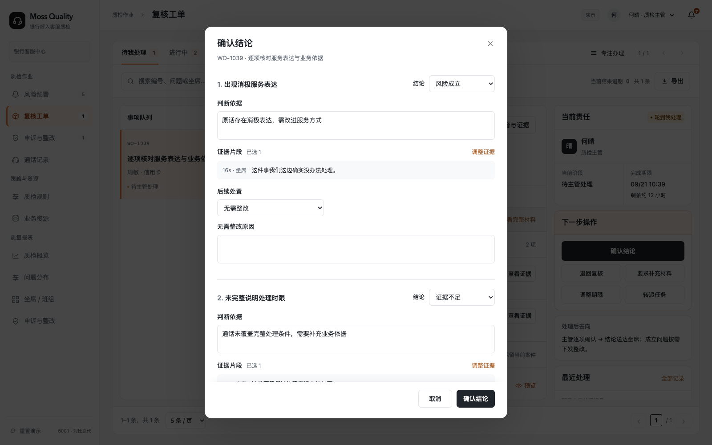

### 7.3 通话记录与证据（F01）

**通话与问题的关联：**通话记录一通一条；通话详情的“问题与处理记录”汇总该通话关联的自动预警、人工抽检发现问题及已归档问题。每个问题显示来源、当前状态、当前责任人及结果，点击进入对应问题详情，查看发现、初审、复核、分发、申诉、整改和归档的实际历史，以及各次操作人、时间、意见和证据。

一通通话可有多个问题，并分别流转和归档；一个问题误报归档不改变其他问题的状态。未发现问题的抽检保留抽检记录，不虚构问题。通话详情是汇总查询入口，风险预警、复核工单、申诉与整改是办理入口；各入口关联同一问题与处理记录，不复制独立档案，也不以单一通话状态概括所有问题的办理状态。

图 2｜通话记录：筛选、检测状态和列表入口（线上实见；6001 · 8e5eced；2026-09-20；1600 × 1000；预设模拟数据）

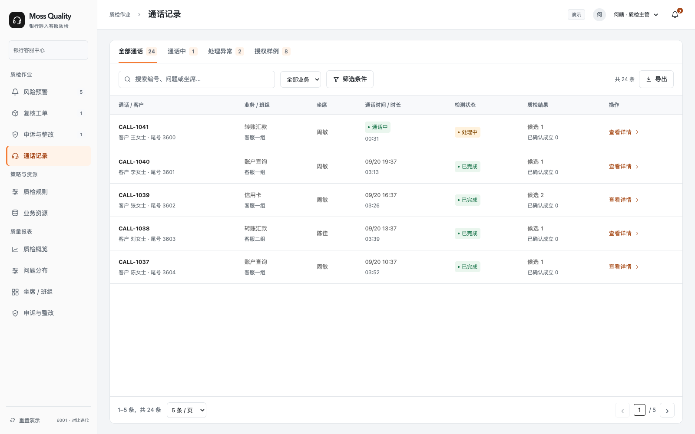

图 3｜通话详情：返回入口、概况与关联事项（线上实见；6001 · 8e5eced；2026-09-20；1600 × 1000；预设模拟数据）

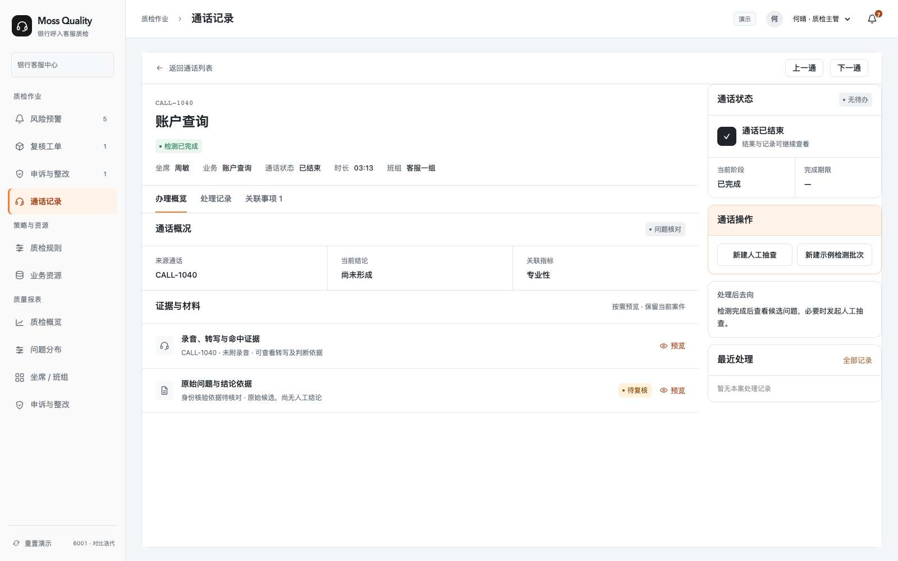

图 4｜证据预览：录音状态、转写与问题证据（线上实见；6001 · 8e5eced；2026-09-20；1600 × 1000；预设模拟数据）

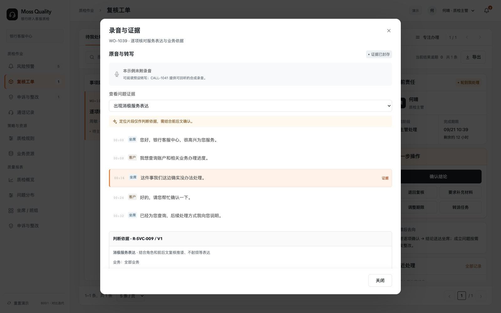

| 区域 / 动作 | 字段来源与默认行为 | 结果 / 异常 |
| --- | --- | --- |
| 列表 | Call 的编号、坐席、班组、业务、起止时间、时长和检测状态；只读授权集合。 | 过滤与分页组合；空结果可重置；点击通话进入真实对象。 |
| 触发规则 | 最新检测批次、当前角色可见的自动问题按 ruleId 去重，显示“X 条”；下方按 indicator 去重显示“涉及 Y 项指标”。列表与 CSV 使用同一口径。 | 同一规则多个问题只计一条；同一指标下不同规则分别计数。人工补录、旧批次不计；误报归档不删除历史触发事实。已完成且无命中显示 0；未完成且无结果显示“— / 待统计”，已有结果标“暂计”。触发数不等于已确认违规数。 |
| 检测状态 | 必需检查项归并为已完成、部分失败、失败、处理中、待处理，状态互斥。 | 部分失败不可当作完全完成；重检形成新批次，保留旧批次快照。 |
| 录音 / 转写 | Segment 时间、说话人、原话与命中证据；录音存在才提供回听。 | 定位证据对应片段；缺失录音时明示，转写仍可核对，不伪造音频成功。 |
| 转写纠错 | 保留原文、修正文本和原因。 | 修正可见并可追溯，不能覆盖原始证据来证明旧结论。 |
| 人工抽检 | 主管从通话列表“发起抽检”或详情发起，填写检查范围、质检员和期限。已结束且授权可见的通话可发起；同通话已有未结束抽检时禁止重复派单。 | 创建 type=spotcheck 的独立复核工单并跳转。无发现：质检员提交范围核验说明，主管确认完成；有发现：登记人工问题、提交依据，主管确认后统一分发。未发现问题不创建误报记录。 |
| 未命中规则 / 人工抽检筛选 | 未命中规则按最新批次已完成且无自动命中问题筛选；人工抽检按已有抽检工单关联筛选。 | 显示筛选数量、每通通话的抽检次数；检测失败、处理中不算未命中。授权样例仍为演示样例。 |

### 7.4 风险预警与提醒（F02、F03）

**预警页签、归档与查询入口**

| 入口 / 操作 | 交互与展示规则 |
| --- | --- |
| 进入风险预警 | 左侧导航“质检作业 → 风险预警”；页签从左到右固定为：待处理｜核实中｜已分发｜误报归档｜全部预警。 |
| 页签筛选 | 待处理：待主管初审；核实中：已转质检员核实、尚未形成确认结果；已分发：非误报处理结果已发给坐席；误报归档：已确认误报的历史记录；全部预警：授权范围内全部预警，包含归档记录。 |
| 确认误报并归档 | 主管直接确认误报、复核后主管确认误报，或申诉成立且确认原自动预警为误报时，将原预警归入误报归档。归档后提示“已归档，可在『误报归档』中查看”，提供“查看归档”快捷入口。 |
| 查看归档 | 风险预警 → 误报归档 → 点击预警编号或“查看详情”。保留原预警编号、原通话及证据、误报原因、核查和裁定记录、确认人和时间、检测与规则/策略版本。支持按预警编号、坐席/班组、业务、指标及归档时间检索。 |
| 查看完整处理过程 | 预警详情中的“处理记录”展示该问题实际经过的全部环节；已分发问题的后续申诉与整改也在同一条关联链中查看。详情提供“关联通话”，返回通话详情；通话详情也可进入同一问题详情。 |
| 归档后操作 | 可查询详情、回听已有录音证据、记录规则优化反馈。归档结束该预警处理并保留记录，不删除数据；不在归档记录上继续原待处理动作。优化反馈不阻塞归档，不自动修改或发布规则。 |
| 人工问题的申诉撤销 | 人工抽检问题经申诉撤销，保留在原问题、抽检和申诉记录，并在通话详情汇总查看；没有对应自动预警时，不新增预警，也不放入误报归档页签。 |
| 预警日志归属 | 预警记录独立保留，风险预警页承载当前与历史记录，详情承载处理日志；不新增独立“预警日志”导航模块，不将历史记录仅转存到通话记录。 |

主管核对命中规则、原话和上下文后初审：确认误报则记录原因并归档并纳入规则优化反馈；需进一步核实则创建复核工单；无需进一步核实则直接分发处理结果及要求。材料不足属于核实中需要补充具体依据的情况，不单列为预警初审出口。直接分发与复核确认后的非误报结果汇合，坐席接受进入整改，不接受进入申诉。规则优化反馈不作为误报归档的前置条件，规则修改仍需验证发布。

| 触发 / 操作 | 前置与输入 | 结果与边界 |
| --- | --- | --- |
| 误报归档 | 主管有依据判定误报，记录原因及证据。 | 关闭归档但不删除；“误报归档”可按编号、问题、坐席及业务检索。记录确认原因、原话片段、来源、规则及版本、批次、确认人、核实人和时间。误报与材料不足严格区分。 |
| 直接提醒 / 分发 | 主管已有充分依据，无需质检员进一步核实；明确处理结果、整改要求、期限及资料要求。 | 坐席接受则进入整改，不接受则进入申诉；此时不强制预先指派质检员。 |
| 转人工核实 | 指定质检员、核实事项和期限。 | 质检员提交误报或非误报意见及依据；主管确认后决定关闭或统一分发。 |
| 分支后指派 | 仅主管直接提醒且坐席直接接受整改时生成主管新增指派待办；其他整改来源沿用系统在复核、人工抽检或申诉核查中记录的质检员。提交申诉时按申诉流程分派核查人及期限。 | 验收人指派可与坐席整改并行，核验前必须落实；申诉核查人与整改验收人按任务分别明确。 |
| 通话中实时提醒 | 由已发布策略触发且通话仍在进行，需实时检测与投递能力。 | 按策略发送并留存投递状态；已读不等于接受正式处理结果，后续人工分流按本节执行。 |
| 转派 / 调整期限 | 主管填写原因，校验对象仍未完成。 | 保留原值、新值、操作者和时间；通知与幂等控制沿用共用契约。 |
| 规则优化反馈 | 仅自动来源的误报提供“记录规则优化反馈”：待评估 / 已记录优化建议 / 无需调整，并填写理由。 | 反馈留在档案及处理记录中；误报归档不等待规则调整，反馈也不直接改动或发布规则。 |
| 已分发与误报分离 | 预警页签固定从左至右为：待处理｜核实中｜已分发｜误报归档｜全部预警。待处理对应待主管初审的预警；全部预警包含前四类及已归档记录。 | 已分发的非误报不得混入误报归档；历史误报依据最新正式结论读取。 |

#### 7.4.1 风险预警办理时限（产品默认值）

2026-09-23 补充：风险预警设置“首次初审”和“预警处置”两个独立截止时间。以下为可配置的产品默认值，用于需求、开发及验收，不代表银行已批准的制度 SLA。期限表示最迟完成时间，应尽快处理，不要求等待到期。

| 风险等级 | 首次初审最迟完成 | 预警处置最迟完成 |
| --- | --- | --- |
| 高风险 | 触发后 5 分钟内 | 触发后 2 小时内 |
| 中风险 | 触发后 30 分钟内 | 触发后 8 小时内 |
| 低风险 | 触发后 2 小时内 | 触发后 24 小时内 |

**起算点与适用范围：**由服务端首次判定当前有效策略满足预警条件的时间 alertTriggeredAt 起算；预警入库或通知失败不得延后起算。证据中的风险发生时间另行记录，用于衡量检测延迟；离线检测不能从尚未被系统识别的风险发生时刻承诺人工响应。未触发预警的检测结果、人工抽检不生成本节时限。

**首次初审完成：**主管完成以下任一有效动作：确认误报并归档；正式结果分发成功；创建复核工单并落实质检员、核实事项及期限。仅打开详情、已读、临时提醒、保存草稿不算完成。无需进一步核实时应在初审期限内直接分发或归档。

**预警处置完成：**确认误报归档，或核实后形成正式非误报结果并成功分发至目标坐席的站内待办，服务端确认可访问后停止计时；仅进入发送队列或投递失败不算完成。无需等待坐席已读、接受、申诉或整改结束；后续申诉和整改保留各自办理期限，不用本节 2 / 8 / 24 小时替代。

**复核与分发衔接：**转人工复核仅结束首次初审计时，预警处置总时钟继续。复核提交期限必须早于预警处置截止，并给主管确认和投递预留时间，默认预留总处置时长的 20%（高 24 分钟、中 96 分钟、低 4 小时 48 分钟），可配置。退回、补证、转派、重复命中及通知重试均不重置或暂停总期限；剩余时间不足时提示并升级处理，不静默顺延。

**实时提醒与责任人：**启用实时提醒的策略命中后立即进入自动投递，不等待主管初审；提醒与正式分发分别记录。预警生成即按班组路由至责任主管；非工作时间转值班主管，无人可接时进入兜底负责人待办并告警。自动提醒、责任路由和投递失败均留痕，失败不得显示成功。

**时间与配置：**默认按自然时间连续计时，包含夜间和节假日；统一存储服务端时间，页面按北京时间展示。在系统级办理时限配置中按高、中、低维护初审时长、处置时长及主管确认预留比例，限授权管理员修改并记录操作；不扩展指标特征或预警触发条件，也不与策略的重复提醒间隔混用。新配置仅影响新预警，原单保留创建时的等级、时长和截止时间，无需等待 P2 配置版本管理能力。

**临期与逾期：**每个尚未完成的时钟分别在已用时达到 80% 时提醒当前责任人，到期未完成立即标红并通知当前责任人、责任主管及值班兜底负责人，收件人去重。提醒按预警、阶段、截止时间和提醒类型去重；交接后新责任人继承临期或逾期提示。逾期不自动判误报、不自动分发或归档。主管在允许调整期限的办理阶段填写原因方可调整；保留原期限、当前期限、操作者及时间，原期限是否超时不能被延期抹除。

**页面展示：**待处理预警在“当前责任”仅显示“初审截止”和剩余分钟 / 逾期时长，状态统一为“待主管初审”。预警初审的三个出口为直接分发、确认误报并归档、转人工复核，任一出口完成即结束初审计时；总处置期限仍保留用于整体超时监控，不在待处理面板并列展示。转核实后突出“预警处置截止”，同时显示复核自身期限。列表支持按当前阶段截止时间排序和筛选逾期，详情保留两阶段完成时间及历史期限。历史预警缺失可信起算点时显示“时限未记录”，不得按打开页面或迁移时间补造达标记录。

**验收口径：**以服务端有效动作时间判断，完成时间不晚于截止时间为按时；到达截止仍未完成即逾期。覆盖高 / 中 / 低默认值、实时与离线起算、无责任人兜底、跨夜和节假日、直接分发、误报归档、复核后分发、投递失败重试、退回补证、重复命中不重置、临期去重、延期保留原超时及旧数据缺失场景。按时率如进入报表，按已到期阶段记录统计，未完成逾期计入分母，缺少可信时间单独列示。

**实现状态：**本次补充产品需求，纳入 P0 预警办理验收；实时提醒仍按 F03 的原定阶段交付。本地原型已补充预警触发时间、初审和处置截止样例，支持持久化倒计时、逾期筛选和状态切换；待处理面板仅展示初审截止。真实服务端计时、责任路由及逾期通知仍需联调验证。

### 7.5 复核工单与主管确认（F04、F05）

流程图 1｜检测结果经已发布预警策略判断后进入预警初审；未触发预警的通话保留记录并可人工抽检。后续复核、结果分发与坐席选择按图执行。

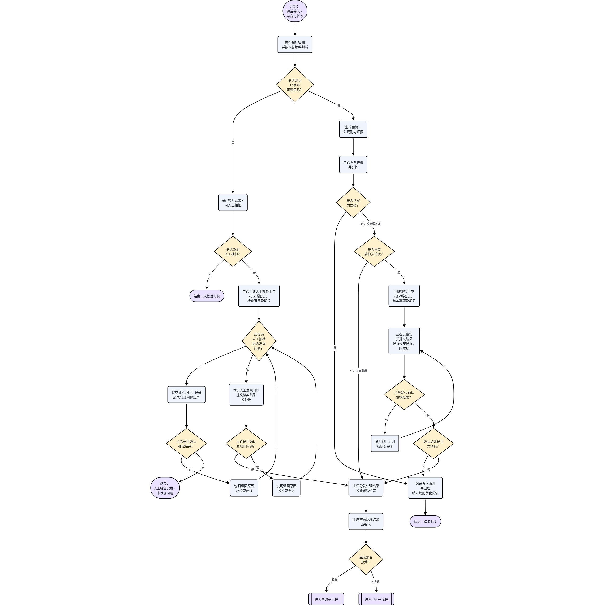

[查看飞书原画板](https://acnc6zeentra.feishu.cn/docx/HfCadGmEroohoOx1qikcA2yAnfh#doxcn2zAktPjhhSAPQ3bgvbMLff)

| 环节 | 字段 / 约束 | 可观察结果 |
| --- | --- | --- |
| 复核派单 | 指定核实事项、质检员及期限，基于命中原话和业务依据核实。 | 任务范围明确，避免对未检查范围作出结论。 |
| 质检员反馈 | 提交误报或非误报核实结果及依据；资料不足时继续核实并明确所缺依据。 | 进入主管确认；退回时主管写明原因，质检员重新核实后提交。 |
| 人工抽检 | 从未命中检测记录或授权通话入口发起；明确人员、范围与期限。 | 发现问题提交主管确认；未发现问题也保留抽检记录并经主管确认，不虚构误报。 |
| 主管确认 | 确认误报则记录原因并归档；确认非误报则分发处理结果及要求。 | 不认可则退回质检员；正式结果保留确认人、时间、版本和证据。 |
| 坐席选择 | 结果详情显示目标、标准、期限、资料要求及质检员来源，提供“接受并开始整改”和“不接受，提交申诉”。已读 / 确认知悉不能替代选择。 | 接受创建整改任务并进入办理页；申诉创建核查案件，未接受时不提前创建整改。重复请求只生效一次，不重复生成任务。 |
| 整改要求与指派 | 分发时明确整改内容、期限、资料及验收标准。仅直接提醒且坐席直接接受的整改可暂未指定质检员，其他路径携带系统已记录的质检员。 | 只有直接提醒且直接接受整改的路径需要主管新增指派，可与整改并行但须在核验前完成；其他路径沿用系统已记录的质检员，不重复指派。 |
| 证据不足 | 作为补证 / 继续核实过程状态，不作为本轮正式复核结论或误报归档理由。 | 保留历史不足意见可读；新提交必须为误报或非误报，缺资料通过补证动作处理。 |

人工抽检关联已有问题仅选择同通话、尚未形成结论且未进入其他核实任务的候选。已分发、已归档或正在核实的问题通过关联记录查看，不从抽检关联入口重启；人工登记只能选择当前有效的指标规则，不能选择停用规则或预警策略。

#### 当前阶段的操作按钮

- 未发现问题的抽检待主管确认：`确认无问题并办结`、`退回重新抽检`。
- 有问题的复核 / 抽检待主管确认：`确认结果并分发`、`退回重新核实`（抽检为 `退回重新抽检`）；全部为误报时主操作为 `确认结果并归档`。人工来源撤销保留人工发现记录，不计入系统误报。
- 确认表单只读展示质检员结论、理由和证据；非误报填写分发要求。主管不能直接改写质检员意见，有异议须退回原质检员，并填写原因、核实要求与期限。
- 普通主管确认阶段不提供通用补件、转派或调整期限。质检员明确申请补证后，主管显示 `安排补证` 与退回操作；缺少明确结论的历史记录只可退回继续核实。
- 质检员办理阶段，主管可直接查看 `调整期限`、`转派任务`；权限和状态同时控制命令执行。详情中的所有有效操作直接展示，取消“更多操作”折叠。
- 确认、退回、完成后的按钮、弹窗标题、提交反馈与事件记录使用相同的业务名称。

### 7.6 申诉核查与裁定（F06）

流程图 2｜申诉子流程：坐席提交申诉后分派核查，主管退回后区分质检员赞同与不赞同，裁定后关闭或转整改。

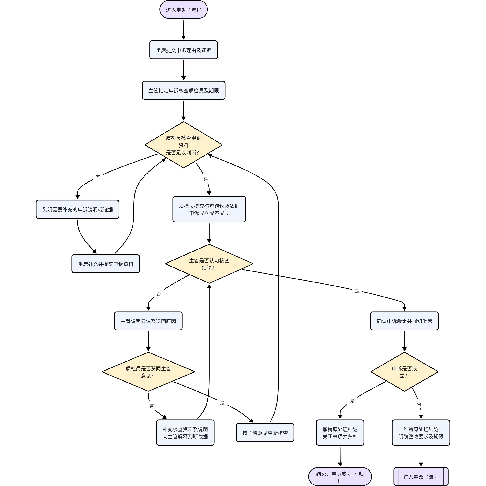

[查看飞书原画板](https://acnc6zeentra.feishu.cn/docx/HfCadGmEroohoOx1qikcA2yAnfh#doxcn6Cz7R6UJtDkHeL9gunLmid)

| 环节 | 要求 |
| --- | --- |
| 提交与指派 | 坐席不接受已分发的处理结果后，提交申诉理由及证据；关联被申诉结果的版本。主管指定核查质检员和期限，原则上另派人员。 |
| 核查与补充 | 由申诉核查质检员发起补件，明确材料要求及期限；坐席补充后仍由该质检员接收并重新核查。补件不会把核查责任转给主管。 |
| 核查结论 | 资料充分后提交申诉成立或不成立的结论及依据，主管审核。 |
| 主管不认可 | 主管说明异议及退回原因；质检员不赞同则补充资料和说明交主管复审，赞同则按主管意见重新核查。不能把两个分支都直接退回坐席。 |
| 裁定与分流 | 主管确认核查结果后裁定；不赞同先退回，不能跳过核查直接裁定。成立则撤销原结论、关闭归档；涉及自动检测误报时记录规则优化反馈，实际修改另行评估，不阻塞结案。不成立则确认整改要求及期限，创建整改并沿用本案核查质检员。 |
| 裁定阶段操作 | 仅展示“确认申诉裁定”和“退回质检员”；确认表单只读核查结论，不提供与质检意见相反的裁定选项、通用补件或调整期限旁路。 |
| 版本及期限 | 保留申诉、核查、退回说明和裁定历史。期限按北京时间展示，正式 SLA 待业务确认。 |

### 7.7 整改执行、验收与联动（F07、F08）

流程图 3｜整改子流程：坐席先整改、核验前落实质检员；主管不认可时先退回质检员，按是否赞同分别回主管或坐席。

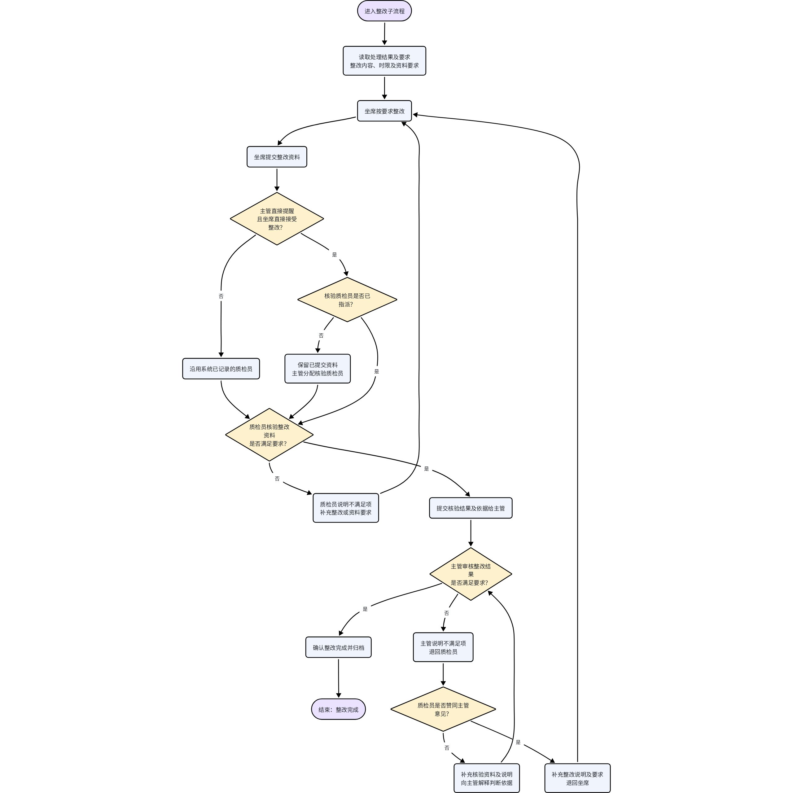

[查看飞书原画板](https://acnc6zeentra.feishu.cn/docx/HfCadGmEroohoOx1qikcA2yAnfh#doxcnL1alr9M7R4DwuoXVMIrnwd)

| 要素 | 实施契约 |
| --- | --- |
| 整改起点 | 坐席接受处理结果或申诉不成立后进入整改；沿用已明确的整改内容、资料要求、标准及期限。 |
| 先整改、后核验门槛 | 坐席无需等待指派即可整改和提交资料。仅“主管直接提醒且坐席直接接受整改”生成主管新增指派待办，可与整改并行；其他路径沿用复核、人工抽检或申诉核查中系统已记录的质检员。 |
| 核验前检查 | 直接提醒且坐席直接接受的整改，在核验前检查指派是否完成：未完成则保留资料、等待主管落实；已完成直接核验。其他路径直接使用系统已有质检员核验，不增加指派环节。 |
| 质检员核验 | 资料不满足要求时写明不满足项及整改 / 资料要求，退回坐席；满足要求时提交核验结果及依据给主管。 |
| 主管审核 | 满足要求则确认整改完成并归档；不满足则写明原因退回质检员，不直接退回坐席。 |
| 赞同与不赞同 | 质检员不赞同主管意见：补充核验资料与说明，交主管重新判断；赞同：补充整改说明及要求，退回坐席执行并重新提交。 |
| 状态与责任 | 整改中、待核验、待主管审核、待质检员核对主管意见、已完成按阶段显示。未指派时主管和坐席可并行有待办；提交资料后显示“资料已提交 · 待指派核验”。指定人员后保留原资料、原轮次和原期限。 |
| 审核阶段操作 | 待主管审核仅展示“确认整改完成并归档”和“退回质检员”；主管审核和质检员回应阶段不直接修改标准或转派。坐席申请调整要求是独立办理上下文。 |
| 材料与历史 | 核验不满足或质检员赞同主管退回后，上一轮材料、核验结果和标准归档，创建下一整改轮次并展示具体补充要求；不赞同则保留本轮材料与通过意见，补充说明交主管。指派不产生新轮次。 |
| 期限 | 保留原期限、当前期限、延期原因和首次逾期事实；新增指派不得重置坐席的整改期限。 |

### 7.8 检测能力、结果与证据（F09）

#### 7.8.1 分类与职责

16 项能力分为 12 类指标规则、1 项预警策略和 3 项任务或展示设置；同一指标可关联多条预警策略。语音识别、文本纠错不触发质检预警，其余 10 类指标可按需关联策略。

客户可维护的字段、资源及预警条件以 [7.9 策略与资源](https://acnc6zeentra.feishu.cn/docx/HfCadGmEroohoOx1qikcA2yAnfh#doxcnAxBimhzDjO6c3OkEWfBkng) 为唯一配置定义。本节只说明检测输入、结果、证据与能力边界，不另外定义一套配置表。

#### 7.8.2 检测结果与证据要求

| 指标 | 输入及处理要求 | 输出与边界 |
| --- | --- | --- |
| 声纹识别 | 授权注册语音、待测原音与预期坐席身份；角色分离不能替代身份比对。 | 输出身份一致性与比对片段；异常区分身份不匹配、未注册声纹、无法确认身份。缺注册与无法确认不直接认定违规；注册和真实比对能力单独评审。 |
| 语音识别 | 录音或实时音频、声道 / 说话人及识别热词；保留增量与最终文本。 | 输出角色、时间范围和转写；角色不确定及转写失败明确标记，不作为“未发现风险”。接入方式与实时音频接口待联调。 |
| 关键词检出 | 按关键词与同义词检出实际出现内容。 | 输出原词、原话、角色和时间；只有有效检出事件进入预警判断，不做“未出现”预警。 |
| 文本纠错 | 根据纠错词库形成修订，保留原文、修订文和差异。 | 明确下游使用的文本版本；金额、账号、日期、利率等关键实体疑点需回听核对，不覆盖原始证据。 |
| 情绪识别 | 结合角色音频与上下文输出已交付标签中的情绪。 | 保留情绪区间及回听证据；低质量输入标记无法判断，客户不满不自动等于坐席违规。 |
| 意图识别 | 按已发布意图定义识别诉求，并保留多意图及诉求变化。 | 输出意图、支持原话及未知结果；未知不强制归入已知类别，也不默认预警。 |
| 服务礼仪 | 按礼仪规范判断必说要素、允许表达与例外。 | 缺失结果提供应完成要素和已检查范围；结束语须在结束后判断，突然挂机等按例外处理。 |
| 语言表达 | 依靠角色音频、时间对齐与语速计算识别静默、抢话、语速过快 / 过慢；保留语速数值及计算依据。 | 输出区间、角色、数值、单位及计算范围；正常附和、系统保持等须保留场景依据，音频或角色不可靠时标记无法判断。 |
| 专业性 | 使用通话发生时适用的业务知识和 SOP 核对事实与步骤。 | 输出疑似错答 / 缺步骤及依据版本；资料不足或冲突时转人工核对，不生成确定结论。 |
| 隐私性 | 根据隐私规则、信息类型、禁止行为与对话语境判断。 | 输出脱敏证据、适用依据和例外；客户主动提供本人信息不自动算坐席泄露，检测与展示脱敏分别验收。 |
| 禁用词 | 根据禁用词库、类别与例外识别有效命中。 | 保留原话及例外判断；可复用关键词证据，同一业务问题不因关联多个指标重复统计。 |
| 消极情感 | 根据服务态度规范及连续对话判断敷衍、推诿等表现。 | 保留具体服务行为和上下文；客户不满与坐席服务态度分别判断，不能仅凭负面情绪定责。 |

#### 7.8.3 执行状态、平台统计与追溯

执行状态与业务判断分别保存。执行状态为待执行、执行中、成功、失败；适用的风险检测结果为命中、未命中、无法判断、不适用。语音识别和文本纠错保存各自处理结果，不强套违规命中结构。失败不得填未命中，不适用须说明依据；通话中的结果只代表已检查范围。

检测结果至少关联通话、指标规则及版本、角色与检测范围、资源 / 服务版本、原音或文本证据。预警另关联命中的策略版本、条件、等级与动作。自动结果与人工结论并列保留，重检产生新批次，历史和进行中的批次继续使用固化快照。

| 平台设置 | 统计或行为要求 |
| --- | --- |
| 覆盖率 | 检测范围在任务设置维护。以约定范围内去重的应处理通话为分母，区分接入、处理中、完成、部分失败、失败和漏跑；重试不增加通话数，缺源清单时不可计算覆盖率。 |
| 时效性 | 实时与事后分别维护允许耗时和超时提醒。计时起止点在项目接入契约中统一，不由各策略自行解释；记录阶段时间、超时、失败和未完成，超时不计为坐席违规。 |
| 数据展示 | 列、筛选及导出字段受用户权限约束。报表口径统一见 7.10；无数据、失败与数值 0 分开显示。 |

证据呈现顺序为发现内容、原音原话、业务依据、当前责任。缺失类结果展示已检查范围；专业性补依据版本；声学结果补区间与数值；敏感证据按授权脱敏。通话中与事后复检通过同一风险关联信息追溯，不重复创建待办。

#### 7.8.4 能力评测与交付边界

正式接入前准备录音与角色契约、业务资源、声纹授权与注册资料、应处理清单和实时 / 事后计时口径。每项明确适用范围、样本、标注责任、服务与资源版本、评价方法和双方确认的门槛；算法或模型选型由研发评审，不把模型名称当作客户配置字段。

身份比对、转写、纠错及分类检测分别评测误识别、遗漏、误改和证据定位；专业性核对业务事实与专家一致性，隐私检测与脱敏分开验证。覆盖率、时效性、展示及风险处置按对应任务和功能结果验收。样本不足、零分母或执行失败不得算通过，也不统一套用未经确认的准确率。

能力建设依赖及排期见 [8.3 联调顺序与上线条件](https://acnc6zeentra.feishu.cn/docx/HfCadGmEroohoOx1qikcA2yAnfh#doxcnA0dTETNTjCRnyytOIqiAYc)；唯一场景清单见 [7.13 验收场景](https://acnc6zeentra.feishu.cn/docx/HfCadGmEroohoOx1qikcA2yAnfh#doxcnGUnbl7uyCcTcPdQLIAU7yh)。新增模型和声纹服务须独立估时，不能从界面演示推断已完成真实能力。

### 7.9 质检策略、业务资源与版本引用（F09、F10）

#### 7.9.1 配置职责与页面归属

策略与资源包含“质检策略”和“业务资源”两个子模块。质检策略展示 12 类指标规则及独立预警策略；业务资源维护规则的业务依据。风险上报与干预属于预警策略，覆盖率、时效性、数据展示在任务或展示设置维护。

以下 16 项指标表是配置归属的统一依据。仅声纹识别、情绪识别、意图识别、语言表达具备特有字段；创建或编辑预警策略时，按所选指标展开对应特征并随该策略保存。指标页说明检测结果与特征定义，不再维护一份供所有策略共用的特征选择。

同一指标可以关联多条预警策略，分别选择特征和风险等级，例如“愤怒→高风险”和“焦虑→中风险”。同一策略多选指标时默认任一规则满足即可，所选特征共用该策略的等级与处置。语音识别、文本纠错不需要预警。

配置顺序：维护并发布业务资源 → 新建或编辑预警策略 → 选择触发指标／规则及对应特征 → 填写通用条件、等级与处置 → 保存草稿、检查、发布。关键词仅在有效检出后预警；服务礼仪的缺失结果由规范判断，不增加关键词“未出现”配置。

#### 7.9.2 16 项指标配置与业务资源

| 指标 | 特有字段 | 规则配置 | 业务资源名 | 字段 | 是否需要预警策略 | 预警策略配置字段 |
| --- | --- | --- | --- | --- | --- | --- |
| 声纹识别 | 异常类型：身份不匹配、未注册声纹、无法确认身份 | 资源固定引用；策略中选择异常类型 | 声纹库 | 坐席/工号、注册语音、启用状态 | 可按需配置 | 触发指标／规则、检测角色、检测阶段及阶段范围、触发方式、累计次数及统计窗口或持续时长、风险等级、处置动作、接收对象、重复提醒间隔（按能力及触发方式显示） |
| 语音识别 | — | 引用资源 | 识别热词 | 词条 | 不需要 | — |
| 关键词检出 | — | 引用资源；检出后按通用策略预警 | 关键词库 | 关键词、同义词 | 可按需配置 | 触发指标／规则、检测角色、检测阶段及阶段范围、触发方式、累计次数及统计窗口或持续时长、风险等级、处置动作、接收对象、重复提醒间隔（按能力及触发方式显示） |
| 文本纠错 | — | 引用资源 | 纠错词库 | 易错文本、正确文本 | 不需要 | — |
| 情绪识别 | 情绪类别：愤怒、焦虑、悲伤、平静（以已交付标签为准） | 资源固定引用；策略中选择情绪类别 | 情绪标签 | 情绪名称、情绪描述 | 可按需配置 | 触发指标／规则、检测角色、检测阶段及阶段范围、触发方式、累计次数及统计窗口或持续时长、风险等级、处置动作、接收对象、重复提醒间隔（按能力及触发方式显示） |
| 意图识别 | 意图类别：从客户维护的意图定义中选择，如投诉、业务咨询、办理挂失 | 资源固定引用；策略中选择意图类别 | 意图定义 | 意图名称、定义、正例、反例 | 可按需配置 | 触发指标／规则、检测角色、检测阶段及阶段范围、触发方式、累计次数及统计窗口或持续时长、风险等级、处置动作、接收对象、重复提醒间隔（按能力及触发方式显示） |
| 覆盖率 | — | 录音来源、业务/班组范围、全量/抽检、抽检比例 | — | — | 不适用 | — |
| 时效性 | — | 实时/事后、允许耗时、超时提醒、接收对象 | — | — | 不适用；任务设置内超时提醒 | — |
| 数据展示 | — | 可见列、筛选条件、导出字段 | — | — | 不适用 | — |
| 风险上报与干预 | — | 通用预警策略 | — | — | 本身即预警策略 | 触发指标／规则、检测角色、检测阶段及阶段范围、触发方式、累计次数及统计窗口或持续时长、风险等级、处置动作、接收对象、重复提醒间隔（按能力及触发方式显示） |
| 服务礼仪 | — | 引用资源；缺失结果按通用策略预警 | 服务礼仪规范 | 检查项名称、必说要素、允许表达、例外表达 | 可按需配置 | 触发指标／规则、检测角色、检测阶段及阶段范围、触发方式、累计次数及统计窗口或持续时长、风险等级、处置动作、接收对象、重复提醒间隔（按能力及触发方式显示） |
| 语言表达 | 表达特征：静默、抢话、语速过快、语速过慢 | 策略中选择表达特征 | — | — | 可按需配置 | 触发指标／规则、检测角色、检测阶段及阶段范围、触发方式、累计次数及统计窗口或持续时长、风险等级、处置动作、接收对象、重复提醒间隔（按能力及触发方式显示） |
| 专业性 | — | 引用资源 | SOP 规则集合；业务知识 | SOP 规则集合：SOP名称、步骤序号、步骤内容、是否必需；业务知识：知识主题、知识内容、依据名称、生效日期、失效日期 | 可按需配置 | 触发指标／规则、检测角色、检测阶段及阶段范围、触发方式、累计次数及统计窗口或持续时长、风险等级、处置动作、接收对象、重复提醒间隔（按能力及触发方式显示） |
| 隐私性 | — | 引用资源 | 隐私规则 | 规则名称、信息类型、禁止行为、正例、反例、脱敏要求 | 可按需配置 | 触发指标／规则、检测角色、检测阶段及阶段范围、触发方式、累计次数及统计窗口或持续时长、风险等级、处置动作、接收对象、重复提醒间隔（按能力及触发方式显示） |
| 禁用词 | — | 引用资源 | 禁用词库 | 禁用词、类别、例外 | 可按需配置 | 触发指标／规则、检测角色、检测阶段及阶段范围、触发方式、累计次数及统计窗口或持续时长、风险等级、处置动作、接收对象、重复提醒间隔（按能力及触发方式显示） |
| 消极情感 | — | 引用资源 | 服务态度规范 | 表现名称、判定说明、正例、反例、例外 | 可按需配置 | 触发指标／规则、检测角色、检测阶段及阶段范围、触发方式、累计次数及统计窗口或持续时长、风险等级、处置动作、接收对象、重复提醒间隔（按能力及触发方式显示） |

#### 7.9.3 通用预警策略字段与联动

| 字段 | 可配置项 | 填写规则 |
| --- | --- | --- |
| 触发指标／规则 | 支持预警的指标规则，可多选 | 任一所选规则满足即可；按规则分别累计 |
| 检测角色 | 坐席、客户、双方 | 按指标能力取共同支持的选项 |
| 检测阶段 | 全程、开场、服务中、结束 | 不支持阶段判断的指标固定全程 |
| 阶段范围 | 开场前 N 秒、结束前 N 秒、服务中起止边界 | 客户维护；开场 / 结束填写对应秒数；服务中填写通话开始后 N 秒至结束前 M 秒；全程不填 |
| 触发方式 | 单次命中、累计次数、持续时长 | 持续时长仅对可持续的状态开放 |
| 累计次数 | N 次 | 仅累计次数时填写 |
| 统计窗口 | 整通通话、最近 1 分钟、最近 5 分钟、自定义时长 | 仅累计次数时填写；自定义填写秒数 |
| 持续时长 | N 秒 | 仅持续时长时填写 |
| 风险等级 | 高、中、低 | 标记本次预警等级 |
| 处置动作 | 通知、通话中提醒、进入人工复核 | 可多选；通话中提醒仅实时任务执行 |
| 接收对象 | 所属主管、指定质检组、当前坐席 | 按处置动作限制选择；通话中提醒固定发给当前坐席 |
| 重复提醒间隔 | 每通话仅一次、1 分钟、5 分钟、自定义时长 | 按同一通话、同一策略控制重复提醒 |

特有字段及其可选项以 7.9.2 表格为准，在预警策略中按所选指标展开，可多选；匹配任一所选特征后再判断通用条件。情绪类别以已交付标签为准，意图来自已发布意图定义；失效选项必须提示处理，不静默替换。未注册声纹或无法确认身份不直接等同违规。

通用选项按所选指标的实际能力限制，多选规则取共同支持的角色、阶段及触发方式。持续时长属于通用策略字段，只对能输出连续状态的能力开放，当前设计用于情绪与语言表达；不能把离散次数换算为持续时长。具体能力开放范围在服务接入时核验，未支持的选项不可保存或发布。

检测阶段决定检查通话的哪一段，统计窗口决定在多长时间内累计有效事件，两者独立。阶段范围由客户在通用策略维护：开场从通话开始计算，结束从通话结束倒数，服务中由开始后的 N 秒和结束前的 M 秒共同界定，不固定为首尾 30 秒。短通话无有效中段时不命中；依赖最终结束时间的完整范围只能在通话结束后判定。

计数口径：关键词每次有效出现为一次命中，去重后累计；其他指标按检测服务给出的事件计数。同一策略多选指标时按通话、指标规则分别累计，任一达到次数即可，不跨指标凑数；检测角色选择双方时累计范围包含双方的有效事件。持续时长按同一角色、同一连续状态计算，不能跨角色拼接。重复提醒按同一通话、同一策略控制；多条策略独立设置等级和去重。

处置动作可组合：通知投递所选接收对象；通话中提醒只在实时通话中发给当前坐席；进入人工复核由有权限的主管或质检组承接，指派与核实按 7.4–7.5 执行。事后或已结束通话不执行通话中提醒。预警等级仅标记风险，不代替人工结论。

条件字段按选择显示：累计次数时填写次数与统计窗口；持续时长时填写秒数；自定义窗口或重复间隔另填秒数。累计次数与时间参数填写正整数并显示单位，服务中起止偏移允许为 0。隐藏条件不参与当前方式的校验或执行。正式数值上限和语速计算口径在联调前确认，不将原型临时限值写成客户制度，也不新增表外客户配置项。

#### 7.9.4 业务资源、模板与文件预览

业务资源按类型固定对应指标；客户维护词条、规范、知识及注册记录，不选择引用规则或资源版本，不在资源表单重复设置预警角色、阶段、次数、时长或等级。语言表达没有业务资源模板。专业性分别维护 SOP 规则集合与业务知识。声纹、情绪用表单；其他资源使用各自的 CSV 模板及结构化表单。资源表格内自带的例外、脱敏等字段按模板维护。

CSV 使用 UTF-8（允许 BOM）、首行为规定中文列名、文件名含 _v2。模板中的示例可替换，不作为客户正式业务要求。选择文件后解析、校验全部记录，仅只读预览前 5 条数据，表头不计入；不足 5 条展示全部。标明文件名、资源类型及总条数。带引号的逗号和换行按 CSV 单元格解析，不能按物理换行截断。超过预览范围的错误同样阻止确认。

检查列名、必填、列数、枚举、重复键及冲突；纠错原词不能有冲突改法，意图名称不重复，SOP 同名分组、序号从 1 连续递增、是否必需为是／否，知识日期使用 YYYY-MM-DD 且结束不早于开始。文件最大 5 MB，正文最多 10 万字。空文件、仅表头、无法解析或校验失败均不得覆盖现有内容。

确认导入将全文件有效记录填入编辑表单；保存草稿后才持久化，检查通过后发布。取消预览或编辑不修改已发布内容。新建资源先选类型，已有资源保持类型不变；按对应模板验证字段，不猜测列含义。

#### 7.9.5 发布、生效与权限

主管可新建、编辑、检查和发布策略及资源；质检员只读并可提出依据建议；坐席无独立管理入口。保存草稿不生效；检查失败保留输入，修改后重新检查。发布前再次校验字段、特征枚举、关联资源与版本；新策略首次发布为 V1，并发旧版本提交不得覆盖新内容。

资源、指标引用快照与预警策略均保留不可变版本。资源按类型固定对应指标，发布后自动更新关联指标的引用，用于后续检测，无需客户选择资源版本。策略保存指标选择、特有特征、通用条件、等级与动作。每个检测批次固化实际使用的规则、资源和策略快照，进行中的检测与历史案件不追溯改写。

完整验收统一见 [7.13 的 A09–A10](https://acnc6zeentra.feishu.cn/docx/HfCadGmEroohoOx1qikcA2yAnfh#doxcnGUnbl7uyCcTcPdQLIAU7yh)，避免在本节重复维护另一份清单。

联调边界：真实检测结果、连续状态、事件计数、通知与复核投递由服务端执行。当前本地原型与本节目标的具体差异列在 8.2，不以预设结果证明能力已上线。

资源删除前展示占用关系；被当前有效规则或草稿引用时禁止删除。删除不移除已固化的历史版本；查看历史案件时按当时快照回查。

### 7.10 质量报表四子模块（F11）

**优先级：P2。**本节四个报表子模块及相关筛选、图表、下钻、导出统一纳入 W7–W8 建议交付，验收 A11–A12 随 P2 执行。已有截图与原型仅作为交互依据，不能视为统计服务已完成生产交付。业务办理的申诉与整改仍按 F06–F08 的 P0 范围执行。

质量报表为独立导航分组，子模块为质检概览、问题分布、坐席 / 班组、申诉与整改。四者共用筛选、统计说明、图表交互、明细和导出规则，各自承担不同分析任务。

图 5｜质检概览：趋势和检测状态环图均显示 callout（线上实见；6001 · 8e5eced；2026-09-20；1600 × 1000；预设模拟数据）

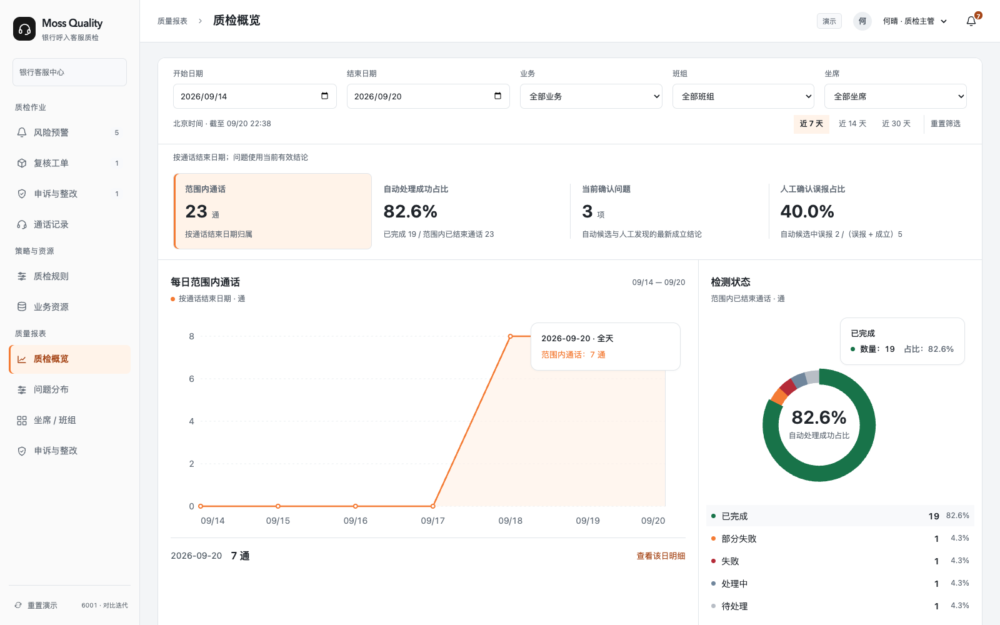

图 6｜问题分布：主指标与当前判定构成（线上实见；6001 · 8e5eced；2026-09-20；1600 × 1000；预设模拟数据）

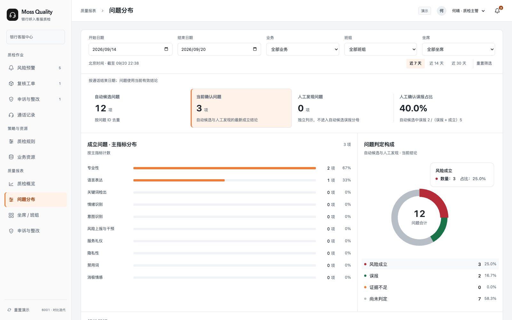

图 7｜坐席 / 班组：通话量与问题矩阵（线上实见；6001 · 8e5eced；2026-09-20；1600 × 1000；预设模拟数据）

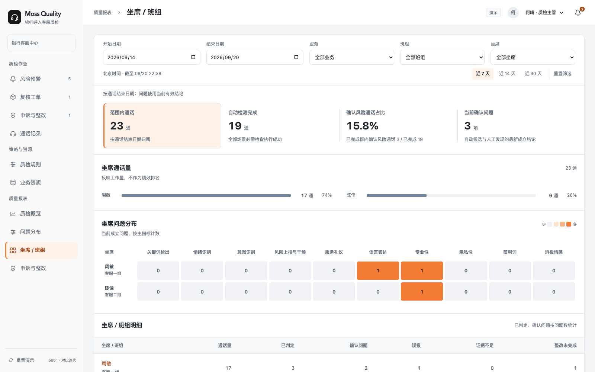

图 8｜申诉与整改报表：当前积压与期间结果分开（线上实见；6001 · 8e5eced；2026-09-20；1600 × 1000；预设模拟数据）

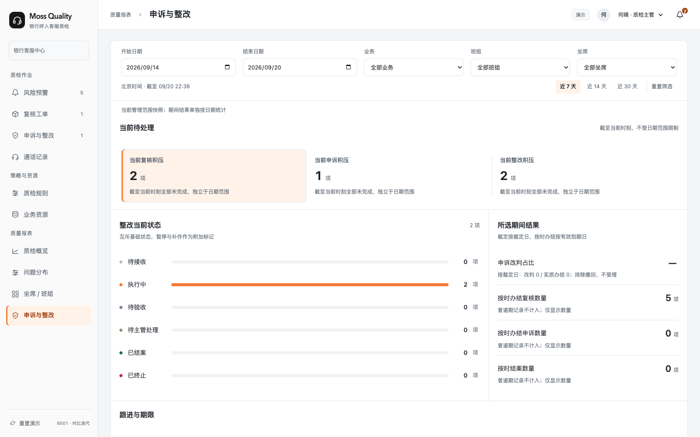

| 筛选 / 图表 | 行为与边界 |
| --- | --- |
| 日期及组织范围 | 默认近 7 个自然日，支持 7 / 14 / 30 天和重置；北京时间。业务、班组、坐席常显，换班组清除原坐席；日期倒置就近报错，隐藏统计及导出，可交换日期。 |
| 趋势口径 | 按真实通话结束日期和当前有效结论重算，不等于历史当日快照。最多 31 点；超出按连续日期段聚合并标注粒度。比例用本段分子 / 分母，不能平均日比例。 |
| callout 与钻取 | 默认显示当前点 / 分组值；移动或键盘切换只更新提示。点击、Enter 或图例进入同口径明细，并将焦点交给明细标题；可返回全期间。 |
| 无数据 | 数量 0 正常显示；比例无分母显示 —，未来日期与缺失比例留空，不连接成 0%；空期间提供查看有数据时段入口。 |
| 导出 | 当前选中指标 / 分类 / 日期段的全部记录，不只当前分页；包含筛选、统计截止时间和口径。保持页面、明细、CSV 对象集合一致。 |
| 返回与刷新 | 同会话切换四子模块保留各自筛选和分页；从明细事项返回保留来源分析。刷新 URL 保留子模块，但筛选恢复默认；不声称可分享筛选结果。 |

| 指标 | 对象与公式 / 日期 | 关键排除 |
| --- | --- | --- |
| 自动处理成功占比 | 范围内已完成检测通话 / 范围内已结束通话；按通话结束时间。 | 部分失败、失败、处理中、待处理不算已完成。 |
| 当前确认问题 | 截止时刻有效成立 Finding 去重；含自动及人工来源，按通话结束日期筛选。 | 一通多问题按问题计数；关联指标不重复计主问题。 |
| 确认风险通话占比 | 完成检测且至少有一项成立问题的通话 / 已完成检测通话。 | 分母为零显示 —，不是问题总数 / 通话数。 |
| 人工确认误报占比 | 自动候选误报 /（自动候选误报 + 自动候选成立）。 | 排除人工发现、证据不足、待判定；不是模型标准 FPR。 |
| 申诉改判占比 | 期间裁定成立的申诉 / 期间完成实质裁定的申诉；按裁定时间。 | 未完成裁定不进入分母。 |
| 当前积压 | 截止时刻全部未完成复核 / 申诉 / 整改；组织与业务筛选有效。 | 不受期间新建或通话日期裁剪，避免历史积压消失。 |
| 按时办结数量 | 按有效到期日归属；完成不晚于有效期限且无首次逾期记录。 | 只展示数量，不展示按时完成率；延期不能清除已发生的逾期事实。 |
| 坐席 / 班组 | 通话量、已判定、成立、误报、证据不足及未完成整改各用自身对象集合。 | 没有统一评分标准，不生成综合分或绩效排名。 |

### 7.11 通知、对象模型与追溯（F12）

#### 7.11.1 通知与责任流转

顶部待办按可执行动作路由。分派、补充资料、意见提交、结果分发、坐席接受 / 申诉、主管退回质检员、验收及结案产生对应事件。仅主管直接提醒且坐席直接接受整改时，为主管生成独立新增指派待办；其他路径沿用系统已记录的质检员，不新增待办；坐席仍可整改和提交材料，两项待办可并行。资料提交后未指定人员时进入待指派核验人，指派完成后通知该质检员，不要求坐席重交。通知已读不等于接受处理结果，旧通知不执行过期动作。

#### 7.11.2 对象与字段关联

| 对象 / 关键字段 | 约束与关联 |
| --- | --- |
| Call / Segment / Batch | 通话绑定坐席、业务、班组、时间与转写；批次固定规则 / 资源快照，检测重试或重检可回溯。 |
| Finding / Conclusion | Finding.distribution 保存 source（direct / review / spotcheck）、结论 version、选择 status（pending / accepted / appealed）、goal、standard、observation、sampleCount、dueAt、inspector、at。Conclusion 保留结论与证据快照。自动误报 optimization 保存状态、说明、操作者及时间，事件保留历次反馈。 |
| Review | callId、findingIds、type、scope、owner、dueAt、status、opinions、history。抽检无发现使用 scopeResult=clear 与 summary；申诉核查被主管退回使用 response 状态及 supervisorComment。同通话不能重复生成未结束的抽检。 |
| Appeal | 关联被申诉结果版本；主管指派核查人，保留补证、核查结论、主管退回和质检员回应。裁定成立关闭，不成立进入整改。 |
| Remedy | origin 记录 direct / review / spotcheck / appeal；仅 direct 且直接接受时 inspector 可暂空。supervisorComment 保存退回原因，supplementRequirements 保存给坐席的整改缺项；response 阶段只允许指定质检员回应。rounds 保留历史资料和验收，指派只补 inspector，不清空材料、不重置 dueAt。 |
| 指标引用快照 / 预警策略版本 / 资源版本 | 指标固定引用对应类型资源；策略保存触发指标、四类特有特征及通用条件；资源保存专属业务字段。检测批次固化实际使用的规则、策略和资源版本。发布只影响后续检测，历史和进行中的批次不变。具体接口对象名在联调时确定。 |
| Supplement / Event / Request | 补件有原阶段、执行人、期限和状态；事件追加；requestId 防重复，对象 rev 检查陈旧提交。 |

#### 7.11.3 字段生命周期说明

生命周期字段角色矩阵：按第 7.5–7.7 节流程事件排序，列明每个字段的选项，以及系统、主管、质检员、坐席分别在哪个节点产生或提交该值。角色列描述赋值与流转职责；“—”表示本角色没有该字段的赋值动作，不代表禁止查看。查看范围仍按 7.1 的组织、任务归属和坐席本人权限控制。

系统状态、来源和办结类型均由实际业务动作生成，不能手工修改以跳过流程。人工判断字段提交前为空；已提交意见按任务及轮次保留，主管审核不覆盖质检员原意见。表中资料补交、分发与指派是触发字段变化的动作，不另造无流程依据的状态。每通通话可有多个问题，问题分别流转。

| 生命周期节点 | 字段及选项 | 系统 | 主管 | 质检员 | 坐席 | 流转约定 |
| --- | --- | --- | --- | --- | --- | --- |
| 1. 检测后判断是否预警 | 预警策略判断结果 满足；不满足 | 自动判断 | — | — | — | 满足：生成预警，交主管初审。不满足：保存检测结果，可由主管发起人工抽检。指标检出不直接等于触发预警。 |
| 2. 预警生成与分流 | 预警处理状态 待主管初审；核实中；已分发；误报归档 | 按业务动作更新 | — | — | — | 生成时为待主管初审；转复核后为核实中；处理结果发给坐席后为已分发；主管确认误报后为误报归档。已分发不代表申诉或整改已结束。 “误报归档”入口为质检作业 → 风险预警 → 误报归档。 |
| 2. 主管初审预警 | 预警初审方式 误报归档；转人工核实；直接分发 | 记录选择并执行分流 | 选择初审方式 | — | — | 误报归档：记录原因和依据，归入风险预警的误报归档页签。转人工核实：指定质检员、核实事项及期限。直接分发：将处理结果及要求发给坐席。 |
| 3. 创建核查任务 | 工单类型 人工复核；人工抽检；申诉核查 | 按发起入口生成 | 发起复核、抽检或指派申诉核查 | — | 提交申诉触发核查流程 | 人工复核来自预警转核实；人工抽检来自通话抽检；申诉核查来自坐席提交申诉。创建后不通过修改类型跳转流程。 |
| 3. 复核 / 抽检办理 | 复核 / 抽检办理状态 核实中；待主管确认；已完成 | 按派单、提交和确认更新 | — | — | — | 派单后核实中；质检员提交后待主管确认；主管退回则回到核实中；主管确认后本工单已完成，依据结果关闭或分发，后续坐席流程单独跟踪。 |
| 3. 质检员提交复核 | 复核结论 误报；非误报 | 保存本次意见 | 确认或退回，不改写质检员意见 | 选择并提交 | — | 误报：提交依据，待主管确认后将原预警归入误报归档。非误报：提交依据，待主管确认后分发。资料不足时继续核实，不作为第三种结论。 |
| 3. 质检员提交抽检 | 抽检结果 发现问题；未发现问题 | 保存本次结果 | 确认或退回，不改写质检员结果 | 选择并提交 | — | 发现问题：登记问题及证据，由主管独立确认；确认后分发处理结果，不认可则写明原因退回质检员继续抽检。未发现问题：提交检查范围及记录，主管确认后完成抽检。两条路径均不进入自动预警的误报归档判断。 |
| 4. 主管审核复核 / 抽检 | 复核 / 抽检确认结果 确认；退回核实 | 记录并推进分支 | 确认或退回核实 | — | — | 确认：按误报、非误报或抽检结果进入对应分支。退回核实：写明原因与要求，退给质检员重新核实。 |
| 5. 分发处理结果 | 处理结果分发来源 主管直接分发；人工复核确认；人工抽检确认 | 依据实际路径生成 | 执行分发，不手工选择来源 | — | — | 三种来源均向坐席分发结果及要求。后两种来源保留已有质检员，供坐席接受后整改核验沿用。 |
| 5. 坐席处理分发结果 | 坐席处理选择 接受并开始整改；不接受，提交申诉 | 记录选择并创建对应任务 | — | — | 选择并提交 | 接受：进入整改。不接受：提交申诉理由及证据，进入申诉核查。未作选择时字段为空；查看或已读不自动赋值。 |
| 6. 申诉提交与办理 | 申诉办理状态 待指派核查；核查中；待坐席补充资料；待主管审核；待质检员回应；已裁定 | 按核查、补件、审核和裁定更新 | — | — | — | 提交后待指派；派单后核查中；材料不足则待坐席补充，提交后回核查中；核查结论提交后待主管审核；主管退回后待质检员回应；补充依据回主管审核，赞同主管意见则回核查中；主管确认后已裁定。 |
| 6. 申诉资料核查 | 申诉资料判断 足以判断；需要补充 | 记录判断并推进核查或补件 | — | 判断是否需要补充 | 按补件要求提交材料 | 足以判断：提交核查结论。需要补充：列明补充要求，交坐席补件，再由同一核查质检员核查。 |
| 6. 提交申诉核查意见 | 申诉核查结论 申诉成立；申诉不成立 | 保存本次核查意见 | 审核，不改写核查意见 | 选择并提交 | — | 作为质检员建议提交主管审核，尚不等于正式裁定。 |
| 7. 主管审核申诉 | 申诉审核结果 认可；不认可，退回质检员 | 记录审核动作 | 认可或说明异议后退回 | — | — | 认可：确认申诉裁定。不认可：填写异议与退回原因，由核查质检员回应。 |
| 7. 质检员回应申诉异议 | 对申诉审核意见的回应 赞同；不赞同 | 记录回应并推进分支 | — | 选择赞同或不赞同并提交依据 | — | 赞同：按主管意见重新核查，必要时补件。不赞同：补充核查资料及说明，交主管再次审核。 |
| 7. 确认申诉裁定 | 申诉裁定结果 申诉成立；申诉不成立 | 记录正式裁定及结论版本 | 认可核查结论后确认裁定 | — | — | 成立：撤销原处理结论并归档；有原自动预警且确认其为误报时，原预警进入误报归档。人工抽检问题被撤销且无原自动预警时，保留原问题、抽检和申诉记录，不新建预警。不成立：维持原结论，明确整改要求及期限，进入整改。 |
| 8. 进入整改 | 整改进入来源 坐席接受处理结果；申诉不成立 | 按进入路径生成 | — | — | — | 坐席接受：再结合分发来源判断核验人来源。申诉不成立：沿用本案申诉核查质检员。 |
| 8. 落实核验质检员 | 核验人指派状态 未指派；已指派 | 根据是否已有核验人生成 | 仅需补派的路径指定核验人 | — | — | 仅主管直接分发且坐席直接接受时可未指派，由主管补派；其余路径沿用已有质检员，直接为已指派。坐席可先整改、交资料，核验前须为已指派。 |
| 8. 整改资料流转 | 整改办理状态 整改中；资料已提交·待指派核验；待核验；待主管审核；待质检员核对主管意见；已完成 | 按资料提交、核验与审核更新 | — | — | — | 进入时为整改中；提交资料后，无核验人为“资料已提交·待指派核验”，已有核验人为“待核验”。主管补派完成后，“资料已提交·待指派核验 → 待核验”，保留原资料、原轮次和原期限。质检员核验不满足时，“待核验 → 整改中”，进入下一轮；坐席再次提交后回到待核验。核验满足后进入待主管审核；主管退回后为待质检员核对主管意见；质检员不赞同并补说明后回到待主管审核，赞同则退坐席进入下一轮整改；主管通过后为已完成。 |
| 9. 质检员核验整改 | 整改核验结果 满足要求；不满足要求 | 保存本轮核验结果 | — | 选择并提交核验依据 | 按要求整改、提交资料 | 满足要求：提交核验依据，交主管审核。不满足要求：写明不满足项和补充要求，退坐席进入下一轮整改。 |
| 10. 主管审核整改 | 整改审核结果 通过；退回质检员 | 记录审核动作 | 通过或说明原因后退回质检员 | — | — | 通过：确认整改完成并归档。退回质检员：说明不满足项，由质检员核对主管意见，不能直接退坐席。 |
| 10. 质检员核对主管意见 | 对整改审核意见的回应 赞同；不赞同 | 记录回应，按分支保留或新建轮次 | — | 选择赞同或不赞同并提交说明 | 收到整改要求后再次提交资料 | 赞同：补充整改要求，退坐席进入下一轮。不赞同：保留本轮资料及核验意见，补充依据给主管，不新建整改轮次。 |
| 11. 对应流程办结 | 办结类型 误报归档；抽检完成·未发现问题；申诉成立·归档；整改完成 | 按对象的实际终点生成 | 执行对应确认或裁定 | — | — | 误报归档：在风险预警 → 误报归档查询；未发现问题的抽检：在复核工单查询；申诉成立：在申诉记录查询，符合自动误报条件的原预警另归误报归档；整改完成：在整改记录查询。通话详情汇总关联这些原记录，不复制档案。 |

归档约定：预警经确认属于误报后，办结状态统一为“误报归档”，归档入口为质检作业 → 风险预警 → 误报归档。原预警、通话证据、误报原因、核查与裁定记录、确认人和时间及检测/规则/策略版本随记录保留。归档后可按权限查询、查看详情、回听证据和记录规则优化反馈；坐席可确认知悉，不提供通用“补充结果意见”办理入口；反馈不阻塞归档，也不自动修改规则。其他入口只关联原记录，不另复制档案。

预警页签顺序为“待处理｜核实中｜已分发｜误报归档｜全部预警”；待处理对应待主管初审，全部预警是集合查询，不是新业务状态。风险等级、通用策略及指标特有选项统一见 7.9；自由填写的理由、证据与期限见各办理章节。

### 7.12 接口与异常处理要求

当前实现是 Next.js / React 前端原型，领域流转集中于 lib/workflow.ts，资源引用发布在 lib/resource-publication.ts，统计在 lib/reports.ts 与 lib/report-visuals.ts，本地持久化在 lib/store.ts。以下为生产接入契约要求，尚不是已部署 HTTP API；具体路径、错误码和负责人在联调前确定。

| 能力 / 输入输出 | 生产实现要求 | 失败与恢复 |
| --- | --- | --- |
| 身份与查询 | 从服务端身份确定组织、角色和数据范围；列表、详情、统计、导出使用同一授权集合。 | 401 / 权限失效不暴露数据；保留可恢复的界面上下文，不能客户端伪装身份。 |
| 业务命令 | 输入 objectId、action、payload、expectedRev、requestId；身份取认证上下文；输出新版本、关联对象、事件和当前允许动作。 | 角色、责任、状态、证据、期限均校验；旧 rev 返回冲突；重复 requestId 返回同一结果，不追加第二次记录。 |
| 关联事务 | 结果分发与坐席选择分离；接受生成整改；仅主管直接提醒且坐席直接接受的路径新增指派待办，其他路径沿用系统已有质检员；提交资料允许未指定验收人；核验、主管审核及申诉裁定按当前阶段和版本校验。 | 核验前未指派必须阻止核验，但不能阻止整改和提交；指派完成复用已提交资料，不重复创建任务。 |
| 音频与材料 | 对象绑定、范围授权、片段定位、原始证据留存；真实上传下载协议待落实。 | 音频缺失、材料失败提供明确状态；失败不构造已上传记录。 |
| 报表 / 导出 | 同一 asOf 与筛选计算摘要、图形、明细及 CSV；大批量导出和任务状态待服务端方案。 | 零样本显示空态；查询失败与数据为零区分；导出失败可重试不假报成功。 |
| 存储与时钟 | 服务端时间作为到期判断权威；演示已用同一前端时钟和本地持久化。 | 本地写入失败须提示未持久化；真实系统持久化、审计、恢复与监控须联调验证。 |

### 7.13 验收场景

**分期验收：**P0 执行 A01–A08、A13–A14 中所属业务场景；其中 A03 的通话中实时提醒部分随 F03 在 P1 验收。P1 执行 A09–A10、A03 的实时提醒场景并回归 P0；P2 执行质量报表 A11–A12。A01、A13、A14 的权限、共用交互及异常要求适用于每次新增交付。未交付阶段的专属场景不作为前一阶段通过条件。

下表是本交付唯一场景验收清单。“已有证据”指源码、自动化或截图支撑，不替代生产联调签字。执行者补充环境、样本、结果和证据；目标指标见[第 4 章](https://acnc6zeentra.feishu.cn/docx/HfCadGmEroohoOx1qikcA2yAnfh#doxcnfHRY3Ip4ey3BaXPwZlVA8c)。

| 验收编号 | 场景 | 输入 / 操作 | 通过标准 | 已有证据与边界 |
| --- | --- | --- | --- | --- |
| A01 | 角色与越权 | 切换主管 / 质检员 / 坐席，直接进入受限 URL 和旧通知。 | 数据、动作、计数一致受限；无旧身份泄漏。 | 已有原型逻辑 / 工作流测试；服务端待联调。 |
| A02 | 通话与证据 | 打开有 / 无音频通话；未命中记录发起人工抽检，分别提交有发现和无发现结果。 | 证据定位正确；抽检范围、质检员、期限完整；主管确认无发现后结束，有发现进入主管确认与分发。 | 已有本地抽检与证据流程回归记录；真实录音接入待联调。 |
| A03 | 预警三向初审 | 主管分别标记误报、转核实、直接分发；坐席分别接受和申诉。 | 误报留痕关闭；非误报确认或直接提醒统一分发；接受与已读区分；材料不足不是独立初审出口。 | 已有本地流程回归记录；本次未重跑，生产鉴权、共享事务及端到端流转待联调。 |
| A04 | 复核与抽查 | 提交误报 / 非误报及证据；主管退回复核；人工抽检无发现或有发现。 | 主管确认后按结果关闭或分发；范围明确，保留意见历史；无发现不虚构误报。 | 已有本地流程回归记录；本次未重跑，生产鉴权、共享事务及端到端流转待联调。 |
| A05 | 分发、坐席选择与指派 | 分别覆盖直接提醒后直接接受、复核后接受、人工抽检后接受、申诉不成立后整改四种来源。 | 接受进入整改，不接受进入申诉；只有直接提醒且直接接受新增指派，其余三种来源沿用已记录质检员。坐席可先整改。 | 已有本地流程回归记录；本次未重跑，生产鉴权、共享事务及端到端流转待联调。 |
| A06 | 申诉核查与意见往返 | 资料不足补充；主管不认可，质检员分别赞同 / 不赞同；成立与不成立裁定。 | 不赞同补依据给主管，赞同重新核查；成立撤销并归档，自动检测误报另记优化反馈且不阻塞结案；不成立进入整改，历史完整。 | 已有本地流程回归记录；本次未重跑，生产鉴权、共享事务及端到端流转待联调。 |
| A07 | 整改核验与主管退回 | 质检员核验不满足；主管审核不满足，质检员分别赞同与不赞同。 | 主管退回先给质检员；不赞同补说明给主管，赞同补要求给坐席；主管通过才结案。 | 已有本地流程回归记录；本次未重跑，生产鉴权、共享事务及端到端流转待联调。 |
| A08 | 指派不阻塞整改 | 主管直接提醒且坐席直接接受后，先整改并提交；分别检查指派已完成与未完成场景；其余来源检查不重复指派。 | 直接提醒且直接接受时，提交资料不受指派阻塞，核验前必须完成指派；其他路径沿用既有质检员。均不要求重交资料，不重置期限或重复生成任务。 | 已有本地流程回归记录；本次未重跑，生产鉴权、共享事务及端到端流转待联调。 |
| A09 | 指标与预警策略 | 核对 12 类目录及四类特有字段；同一指标建立不同特征和等级的策略；多选规则，切换角色、阶段、累计 / 持续及自定义参数。 | 字段与 7.9 两表一致；特征随具体策略保存；关键词只有检出预警；语音识别与纠错不可选为触发指标。阶段范围归通用策略；按能力限制选项，隐藏字段不执行；草稿不生效、检查发布后刷新值一致。 | 本地页面与策略配置代码已有对应实现；服务中范围待同步，真实事件判断和投递待联调。 |
| A10 | 资源与固定引用 | 按资源类型填写表单或导入超过 5 条的 CSV；在第 6 条放入错误；覆盖草稿、取消、检查、发布及在途检测。 | 模板字段一致；全文件校验、只预览前 5 条数据；错误阻止导入，确认导入为全量；草稿不修改已发布内容。发布自动更新固定引用，历史及在途快照不变。 | 资源导入、发布代码及既有测试记录；真实存储、并发和检测版本绑定待联调。 |
| A11 | 报表口径 | 同通话多问题、人工发现、证据不足、改判、零分母、跨期积压。 | 对象去重、分母和日期正确；数量能对账，不制造综合分。 | 统计实现与回归；生产样本待对账。 |
| A12 | 图表与导出 | 无悬停查看 callout；移动 / 键盘切换；点击钻取；导出超过一页。 | 提示常显且平滑，悬停不跳转；图表无内部双向滚动；CSV 为全部当前明细。 | 既有报表交互与导出验证记录；生产容量待测。 |
| A13 | 导航与状态 | 报表四模块切换、事项返回、刷新、访问旧 overview。 | 侧栏与 URL 一致；同会话条件保留、刷新默认；旧入口到复核。 | 既有导航实现；当前交付需按目标版本复验。 |
| A14 | 弹窗与失败恢复 | Tab / Esc、未保存取消、提交中重复点击、旧 rev、写入失败。 | 焦点受控并返回；输入保留；无重复事件或伪成功。 | 原型通用组件与测试；网络错误联调待执行。 |

## 8. 交付与上线

### 8.1 交付物与版本基线

| 载体 | 版本 / 标识 | 用途与状态 | 差异 / 待办 |
| --- | --- | --- | --- |
| 线上原型与代码快照 | 文首线上入口；GitHub 8e5eced | 已有演示入口及对应代码快照；本次未发布。 | 不能作为本轮全部需求已上线的证明。 |
| 本地原型 | 质检-ui-6001 工作区；当前预览端口 6002 | 本次只读核对质检策略页面：12 类指标入口、独立预警策略、资源引用。工作区含未提交修改。 | 真实检测与投递尚未接入；差异见 8.2。 |
| 飞书 PRD | 6001-R5 / 2026-09-23 | 本文为当前需求口径；八章结构、7.9 编号、配置职责与验收已整理。 | 数值边界、服务能力、正式 SLA 等待落实项见 8.4。 |
| 流程与界面依据 | 7.5–7.7 三张业务流程图；通用交互、通话证据及报表截图 | 流程图表达目标业务规则；截图为注明版本的界面样例。 | 与当前需求冲突的规则编辑、资源切换及办理截图已移除。 |
| Figma 与生产接口 | 未提供本次对应设计稿及已部署接口 | 文首未列不存在的资产。 | 按研发需要补交，验收时关联真实版本。 |

### 8.2 设计覆盖与实现差异

保留的截图用于说明统一弹窗、通话证据和报表交互，不作为新规则配置或所有角色流程已实现的证明。业务办理以三张现行流程图及第 7 章契约为准。

2026-09-23 本地页面实现核对：6002 风险预警页签已按“待处理｜核实中｜已分发｜误报归档｜全部预警”排序；误报归档后提供“查看归档”快捷入口，保留原预警、原因及证据。通话详情新增“问题与处理记录”入口，关联同一问题详情；单个问题的处理记录按问题及关联工单筛选，不混入同通话其他问题的事件。已验证归档提交、数量变化、快捷跳转、通话往返；112 项工作流测试、构建及修改文件静态检查通过。本次更新本地原型，未重新发布线上版本，真实服务联调范围不变。

| 目标要求 | 当前实现差异 | 待完成及验收 |
| --- | --- | --- |
| 16 项分类与四类特征 | 本地页面已有 12 类指标入口及策略特征配置；部分能力仍是预设结果。 | 按 7.9 两张表验收完整字段、联动和保存，不用表单存在推断真实检测已接入。 |
| 语音识别、文本纠错不需要预警 | 本次查看的本地指标目录卡片仍使用“通用策略”标识，容易误解。 | 改为“不需要预警”并保持策略触发列表不可选；按 A09 验收。 |
| 阶段范围由客户维护 | 服务中首尾各 30 秒为原型固定逻辑，不能作为正式业务规则。 | 在通用策略补充服务中起止边界；对应规则仍以 7.9 为准。 |
| 真实检测、通知及共享状态 | 现有页面以浏览器状态和预设结果演示。 | 接入鉴权、检测、音频、材料、持久化、审计及投递服务；按 A01–A14 执行端到端验收。 |

### 8.3 联调顺序与上线条件

**建议排期（待研发估时确认）：**T0 为资源、接口环境和业务口径确认后的项目启动日；W1 为启动后的第 1 个工作周，不等同于文档更新日期。按前端 1 人、后端 2 人、测试 1 人投入，并由产品、设计及数据 / 检测集成按需支持，暂估 8 周；这是规划假设，不是已确认人员配置或上线承诺。实际负责人、投入和绝对日期在启动评审后补齐。

| 阶段 | 计划周次 | 交付功能与工作 | 责任角色 | 里程碑 / 验收出口 |
| --- | --- | --- | --- | --- |
| 准备 | T0 前 | 确认组织权限、录音 / 检测接口、固定规则资源版本、SLA 和验收样本；冻结接口契约 | 产品 / 技术负责人 / 业务 | 负责人和接口环境落实后确定 T0 |
| P0 基础 | W1–W2 | F01、F02、F12 基础；身份鉴权、通话与证据读取、候选分流、通知责任路由、数据库和版本快照 | 后端主责；前端 / 集成 / QA 协作 | A01–A03；证据可定位，权限不越界，固定规则版本可追溯 |
| P0 闭环 | W2–W4 | F04–F08、F12 完整；复核、主管确认、申诉、整改及联动；W4 完成联调、缺陷修复和首期验收 | 前后端 / QA；产品与业务验收 | A04–A08、A13–A14；幂等、并发、版本、轮次和期限通过；P0 试运行须满足银行上线条件 |
| P1 增强 | W5–W6 | F03、F09、F10；通话中提醒、指标配置、预警策略、资源维护、检查发布及固定引用生效；W6 联调验收 | 前后端 / 检测集成 / QA | 提醒链路按 A03 对应场景复测；A09–A10 通过，新旧批次与历史引用不变；回归 P0 |
| P2 质量报表 | W7–W8 | F11 四个子模块：质检概览、问题分布、坐席 / 班组、申诉与整改；统一筛选、常显 callout、下钻、CSV；W8 样本对账和验收 | 数据 / 后端主责；前端 / QA / 业务协作 | A11–A12 通过；按角色与相同筛选条件核对图表、下钻、导出；对账差异关闭后验收 |

**依赖与调整：**P1 的实时提醒依赖流式音频 / 检测服务；接口未就绪时记录阻塞并重估 F03，不用模拟回执验收。P2 依赖 P0 的真实闭环数据和经确认的统计口径，可在 W5–W6 做口径设计，功能交付仍为 P2。每阶段上线均须完成所属功能的权限、安全、留存、监控、备份、容量、恢复和业务 SLA 检查，并由实际负责人确认；P2 报表验收不作为 P0 / P1 上线前置条件。资源或接口发生变化时同步重排周次，不压缩必要验收。

### 8.4 待落实事项

| 事项 | 确认责任 / 时点 | 对交付的影响 |
| --- | --- | --- |
| 正式业务 SLA、申诉时限、留存期限 | 业务 / 合规；后端期限与存储设计前。 | 预警产品默认值见 7.4.1，需确认值班责任与正式业务 SLA；申诉和整改期限另行确定，产品默认值不得直接视为银行制度。 |
| 组织与身份、音频及检测接口、失败码 | 集成 / 后端；联调开始前。 | 决定真实鉴权、对象同步与异常恢复方案。 |
| 生产统计样本与质量衡量目标 | 业务 / 数据 / 测试；报表验收前。 | 不得用模拟数据推导准确率、覆盖提升或工时收益。 |
| 服务容量、导出规模、部署权限与容灾 | 后端 / 运维；生产上线前。 | Vercel 演示可访问不代表满足银行上线要求。 |
| 可编辑设计稿与负责人分配 | 产品 / 设计 / 项目负责人；研发排期前。 | 按需补 Figma 节点与实际负责人；以本次目标需求组织设计和验收。 |
| 配置数值边界与能力开放范围 | 产品 / 客户业务 / 检测研发；策略联调前。 | 确认阶段参数、累计次数、持续时长的合法边界、语速计算口径及指标能力；不扩展 7.9.2 表外客户字段。 |

### 上下文操作与样例验收索引

全入口核查结果、14 个新增中间状态样例及可直接打开的办理链接，见 [上下文操作核查与样例补齐](上下文操作核查与样例补齐-20260923.md)。新增样例通过共用业务命令推进；浏览器升级只追加样例，不重置现有进度。

全位置二次复核及增量样例见 [全位置操作复核](全位置操作复核-20260923.md)。

三张主流程、三张角色时序及八张页面流程的逐节点按钮与责任映射见 [流程节点与操作按钮核查](流程节点与操作按钮核查-20260923.md)。其中申诉与整改主管确认/退回表单显示本轮质检依据及前次退回意见，补充说明不可在交接时丢失。
