# 银行语音质检 MVP-P0：产品方案与核心功能 PRD

版本：方案 V1.9｜日期：2026-09-13｜状态：v0.2.4 页面减法、角色导航与申诉整改队列迭代。保持三角色七模块、16 项指标与 10 类规则；页面内流程、页面间事件、角色责任、流程图和时序图共同维护。

适用项目：`/Users/hpl/Desktop/语音B端产品/质检-mvp-p0`；目标演示端口：5001。当前交付对象是高保真交互原型，允许模拟数据、预设检测结果、前端状态和模拟发布。本文在新项目内统一替代前面讨论的四页面方案；原项目及其完整版文档继续保留。

## 1. 方案摘要

建议以“3 个核心角色、7 个业务入口、1 条完整质量改进闭环”收敛首版：发现候选风险 → 人工复核 → 主管确认 → 申诉纠错 / 整改跟进 → 报表查看结果；规则与业务资源提供判断依据。

保留申诉与整改、业务资源、质量报表，缩减多级审批、专家独立工作台、班组中转、我司项目后台和高级配置。沿用当前 UI 风格及证据阅读方式。完整指标目录仍为 16 项，规则配置对应其中 10 类，不将目录完整性等同于模型实现或真实验收通过。

## 2. 参与方与决策责任

| 参与方 | 本轮责任 | 说明 |
| --- | --- | --- |
| 产品负责人（用户） | 采纳范围、决定产品取舍、评审原型 | 本文是可执行建议，不冒称已经批准所有旧提案 |
| 原型设计与开发 | 页面、交互、状态、样例和文档一致 | 在新目录实现，不直接修改原项目 |
| 业务评审者 | 核对场景、规则含义、复核与整改标准 | 未指定具体人员；不得把模拟意见当成专家签字 |
| 后续真实研发与交付 | 模型、接入、权限、评测、容量与上线 | 另阶段开展，不作为本轮原型完成门槛 |

## 3. 背景、核心痛点与参考依据

### 3.1 当前产品基础

原项目已经覆盖客户生产台与我司项目后台、10 个角色及多套工单布局。reviews 汇总了产品、流程、指标、研发、交互与历史差异；代码有可复用的页面和样例，但部分当前文档仍描述待实现行为。

本方案依据用户明确的高保真原型定位、reviews 当前专题和公开产品资料制定。以下痛点是对现有产品的分析假设，尚无新一轮银行用户访谈或量化使用数据，不写成已验证的客户调研结论。

| 核心痛点 | 对使用者的影响 | P0 处理 |
| --- | --- | --- |
| 导航和角色多，主要任务被交付与配置功能分散 | 初次使用难以判断从哪里开始 | 三个角色有不同默认待办，七个业务入口归为三组 |
| 风险发现、最终结论、整改完成混用 | 不清楚问题是否成立、由谁继续处理 | 分开候选风险、复核、申诉、整改及其状态 |
| AI 命中难以结合上下文核查 | 误报、引用、否定和证据缺失不易解释 | 录音/转写定位、前后文、规则与资源版本同屏可追溯 |
| 角色层级过多，交接成本高 | 简单问题也需班组、专家等多次传递 | 主管直接分派质检员和整改坐席；必要的专业补证仍留出口 |
| 只有质检结论，没有纠错和改进结果 | 坐席异议无处处理，主管无法查看整改效果 | 申诉与整改独立入口，报表可下钻到案件 |
| 规则与知识依据脱节 | 不知道判断基于哪版词库、知识或 SOP | 保留精简资源维护、规则引用及历史版本 |
| 16 项体系与 10 类规则被混为一个数字 | 误以为能力漏项，或错误宣称全部实现 | 完整目录、规则入口和演示能力分别标识 |

### 3.2 竞品事实与本项目取舍

核验日期：2026-09-12。厂商公开页面可验证功能表达，不能据此推断真实效果、银行适配程度或完整权限设计。

| 参考产品 | 公开可核验事实 | 本方案借鉴 | 本轮不照搬 |
| --- | --- | --- | --- |
| 追一 See | 语音/文本分析、多类规则和评分模板、人工补充检测点、分析结果可追溯会话 [S01] | 自动发现配合人工判断，结论能回到证据 | 全套营销分析、模型训练、复杂评分模板平台 |
| 智齿 | 2020 年官方功能说明介绍线上申诉、审核、重检、理由与历史追溯，可配置一/二级流程 [S02] | 坐席申诉、主管受理、质检员核查、保留改判记录 | 多级会签、复杂次数与窗口策略；不将旧文章当作现售版本承诺 |
| 晓多明察 | 官方介绍包含跨平台/店铺质检、实时告警、质培联动和全局汇总报表 [S03] | 结果跟进与统计构成质量改进链路 | 电商多店铺、营销转化与完整培训平台 |

三角色、七入口、主管最终确认是结合本项目的产品取舍，不是竞品共同要求。上述资料支持保留“证据—复核—纠错—改进—分析”的必要环节，没有足够依据承诺效率提升比例或模型准确率。

来源：[S01 追一 See 官方介绍](https://zhuiyi.ai/product/see)；[S02 智齿质检申诉官方说明](https://blog.sobot.com/article/764/view.html)；[S03 晓多明察官方介绍](https://www.xiaoduoai.com/app/detail/app_mc)。

## 4. 设计目标与成功标准

### 4.1 设计目标

1. 让主管围绕风险优先级完成分诊、确认和跟进，始终知道当前责任人与下一动作。
2. 让质检员基于完整证据给出意见，保留误报、证据不足、风险成立三种结果。
3. 让坐席能理解本人结论、提出异议、完成整改，而非只能被动接收通知。
4. 让规则、业务依据、过程记录与报表可相互追溯，支持评审“为什么这样判、处理是否完成”。
5. 用一套完整可操作的高保真原型验证这些任务，延续现有视觉风格，控制每个模块的功能深度。

### 4.2 本轮验收目标

P0 原型验收范围已冻结：七个入口按角色开放；第 8 节 T01—T18 与已采纳 D01—D05 均纳入验证。跨角色操作、列表、详情、通知、报表使用统一状态；刷新保留演示进度；重复请求不重复建案；坐席仅能查看本人授权记录。实际验证结果及限制见实现与验收记录，不将原型验证解释为生产能力达标。

业务上的复核效率、误报减少和整改效果作为后续试点观察目标；没有基线，不设置虚构的降本百分比。首版报表用于验证统计口径，示例数字不作为真实经营或模型效果。

## 5. 目标场景、假设与范围

### 5.1 目标场景

单个银行呼入客服团队，围绕业务咨询、身份核验、服务态度与敏感信息等典型场景开展事后质检，并包含轻量的通话中风险提醒。角色为质检主管、质检员、客服坐席；班组保留为人员归属和筛选维度。

假设主管可直接分派到坐席，并维护经业务确认的示例资源。未来若试点要求班组签收或专家独立裁定，再增加相应角色；当前不能据此认定主管具有所有专业裁定能力。

### 5.2 范围边界

| 范围 | P0 决定 |
| --- | --- |
| 核心业务 | 七模块均保留，每个只做主路径与必要异常 |
| 实时能力 | 演示候选告警、提醒、回执和通话结束转复核；不建设 CTI 或实时流服务 |
| 申诉与整改 | 两类独立案件、三个角色、基本补件与退回、关联暂停及恢复 |
| 规则 | 固定结构；只对明确开放的少量参数提供修改、预览和版本化生效 |
| 资源 | 词库、业务知识、SOP 三类；单条维护、草稿、影响查看、模拟发布 |
| 统计 | 一页质量报表，固定视图、筛选、下钻与 CSV 导出 |
| 排除项 | 多租户、用户权限配置平台、专家/班组独立工作台、训练平台、自定义报表、复杂审批编排、全套项目交付后台 |
| 未来真实交付 | ASR/声纹/纠错等真实模型、独立金标、真实接口、容量压测及生产权限另立研发范围 |

## 6. 产品价值与相对完整版的变化

主管得到完整的问题处理视图，质检员得到可核验的证据与明确待办，坐席得到透明结论和纠错渠道。资源提供依据，报表验证处理结果；三者共同支撑质量改进。

| 维度 | 完整版 | MVP-P0 |
| --- | --- | --- |
| 工作面 | 客户生产台 + 我司项目后台 | 客户质检作业一个工作面 |
| 角色 | 10 个角色 | 3 个核心角色；班组仍是数据维度 |
| 申诉整改 | 专家、班组、多级协作 | 主管、质检员、坐席直接交接，仍有独立案件 |
| 导航 | 工作台、作业、资源、系统、交付评测等 | 3 组、7 个入口；待办融入业务页 |
| 工单布局 | 多套对比稿 | 一套队列、证据、处理面板 |
| 规则资源 | 复杂变更、审批、资源类型和回归 | 固定规则 + 少量开放参数 + 三类业务资源 |
| 报表 | 完整分析与运营体系 | 一页固定视图，可追溯原始对象 |
| 指标 | 16 项完整体系及评测交付 | 16 项目录保留，10 类规则分工不变 |
| 交付检验 | 涉及真实模型和生产环境 | 先验证页面、流程、样例和统计一致性 |

## 7. 产品设计与核心功能 PRD

### 7.1 页面目录与布局

```text
银行语音质检
├─ 质检作业
│  ├─ 风险预警
│  ├─ 质检工单
│  ├─ 申诉与整改
│  └─ 通话记录
├─ 策略与资源
│  ├─ 质检规则
│  └─ 业务资源
└─ 分析
   └─ 质量报表
顶栏：角色/演示身份切换、通知；侧栏底部：演示数据重置与版本
```

主管默认进入“风险预警—待分诊”，质检员进入“质检工单—我的待办”，坐席进入“质检工单—需我处理”；无待办时显示结果快捷入口，不自动伪造任务。导航名称、分组与相对顺序一致，按权限隐藏无关入口，不为某角色重新排序；坐席顺序为质检工单、申诉与整改、通话记录。

| 页面 | 内部组织 | 主要布局 |
| --- | --- | --- |
| 风险预警 | 待分诊、跟进中、已转复核、已关闭 | 左侧风险队列，中间证据，右侧当前责任与动作 |
| 质检工单 | 我的待办、全部授权工单、已完成 | 复核意见与主管结论分区，历史与下一步分区 |
| 申诉与整改 | 单层状态页签：需我处理/进行中/已结束/全部；可见类型筛选：全部类型/申诉/整改 | 当前案件、原结论、关联案件、补件/验收记录 |
| 通话记录 | 日期、业务、班组、坐席、检测状态筛选 | 紧凑表格 + 通话详情 |
| 质检规则 | 指标分类、规则列表、版本与允许修改参数 | 列表 + 详情/编辑弹窗 |
| 业务资源 | 词库、业务知识、SOP | 列表 + 草稿编辑 + 发布确认 |
| 质量报表 | 质检概览、问题分布、坐席/班组、申诉整改 | 共享筛选，一页固定视图，支持下钻 |

所有队列即使为空也保留分类切换；返回列表保留筛选、分页和选中项。列表默认 5 条，可切换 10/20 条。相关事件通知跳到具体对象，不额外创造任务状态。

### 7.2 角色矩阵

| 能力 / 数据 | 质检主管 | 质检员 | 客服坐席 |
| --- | --- | --- | --- |
| 风险预警 | 查看管理范围，分诊、提醒、分派 | 无独立入口，工单内看关联风险 | 无独立入口，通过通知收本人提醒 |
| 通话记录 | 管理范围全部 | 分派任务及授权样例 | 仅本人通话 |
| 质检工单 | 全部管理范围，分派、确认、下发整改 | 仅本人任务，提交复核意见 | 仅本人已送达结果 |
| 申诉 | 受理、补件协调、分派、最终裁定 | 被分派后核查，提交意见 | 本人提交、补充、撤回、查看结果 |
| 整改 | 下发、调整、决定结案/退回 | 被分派后验收、补样、提交结果 | 本人接收、反馈、补材料、申请调整 |
| 质检规则 | 查看、修改开放参数、确认模拟生效 | 查看规则及版本 | 仅在本人结果内查看所引用依据 |
| 业务资源 | 维护草稿、查看影响、确认模拟发布 | 查看当前及任务引用版本，提出补充意见 | 仅查看本人任务需要的相关条目 |
| 质量报表 | 管理范围筛选、下钻、导出 | 不提供独立入口，工作页保留本人任务统计 | 不提供独立入口，查看本人结果 |
| 最终结论 | 确认或改判，必须有依据 | 提交意见，不直接改主管结论 | 不能编辑结论 |
| 历史记录 | 查看，不能直接覆盖 | 查看授权部分，追加意见 | 查看本人相关记录，追加材料 |

动作可用性共同取决于角色、数据范围、对象状态及当前责任分工。每个对象保留一名主责任人；登记的补件执行人可以在授权子任务中追加材料，但不能因此取得复核、裁定或结案权限。原型用前端实现此约束，不将角色切换器描述为真实身份认证。通知、搜索、导出、详情链接与统计均使用相同的数据范围。

运营统计并入主管；班组中转缩为主管直派；专家不设独立账号。存在规则/业务边界争议时，主管登记待补依据、来源、期限和责任人，补入意见后再判断；无法补足按证据不足关闭，不强制给出成立结论。

### 7.3 功能清单与优先级

| 编号 | 功能 | P0 可交付行为 | 后置内容 |
| --- | --- | --- | --- |
| F01 | 通话与证据 | 查询、回听、转写定位、检测状态、关联追溯、人工抽查 | 真实音频接入、大批量上传任务 |
| F02 | 风险分诊 | 误报/证据不足区分、补证跟进、人工分派 | 自动分派策略、复杂升级 |
| F03 | 通话中提醒 | 发送、坐席反馈、结束后自动衔接复核 | 实时监控台、CTI、强制干预 |
| F04 | 人工复核 | 意见、证据、补充核查、主管确认 | 专家独立派单与会签 |
| F05 | 无需整改出口 | 保留成立结论、理由、送达和申诉 | 外部系统移交办理 |
| F06 | 申诉 | 提交、主管受理、补件、核查、裁定、撤回 | 多级复议、工作日窗口配置 |
| F07 | 整改 | 直派坐席、材料反馈、质检验收、主管结案/退回 | 班组签收、课程培训、自动抽样 |
| F08 | 申诉整改关联 | 有效提交暂停，裁定后恢复/终止，历史期限保留 | 复杂 SLA 策略和节假日日历 |
| F09 | 固定规则 | 查看、白名单参数编辑、影响预览、版本化生效 | 新建/删除规则结构、AI 编排 |
| F10 | 业务资源 | 三类资源、草稿校验、引用关系、版本发布 | 通用知识平台、声纹资源、自动训练 |
| F11 | 质量报表 | 固定视图、明确分母、下钻、CSV | 自定义报表、定时推送、排名考核体系 |
| F12 | 通用交互 | 通知定位、取消/校验、刷新保存、重复提交防护、重置 | 真实消息平台、多客户端协同 |

F01—F12 保留在首版，“后置”不纳入首版验收。用户已确认 D01—D05 的建议方案：仅不利结论正式申诉、证据不足终止旧整改、优先另一质检员核查、首版只显示按时结案数量、仅开放三类规则示例参数。规则结构和模型编排不开放。

### 7.4 质检架构与数据关系

| 层 | 业务职责 | 原型承接方式 |
| --- | --- | --- |
| 输入与能力 | 通话、角色转写、声学/语义结果 | 预设音频、逐字稿、检测状态与结果，不连接真实模型 |
| 判断依据 | 16 项目录、10 类规则、词库/知识/SOP | 统一指标目录、固定规则版本、资源引用版本 |
| 业务处理 | 分诊、复核、申诉、整改 | 独立对象、状态迁移、责任人、期限、追加事件 |
| 用户呈现 | 七模块、通知、统计 | 从同一业务状态读取，不各自维护数字 |

```text
通话 Call
├─ 自动候选 Finding ── 候选复核 ReviewTask
└─ 人工抽查 ReviewTask ── 零到多个人工发现 Finding

每个问题 Finding ── 证据 Evidence / 逐项结论版本
结论版本 ── 申诉 Appeal ── 需要时创建申诉核查任务
成立结论版本 ── 整改 Remediation ── 材料 / 样例 / 验收轮次

规则引用快照 ── 固定规则版本 + 固定资源版本
检测批次开始时固定快照；历史重检另建批次
事件 Event 关联业务对象，驱动通知 / 待办 / 报表
```

主管可从通话记录发起人工抽查，填写检查项范围、质检员、要求和期限；任务直接关联通话，风险列表初始可以为空，不伪造 AI 命中。抽查结论分为“检查范围内未发现问题”“发现问题”“证据不足”；未发现问题须注明已查范围，经主管确认后完成任务，不创建风险或误报记录，也不表示整通或 16 项全部合格。发现多个问题时分别记录人工发现及证据、逐项确认和按需整改；任务结论是这些问题的汇总，不替代逐项结论。自动检出与人工发现分别保留来源，同一事实经确认后只用一个问题编号统计，来源关联可以多个。

首版每条自动候选风险最多建立一个进行中的初次复核工单；人工抽查任务可先无风险，随后关联零条或多条人工发现。任务类型区分候选复核、人工抽查、申诉核查，检查范围必填；申诉核查另需引用被检查结论版本，初检和无发现抽查不强造结论版本。同一任务补充核查按轮次追加；申诉需要重查时新建关联核查任务，原初次复核工单保持已完成。不同案件可互跳，各自维护状态。

对象关系补充：人工抽查 ReviewTask 直接引用 Call，Finding 可以为空；发现问题后逐项建立/关联 Finding。申诉只引用被申诉的问题结论版本，整改引用成立问题及其结论版本。人工抽查任务的汇总结果不是某一条风险事实结论。

同一通话可有多个风险；同一事实由多个检测条件支持时使用一个主指标，其他标为关联依据，不自动重复计为多个独立违规。同一请求标识的重复动作返回已有对象。候选复核按风险编号与任务类型防重复；人工抽查按通话、检查项范围与进行中状态防重复；申诉按被申诉结论版本防并行重复；整改按来源问题、结论版本和处理目标防重复。需要新增检查范围或轮次时由主管明确发起并记录理由，不把合法的新任务误当重试。P0 不提供跨通话合并工单或批量整改案件。

所有活动对象有当前责任人、下一动作和必要期限；结论、生命周期、严重度、检测执行状态独立显示。历史追加不覆盖；失败、未知、未检测不等于无风险。通知已读不代表业务完成，坐席已读不代表认可结论。

联动与过期动作：申诉撤回、不受理或直接办结时，取消尚未完成的关联申诉核查任务，保留已提交意见并关闭其待办；取消不产生新的风险结论。结论版本、整改标准或任务责任人变化后，旧表单提交须提示上下文已变化，保留输入并重新核对。原型在同一次状态更新中完成任务、责任、通知与关联案件变化，不要求建设真实事务服务。

### 7.5 核心流程架构

本节按质检主线、申诉回流、整改验收提供三组现行图表，每组同时包含分支流程图与角色交接时序图：流程图说明判断、分支与回流；时序图说明角色、系统事件及先后顺序。逐页阅读请先看 7.18 的页面间事件、页面内流程和角色责任。原流程来源保留于 reviews/sources/银行呼入客服质检主管分诊细化流程.md。图表达已采纳规范，N01—N06 对应修复已完成；本轮补充 12 项生命周期回归，总计 50 项。图与代码均保留主线、申诉、整改的判断与角色交接；验证范围不等于所有组合均已覆盖。

#### 7.5.1 质检主线

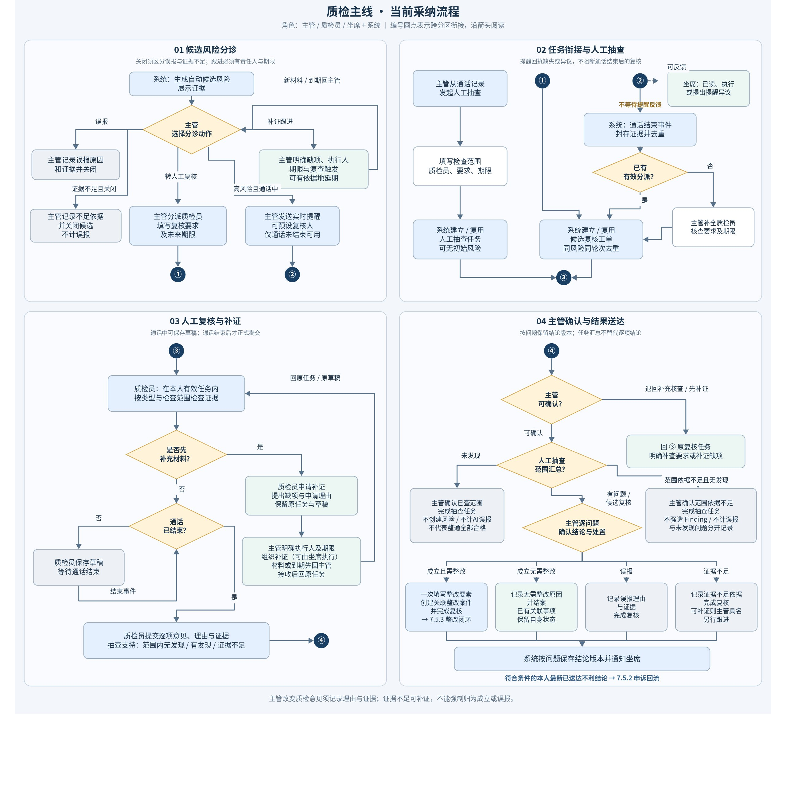

[可编辑 SVG](流程图/01-质检主线.svg) · [Mermaid 流程源](流程图/01-质检主线.mmd)

**现行角色交接时序图**

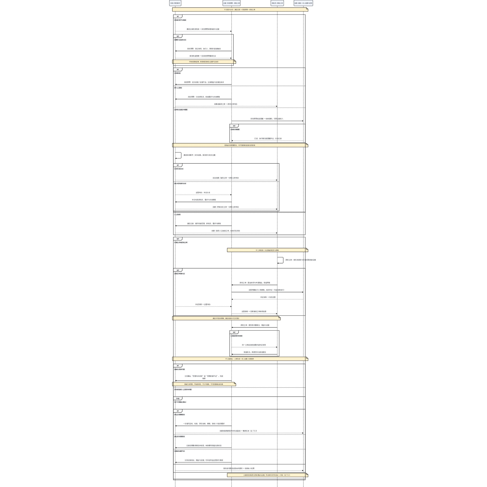

[Mermaid 时序源](时序图/01-质检主线.mmd) · 飞书画板支持放大查看交接细节。

补证/观察是主管分诊或确认中的跟进方式，必须有缺失项、责任人和期限；新材料或到期后回主管。主管可继续分派、记录有依据的延期或以证据不足关闭。提醒回执缺失或提醒异议不阻断通话结束后的复核。

#### 7.5.2 申诉回流

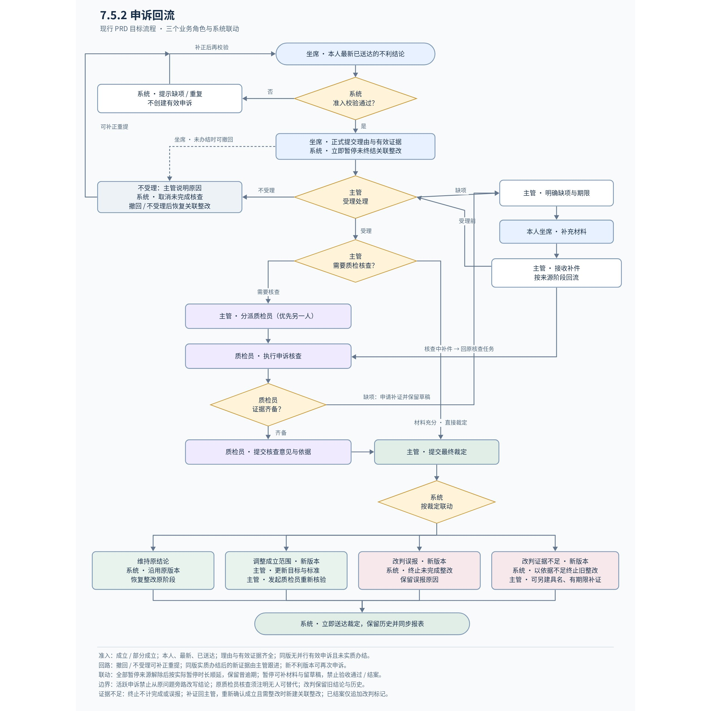

[可编辑 SVG](流程图/02-申诉回流.svg) · [Mermaid 流程源](流程图/02-申诉回流.mmd)

**现行角色交接时序图**

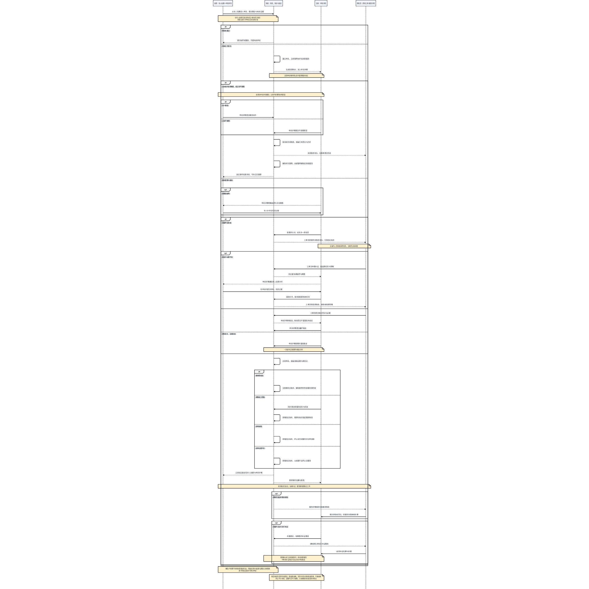

[Mermaid 时序源](时序图/02-申诉回流.mmd) · 飞书画板支持放大查看交接细节。

图中暂停是有效提交触发的系统动作，不等待主管点击受理。提醒阶段的异议是提醒反馈；正式申诉只针对已送达的人工结论。补件重提一律先回主管；专业依据不足可登记补证，不新增专家角色。

#### 7.5.3 整改执行与验收

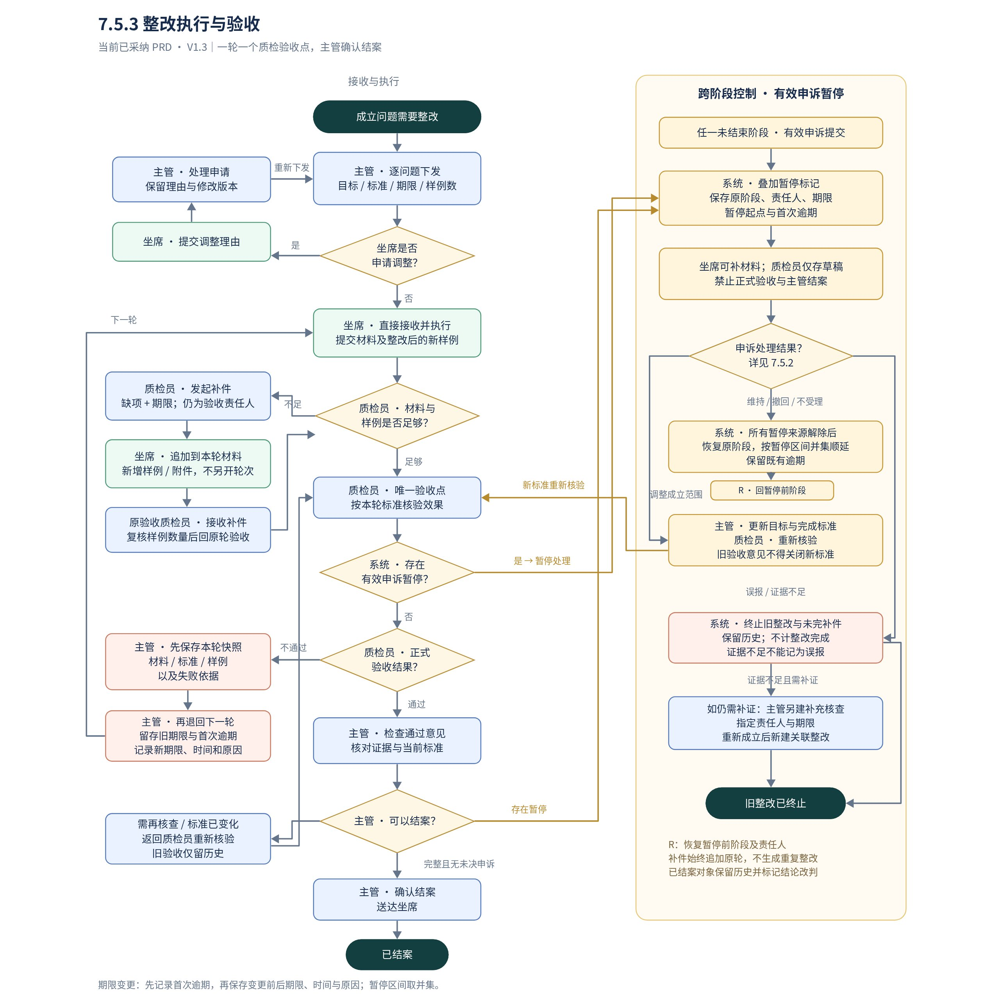

[可编辑 SVG](流程图/03-整改验收.svg) · [Mermaid 流程源](流程图/03-整改验收.mmd)

**现行角色交接时序图**

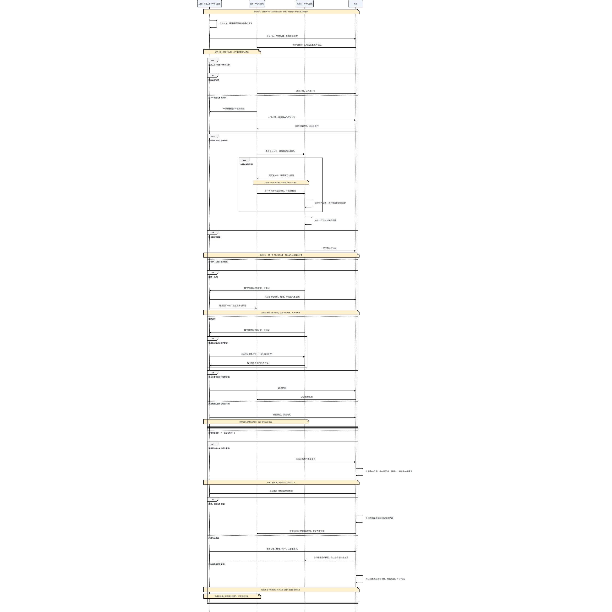

[Mermaid 时序源](时序图/03-整改验收.mmd) · 飞书画板支持放大查看交接细节。

一轮整改只有质检员一个验收点，主管决定是否结案。主管需要再次核查时返回质检员，不能自行把失败改成通过。模拟数据允许演示通过、失败和待补样例，但材料提交本身不触发验收通过。

### 7.6 核心对象状态与责任

| 对象 | 主要状态 | 当前责任与出口 |
| --- | --- | --- |
| 候选风险 | 待分诊、跟进中、已转复核、已关闭 | 前两态由主管负责；跟进须说明是补证或提醒；关闭保留误报/证据不足原因 |
| 复核任务 | 待复核、复核中、待主管确认、已完成、已取消 | 前两态质检员负责，待确认归主管；补充核查回质检员；已取消保留历史且不产生结论 |
| 申诉 | 待受理、待补充、核查中、待裁定、已办结、已撤回 | 主管/坐席/质检员按阶段交接；不受理是带理由的办结结果，不删除记录 |
| 整改 | 待接收、执行中、待验收、待主管处理、已结案、已终止 | 坐席→质检员→主管；待主管处理细分待结案/待退回；暂停和待补材料是叠加标记 |
| 规则/资源版本 | 草稿、当前生效、历史版本 | 主管维护；发布只切换新引用；历史不能原地覆盖 |

风险逐项结论为风险成立、误报、证据不足；人工抽查任务还可汇总为“检查范围内未发现问题”，不将其记成误报。任务完成须检查范围内所有必查项已有结果或明确证据不足原因，每个成立问题已指定后续去向。成立后的去向为无需整改结案或已转整改；两种均可完成本次复核，独立整改通过验收并经主管确认后才算整改完成。

### 7.7 核心功能 PRD：通话与证据（F01）

使用者从列表、预警、工单或报表进入同一通话详情。列表字段包括通话编号、业务、坐席/班组、起止时间、时长、检测状态、候选风险数、最新人工结论概况。

详情提供录音播放/暂停、进度定位、角色转写、命中高亮、前后文、规则与资源版本，以及关联风险、工单、申诉、整改。点击证据时间跳到对应音频与话轮；同一通话多风险切换不重新创建通话记录。

样例音频可使用可合法使用的合成素材。无音频的特定样例明确显示缺失，转写仍可阅读；不以会移动的进度条冒充真实回听。原始转写与修订文本分开保存，P0 不提供通用逐字稿编辑器。

验收：不同入口打开同一对象内容一致；至少一条完整主流程能实际回听并定位；失败/未检测与正常未命中可区分；坐席搜索和直接链接均不能看到他人记录；CSV 与当前筛选一致。

检测状态的示例契约：未开始为待处理；至少一个必需项已开始而整批尚未结束（含排队/待重试）为处理中；所有必需项都执行成功为已完成；全部结束但部分必需项失败为部分失败；全部必需项失败为失败。成功执行但无法判断与执行失败分开：前者的业务结果可以是证据不足。必需项集合随场景固定，不默认要求 16 项逐通检测。人工抽查结果不把自动检测失败改成成功；已完成也不等于没有风险。

人工抽查可关联同通话已有问题，禁止重复关联或抢占其他进行中复核。每个正式结论版本保存选用证据、规则版本和检测批次；详情区分原始命中与各版结论，申诉和整改固定引用对应版本。旧记录未保存独立证据时明确提示，不伪造回填。

### 7.8 核心功能 PRD：分诊与实时提醒（F02、F03）

主管选中候选风险后查看业务场景、严重度、证据、当前阶段及下一动作。“关闭候选”“要求补充材料”“转人工复核”直接展示；通话中另显示“提醒坐席”。关闭表单区分误报和证据不足，补件直接进入缺项表单。阶段主动作以实心按钮突出，不增加“更多操作”入口。

关闭须填写原因类型、具体说明和证据；补证须填写缺失项、执行人、期限和复查触发条件。分派须填写有效质检员、复核要求和未来期限，保存后同时更新主管队列与质检员待办。

提醒仅在通话未结束时可用，填写提醒内容、接收坐席，可预设复核人。坐席收到后可已读、反馈执行情况或提出提醒异议；发送、送达、已读、执行反馈分开记录。原型用场景事件模拟通话结束，不把“挂断客户电话”设计为主管业务按钮。

结束事件封存当前证据。已存在有效分派时自动复用/创建对应复核；分派不存在或失效时进入待主管补全，不随机指定人员，不静默关闭。同一风险和轮次重复收到结束事件只保留一个任务。

验收：误报与证据不足分别查询；补证到期有待办并可退出；提醒不是最终违规；回执缺失不阻断转复核；已结束通话无法再次发实时提醒；空队列仍可切换分类。

提醒同时进入本人“质检工单”的常驻队列与待办通知。坐席页分为“需我处理 / 全部事项 / 通话提醒 / 质检结果”，未读提醒计入需我处理；标记已读只清除阅读待办，仍可在全部事项和通话提醒中查看、反馈或提出异议。执行反馈为可选动作，不新增强制反馈任务；提醒与正式结论分别记录，不互相替代。

### 7.9 核心功能 PRD：复核与主管确认（F04、F05）

质检员仅处理分派给自己的有效任务，按任务类型和检查范围提交意见、理由及证据；候选复核逐项判断风险成立/误报/证据不足，人工抽查另支持范围内未发现问题。保存草稿不改变责任人；提交后进入待主管确认。材料不足时提出缺项、执行人及期限，由主管组织并回流。申诉核查只向申诉案件提交意见，不直接发布新结论或再建整改。

主管可以确认或退回补充核查；改变质检意见须记录理由和证据。依据不足时先补证，不强制判断成立或误报。最终结论通知坐席并留在本人结果中。申诉核查意见只在申诉案件裁定后形成结果，不重复发布；D03 已采纳：默认优先选择另一名质检员，原复核人核查须记录无人可替代的原因。

风险成立后提供“无需整改结案”和“下发整改”两个出口。无需整改须记录原因，例如当次已经纠正并有证据、仅需记录或已存在关联整改；已有关联事项继续保留自己的状态。下发整改弹窗一次完成责任坐席、目标、期限、标准、验收质检员及复测要求，提交即创建案件并完成复核，不生成额外待下发草稿。

验收：无整改的成立风险仍计为成立且可申诉；误报不生成整改；证据不足不计误报；仅记录已读不会变更人工结论；工单完成不等于关联整改完成。

复核保存与提交共用表单；通话中可留草稿，结束后才正式提交与送达结论。主管逐问题选择整改或无需整改理由，可复制上一问题要求。有效申诉期间禁止从原问题另行改写正式结论，新证据进入当前申诉。主管待分诊事项只进入风险预警，工单队列及导航按对象实际所属页面计数。

### 7.10 核心功能 PRD：申诉（F06）

坐席仅可对本人最新已送达的风险成立或部分成立结论正式申诉，必填理由并关联有效证据。误报、证据不足等结果通过补充意见与主管补证跟进处理。同一结论版本同时只允许一件有效进行中的申诉；撤回、不受理后可补正重提，不消耗实质裁定机会；实质办结后同版不无限重复，新证据由主管登记跟进，新不利结论版本可再次申诉。以上为已采纳 D01。

主管受理、退回补充或说明不受理原因；受理后可以依据充分材料直接裁定，或分派质检员核查。受理前补件和核查中补件均由主管提出明确缺项；坐席重提后先回主管，再交原核查人，保留来源阶段和轮次。

裁定支持维持原结论、改判为误报、改判为证据不足、调整成立范围。原结论和证据保留；维持沿用原结论版本，仅改判新增版本。调整成立范围时同步修改整改目标与标准，旧验收意见不可关闭新标准任务。坐席可撤回尚未办结的本人申诉；撤回不等于承认原结论。

P0 不设置 3/1/2/3 工作日制度。补件和核查期限由主管指定，逾期提示而不自动判败；申诉创建时的初始跟进期限为原型演示值，可由主管调整，并不构成客户 SLA。重提与同版实质办结限制按已采纳 D01 执行。复杂复议与窗口配置后置。

验收：重复点击不重复建案；补件不绕过主管；核查意见不直接变成最终裁定；改判保留历史、更新有效结论及报表；非本人不能提交。

受理表单提供“受理并分派”和“受理并裁定”：一次提交内完成受理和下一动作，第二步失败则整体不生效，重复请求不重复创建对象。核查中补证等待坐席回复时，父申诉和原核查不计主管办理待办；回复后只在原申诉产生主管接收补证待办，接收后恢复原质检员核查。等待状态可以在进行中查看，具名执行人与正式意见责任分开。

### 7.11 核心功能 PRD：整改与暂停（F07、F08）

下发后坐席直接接收任务，查看问题、目标、完成标准、期限和所需样例。要求不清楚或不可执行时向主管申请调整，记录修改版本，不退回已完成的原复核工单。坐席提交文字说明、关联样例或预设附件后进入待验收。

质检员检查材料与整改后的相关通话样例，给出通过、不通过或证据/样例不足。样例不足保持待验收并标记待补材料：质检员仍是验收主责任人，坐席是具名补件执行人，双方待办分别显示核验跟进和补件；每次补件有缺项、期限、提交记录及回到质检员的出口。不通过后进入待主管处理（待退回），通过后进入待主管处理（待结案）；两者不能共用“已通过”标记。主管可要求再核查，不能绕过质检员验收直接通过。

首版不固定“7 天、10 通”等客户制度。主管下发时填写观察要求与所需样例数量，使用演示值；完成标准修改须保留理由及版本，相关待验收或待结案任务须先回到质检员确认；旧验收意见保留为针对旧标准的历史，不可拿旧意见直接关闭新标准任务。示例用整改后的通话/材料表现改善，不能把提交培训说明自动算作效果达标。

有效申诉提交后，若存在未结束的关联整改，则设置“申诉暂停”：保存暂停前阶段、责任人、原期限、暂停起点及是否已逾期；允许追加说明，禁止进入验收通过或结案。重复暂停事件不重复累加；如存在多个暂停来源，记录来源集合，仅在全部解除后恢复，重叠区间按时间并集计时。整改材料补充可以继续，暂停期内的意见只能保存草稿，不得发布通过或结案。

维持、撤回或不受理后恢复整改原阶段，按实际暂停时长顺延期限，保留暂停前逾期标记。改判为误报时终止未完成整改并注明误报原因。D02 已采纳：改判为证据不足时，以“原整改依据不充分”终止旧人员整改，不计完成或误报；能补证时另建具名、有期限的补证跟进，后续重新确认成立须新建关联整改。调整成立范围时更新目标和标准并重新核验。已结案整改保留历史，追加来源结论改判标记并在报表单列。

验收：申请整改只产生一件案件；补材料不会新建重复整改；没有合格验收不得结案；暂停期间不能结案；恢复时长可复算；终止不计入完成；已逾期事实不被申诉清除。

验收统一从“验收处理”进入同一表单，提供“保存草稿 / 提交验收意见”。草稿保存结果、说明、补件期限（如适用）、轮次、标准版本、保存人和时间；刷新或重开恢复已保存内容。轮次、标准或验收人变化后，旧稿保留为参考，当前验收人须确认已核对本轮材料与标准才能再保存或提交。旧稿归档，旧验收人失去写入权限。暂停或等待补件时可继续保存草稿，正式验收仍受状态约束。

普通补证改判与申诉改判共用整改终止处理：同步结束未回复、已回复待接收的失效补件，显示“随整改结束”及原因，保留要求、原回复和材料；终止后的旧页面不能继续回复或接收。维持结论则恢复原补件。退回前保存本轮标准、材料、样例与验收意见；变更期限前记录已发生的逾期及调整前后值。

### 7.12 核心功能 PRD：质检规则（F09）

提供对应 10 类指标的分类入口，规则列明名称、主指标、适用业务、判断说明、严重度、证据要求、关联资源、版本。关键词检出/禁用词、情绪识别/消极情感分别呈现；关联指标不重复计数。

主管只能编辑该规则明示开放的字段，例如静默时长阈值、适用业务或提醒触发参数；无开放字段的规则只读。规则结构、主指标、检测器编排、证据契约不可编辑，不提供新建或删除规则逻辑入口。

参数编辑 → 本地字段校验 → 修改差异与引用预览 → 查看明确标为示例的预设检查 → 确认模拟生效。D05 已采纳，开放字段见下表与实现记录：R-AC-003 静默阈值，单位秒、默认 15、允许 3–60 的整数；R-INT-001 业务范围，默认全部业务，选项为全部业务/账户查询/信用卡/转账汇款；R-AL-001 提醒触发，默认高风险候选，选项为高风险候选/所有候选/关闭提醒。其余规则只读。预设检查失败保留草稿；发布新增版本。在途检测固定开始时快照，新启动使用新版；历史重检显式新增批次，不修改旧结果引用。

验收：仅主管能修改白名单字段；取消不改变生效版本；非法参数阻止提交；发布后列表、详情、引用关系一致；示例检查明确属于原型模拟。

### 7.13 核心功能 PRD：业务资源（F10）

保留词库、业务知识、SOP 三类。词库条目含词语、分类、适用角色和例外说明；知识条目含问题/主题、答案、业务范围及依据；SOP 含步骤顺序、必要步骤和允许例外。每类均有资源编号、状态、版本、更新时间和引用规则。

主管新增条目或从当前版本创建草稿；编辑、保存后记录出现在列表，不能只弹成功提示。基础校验包括必填、同范围重复词条、空 SOP 步骤及缺失引用。质检员只读并可提出补充意见，坐席仅查看本人案件引用的必要内容。

发布前显示内容差异、受影响规则、预设检查结果及生效范围。确认发布后只生成新资源版本；另行选择受影响规则并确认切换引用，才为所选规则生成新的引用配置版本或快照；不原地修改已有 RuleVersion 指向的资源。新启动的示例检测取新快照，已开始的检测和历史案件保留旧快照；历史资源仍可从旧案件查看。检查失败保留草稿并给出修正入口；不物理删除仍被历史引用的版本。P0 不建设多部门审批、真实解析任务或模型训练。

验收：三类各至少一个可维护示例；草稿/生效/历史可区分；发布后规则引用不变，确认切换后的新检测引用新版，旧案例保留旧版；不能用资源维护绕过固定规则逻辑的权限。

### 7.14 核心功能 PRD：质量报表（F11）

主管共享业务、班组、坐席筛选；日期由各视图明确解释：质检概览/问题分布按通话结束时间，申诉改判按裁定时间，任务按到期时间，当前积压是截止时刻的全部未完成对象。界面和导出显示“日期作用于哪个字段”，不得把同一个日期框误解为所有指标使用同一批通话。每张卡片标明统计单位与时间口径，可下钻到同一组通话、风险或案件；导出包含当前筛选、统计截止时间及口径。

| 指标 | 首版口径 | 防止误读 |
| --- | --- | --- |
| 应质检通话 / 已完成 / 部分失败 / 失败 / 处理中 / 待处理 | 按通话结束时间选定通话群，按唯一通话 ID 和该次检测的必需检查项计算互斥状态，截止时刻保持一致 | 部分检测失败单列，不伪装全项成功；不声称真实系统全量覆盖 |
| 候选风险数 | 该通话群中来源为自动检测的候选 Finding 去重数；人工发现单列 | 不等同于通话数或违规数 |
| 人工确认风险数 | 该通话群中截止时刻最新有效人工结论为成立的问题编号数，含自动候选和人工发现，来源分别展示 | 申诉中单列标记；改判后更新当前口径并留历史 |
| 确认风险通话占比 | 已完成检测通话中至少有一个有效成立风险的通话数 / 已完成检测通话数 | 未处理、失败另列；分母为零显示暂无数据 |
| 人工判定误报占比 | 已获确定人工结论的自动候选中：误报数 /（误报数 + 风险成立数） | 仅自动候选样本；人工新增问题、无发现抽查、证据不足和待判定不进入分母；不是模型标准 FPR 或准确率 |
| 申诉改判占比 | 期间办结且改判的申诉数 / 期间已完成实质裁定的申诉数 | 按裁定时间；撤回、不受理不进入该分母 |
| 整改状态 | 当前待接收、执行中、待验收、待主管处理、已结案、已终止；另列其中暂停、待补材料 | 暂停是叠加标记，不与生命周期状态相加凑总数 |
| 按时完成率 | D04 已采纳：首版不展示比例，仅展示按时结案数量 | 三类对象分别核对；已逾期后暂停不能从原统计记录中消失 |
| 当前积压 | 截止时刻未完成总数、其中逾期、其中暂停及最早积压时间 | 不受“本期新建”限制，避免历史积压消失 |

D04 已采纳：首版展示任务总量、当前积压、逾期、暂停、延期、终止、按时结案数量与明细，不展示按时完成率。原期限、有效期限、每次暂停和调整、首次逾期及报告截止时刻保留；暂停不能抹除曾逾期事实。按时结案数量按有效到期日归属，需完成于有效期限内且无首次逾期记录；该数量不暗含比例分母。

坐席/班组表展示通话量、已判定量、确认风险、误报、证据不足与整改状态；无统一评分办法时不生成综合分或绩效排名。不同指标可各显示样本量，低样本结果不放大解释。

验收：点击任一数值能核对明细数量；一通多风险不重复计算通话；无整改成立、证据不足、申诉改判、暂停、逾期、终止、零分母各有样例；导出与页面同口径。

报表采用连续的“指标摘要—图形分析—对象明细”布局。质检概览 4 个摘要指标可切换趋势；问题分布使用主指标条形图和判定环图；坐席/班组使用通话量对比和问题矩阵；申诉与整改使用 3 个当前积压摘要、6 类基础状态和 4 项期间结果。其余指标常显，均可核对明细与导出。

| 视图 / 区域 | 展示与统计 | 操作与结果 |
| --- | --- | --- |
| 共用筛选 | 默认近 7 天（含当天，共 7 个自然日），北京时间；日期、业务、班组、坐席直接展示 | 近 7/14/30 天、重置；换班组清除旧坐席；倒置日期就近报错并隐藏统计和导出，可交换日期 |
| 质检概览 | 范围内通话、自动处理成功占比、当前确认问题、人工确认误报占比；趋势按通话结束日归属 | 点击摘要切换趋势及同口径明细；点击日期点查看该日期段明细和分子/分母；可返回全期间 |
| 检测状态 | 已完成、部分失败、失败、处理中、待处理互斥构成；中心显示成功占比 | 图例显示数量、占比；点击直接进入该类通话明细 |
| 问题分布 | 10 类主指标按当前成立问题数降序；判定构成为成立、误报、证据不足、尚未判定，含自动和人工来源 | 主指标点击定位该类问题；构成图例点击查看判定分组。此构成图与“仅自动候选”的误报占比是不同口径 |
| 坐席 / 班组 | 工作量对比；坐席 × 10 类主指标矩阵显示当前成立问题数；保留坐席明细表 | 点击坐席查看其通话；点击格子查看该坐席与该主指标的交集；0 也可核对空明细 |
| 申诉与整改 | 当前积压、整改基础状态、期间改判与按时办结分区；暂停和补件是附加标记 | 状态、结果和期限指标分别下钻；调整日期不使历史积压消失，业务/班组/坐席范围仍生效 |

趋势使用记录真实日期和当前有效结论重算，**不代表当日历史快照**。不生成缺失历史、环比或综合评分。最多 31 个时间点：超过 31 天时按连续日期段聚合，图中标明每段天数。数量为 0 正常显示；比例无分母及未来日期留空，不连接成 0%。分段比例由本段分子/分母计算，不能平均每日百分比。

图表、明细与 CSV 派生自同一对象集合；日期钻取后的说明和分母使用该日期段。分页仅影响屏幕行数，导出包含当前选中分组的全部记录。图表或矩阵选中后焦点到明细标题；方向键/Home/End 可浏览趋势日期，Enter 查看，页签支持左右键。跨页查看事项后“返回来源页面”恢复原报表视图、选择及条件。刷新重新进入默认视图和近 7 天；业务演示状态继续保留。

390px 窄屏筛选与摘要分列、图形上下排列；趋势、矩阵和明细在各自区域横向滚动，不使整个页面溢出。色彩同时配名称与数量，图例是可聚焦按钮；不以“更多”折叠常用筛选或指标。

### 7.15 核心功能 PRD：通知与统一交互（F12）

分派、补件、意见提交、结论送达、申诉、整改验收和资源发布生成对应事件。通知包含对象、动作、摘要和发生时间，点击进入有权限的具体位置；已读仅改变通知状态。失去权限或对象不再待办时说明当前状态，不让旧通知执行过期动作。

提交前验证必填与未来期限；提交期间防重复。成功必须伴随真实的前端记录变化；失败保留输入并给修正/重试入口；取消不写入记录。非责任人只读并显示等待谁处理。

责任补充：补件执行人是限定动作的例外，只能提交对应材料；质检员和主管的正式意见仍由当前主责任人提交。主管可对未完成任务转派并记录原因；原责任人的未提交草稿保留但失去提交资格。各期限标明日期/时间与 Asia/Shanghai 时区，演示状态使用统一时钟，避免固定历史种子到期后全部意外显示逾期。

全局保存演示状态；刷新、角色切换后继续流程。重置数据需提示将清空本轮演示操作，恢复预设样例。种子快照显示为示例初始状态，时间线仅把实际操作写成已发生事件。

默认队列按当前可办理阶段计算，等待他人的事项留在进行中。补件嵌入原案件；已读提醒、知悉结果、接收整改为单次操作。兼容旧演示状态：补充结论证据快照、补证申请、整改轮次和期限记录；已结束整改的遗留未完补件恢复为只读结束状态。旧版仅保存的验收文字缺少轮次等依据，作为待核对参考；已经丢失的旧历史不伪造恢复。本轮不清空浏览器演示进度。

### 7.16 16 项指标与 P0 页面分工

| 指标 | 规则页 | P0 承接 |
| --- | --- | --- |
| 声纹识别 | 不显示为规则 | 完整目录保留，能力说明；首版不做注册管理 |
| 语音识别 | 不显示为规则 | 通话转写、角色区分和检测状态示例 |
| 关键词检出 | 显示 | 规则条件与命中词证据 |
| 文本纠错 | 不显示为规则 | 原始/修订转写的版本说明示例 |
| 情绪识别 | 显示 | 角色、情绪标签与话轮证据 |
| 意图识别 | 显示 | 业务意图条件，可由预设服务结果提供 |
| 覆盖率 | 不显示为规则 | 报表中应处理与处理状态的演示口径 |
| 时效性 | 不显示为规则 | 事件时间、任务期限和待办；不承诺模型时延 |
| 数据展示 | 不显示为规则 | 七模块的一致展示、筛选、下钻与导出 |
| 风险上报与干预 | 显示 | 提醒、回执、转复核的处置条件 |
| 服务礼仪 | 显示 | 开场/结束语等规则与例外 |
| 语言表达 | 显示 | 静默、抢话、语速等预设证据 |
| 专业性 | 显示 | 知识/SOP 依据及人工核查 |
| 隐私性 | 显示 | 敏感信息事件、角色及语境 |
| 禁用词 | 显示 | 禁用词规则与引用/否定边界 |
| 消极情感 | 显示 | 服务态度与上下文证据，独立于情绪标签 |

全目录放在 PRD，并在规则页提供常驻“16 项指标目录”按钮，不增加第八个导航。规则分类完整覆盖 10 类；重点演示案例集中在隐私、身份核验、服务礼仪、禁用词、消极表达及语言表达。目录/示例不表示真实 16 项能力已实现或验收通过。

### 7.17 UI 与代码目录

页面名称仅在顶栏面包屑保留一个主标题；正文直接进入业务内容。移除重复介绍、当前角色、侧栏口号和页脚。作业页不再显示“当前范围事项 / 需我处理 / 当前逾期”大数字卡；导航角标表示本模块全业务待办，页签及列表按当前筛选计数，逾期显示在筛选栏并使用当前结果范围。每个筛选区只保留一个重置入口。例如账户查询筛选后待办 2、全部候选 4；重置后待办 5、全部候选 13。详情中的当前处理人仅在动作区展示一次。

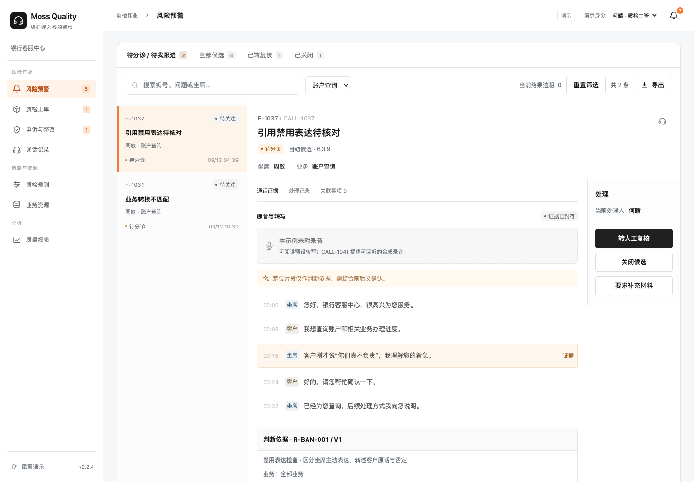

沿用当前浅灰画布、白色内容面、细边框和紧凑表格。橙色用于选中与证据，黑色用于主要动作，绿/红配文字表示结果和风险。当前画布 #F6F7F8、正文 #171717；通用面板圆角 10px。报表使用边框 #E4E7EB、图表强调 #EF7927、文字强调 #B75717，数字等宽；以 27px 摘要数字、15px 分区标题和 12–13px 说明建立层级。继承字体与组件尺寸，根据实际页面可读性调整，不重做品牌风格。

固定侧栏与顶栏，常用筛选和当前动作直接展示。通话列表只负责查询；点击编号或查看详情进入独立详情视图，返回保留筛选和页码。详情显示通话状态，不把没有待办误写成“已办结”；原话、判断依据和引用快照直接展示，检测批次和历史轮次可按需展开。

规则与资源采用“左侧列表、右侧完整详情”。规则标题下优先显示参数配置：当前值、单位、范围与业务作用；点击参数旁的编辑按钮就地进入编辑态，同时显示修改原因、保存草稿和取消。固定规则与只读角色给出明确说明。继续仅开放静默阈值、适用业务、提醒触发三个白名单字段，不扩大规则搭建能力。

草稿通过新旧值对照、检查结果、发布按钮形成连续链路。未保存参数切换模块、规则或版本时保留输入并就近提示；保存草稿不直接生效。新增资源保存后自动定位到新条目。历史版本只读，先返回当前版本再修改。

正文与表单采用清晰的字号和对比度；弹窗使用浏览器原生 dialog，支持焦点限制、Escape 和焦点恢复。390px 窄屏在列表与详情之间切换，不挤压三栏；保留可见返回入口。按钮不做缩放按压动效，结果提示采用 200ms 透明度反馈；高频导航与数据即时响应，键盘操作不附加动效，减少动态效果设置保留短暂淡入淡出。

队列翻页同步本页选中对象与详情；日期倒置时就近报错、暂停导出，并可直接交换日期。以上分别关闭复评 N05 与 N06。

以下为本轮实际目录。共享页面组件承接七个业务入口，减少重复流程实现；核心逻辑集中在 lib，便于后续按模块拆分。

```text
质检-mvp-p0/
├─ app/                         页面入口、布局、正式样式
├─ components/                  队列证据、动作表单、规则资源、报表与共享 UI
├─ lib/
│  ├─ workflow.ts               对象、权限、状态迁移、历史与通知
│  ├─ fixtures.ts               通话、风险、规则、资源和场景种子
│  ├─ store.ts                  浏览器持久化、身份恢复和统一时钟
│  ├─ reports.ts                统计口径、下钻和 CSV
│  ├─ report-visuals.ts         趋势、分类、矩阵与日期段明细派生
│  └─ official-indicators.ts    完整 16 项目录
├─ public/audio/                本地合成演示录音
├─ scripts/                     57 项业务/报表回归与 MVP 验证
└─ docs/reviews/
   ├─ README.md                 唯一核心阅读入口
   ├─ PRD-银行语音质检-MVP-P0.md
   ├─ 实现与验收记录-MVP-P0.md
   ├─ 方案交付记录.md
   ├─ 合成音频说明.md
   ├─ 流程图/                    三条现行分支流程及历史来源
   ├─ 时序图/                    三条现行角色交接时序及预览
   ├─ 页面流程/                  页面事件总览、七页流程及预览
   ├─ 界面验收/                  桌面、手机、报表截图
   └─ sources/                  核心来源快照
```

页面共享对象和动作校验，不为每个页面复制一套流程。规则/资源版本、业务事件和统计由统一数据层派生；原型采用本地状态即可。代码迁移以核心模块为范围，原目录与原 Git 标签保留；旧方案代码在新目录也须按本 PRD 调整，不能只增加菜单。

### 7.18 页面事件与逐页操作说明

本节以七个现有页面为阅读入口：页面间事件说明触发、接收人和随案信息；页面内流程图说明处理路径；角色责任表说明动作及出口。7.5 三组流程图与时序图同时作为现行规范。图中的业务交接表示生成或更新对象与待办，浏览器是否切页由用户点击决定。

范围保持三角色、七模块、16 项指标和 10 类规则。N01—N04 已在 v0.2.2 修复，N05/N06 已在 v0.2.1 修复。当前动作、常用筛选和必要证据选择直接展示，不以“更多”折叠增加步骤。

#### 7.18.1 页面间事件流转

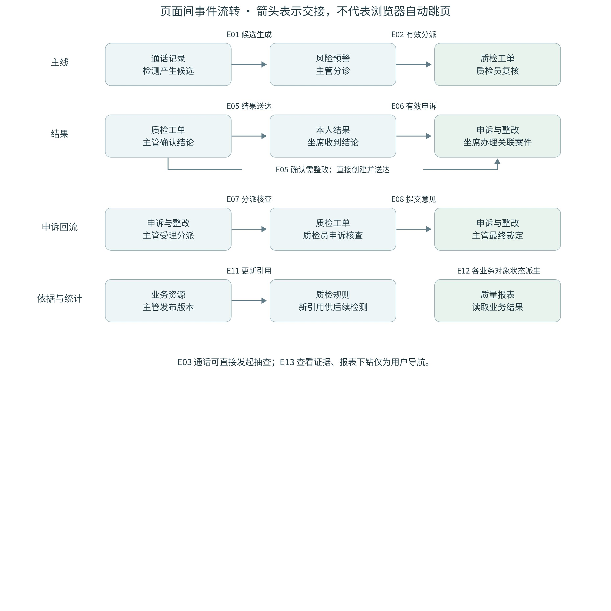

[可编辑 SVG](页面流程/events.svg) · [Mermaid 语义源](页面流程/events.mmd)

| 编号 | 触发页面与事件 | 接收页面及责任 | 随案信息与效果 | 类型 |
| --- | --- | --- | --- | --- |
| E01 | 通话记录：检测产生候选 | 风险预警 · 主管分诊 | 通话、候选、证据位置、检测与规则版本 | 业务事件 |
| E02 | 风险预警：主管有效分派 | 质检工单 · 具名质检员 | 关联风险/通话、核查范围、要求、期限 | 业务交接 |
| E03 | 通话记录：主管发起抽查 | 质检工单 · 具名质检员 | 通话与检查范围；可尚无具体问题 | 业务交接 |
| E04 | 质检工单：普通复核提交 | 同页 · 主管待确认 | 逐问题意见、证据和补查历史 | 同页交接 |
| E05 | 质检工单：主管确认结论 | 本人结果；需整改时 → 申诉与整改 · 坐席 | 结论版本；整改目标、标准、期限与验收人 | 送达及条件建案 |
| E06 | 本人结果：有效正式申诉 | 申诉与整改 · 主管待受理 | 原问题、已送达结论版本、理由与证据；暂停未终结整改 | 业务事件 |
| E07 | 申诉与整改：主管分派核查 | 质检工单 · 具名质检员 | 申诉来源、争议点、原结论、补充材料与期限 | 业务交接 |
| E08 | 质检工单：申诉核查提交 | 申诉与整改 · 主管待裁定 | 原申诉、核查意见、依据；不直接替主管发布裁定 | 业务交接 |
| E09 | 申诉与整改：申诉补件 / 整改补件回复 | 原申诉 → 主管；原整改 → 原验收质检员 | 所属案件、缺项、执行人、材料、原轮次 | 同页交接 |
| E10 | 申诉与整改：最终裁定 | 本人结果；对应整改恢复、重核或终止 | 最新结论、裁定依据、目标版本、暂停记录；立即送达 | 关联状态更新 |
| E11 | 业务资源：发布版本，再显式切换引用 | 所选规则引用更新 → 后续检测 | 发布只新增资源版本；切换另建规则快照，不改写旧案 | 两个独立动作 |
| E12 | 风险/复核/申诉/整改状态改变 | 质量报表 · 主管查看 | 按已定义时间口径、授权范围派生统计与明细 | 只读派生 |
| E13 | 报表明细 / 案件关联对象：用户点击 | 所属业务页 / 通话记录 · 原授权角色 | 同一对象、来源页与查询上下文 | 用户导航；不新建任务 |

#### 7.18.2 风险预警

**目的：**主管完成候选风险分诊，明确是关闭、补证、转复核还是通话中提醒。

**入口：**检测产生候选风险；主管默认待分诊入口；具名补证回复或到期跟进。

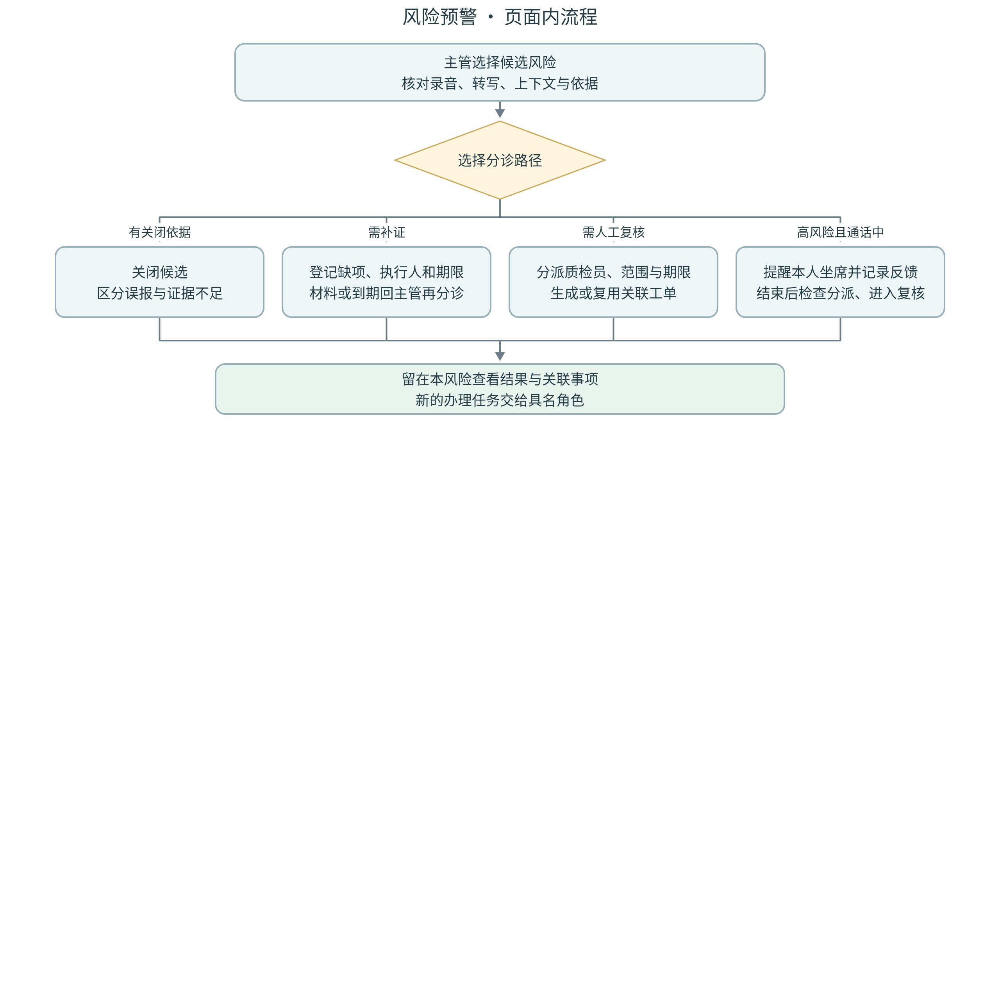

[可编辑 SVG](页面流程/alerts.svg) · [Mermaid 语义源](页面流程/alerts.mmd)

| 角色 | 本页或关联入口责任 | 交付与边界 |
| --- | --- | --- |
| 主管 | 查看证据；选择分诊路径；指定办理人及期限 | 完成分诊或收到补证后继续判断 |
| 质检员 | 没有独立预警入口；在分派工单中查看相关风险 | 收到关联工单后开始复核 |
| 坐席 | 从本人通知或质检工单查看实时提醒，标记已读，可反馈执行或异议 | 提醒反馈不替代正式质检结论 |

**事件与去向：**分派成功 → 质检工单；提醒发送 → 坐席通知及质检工单的通话提醒；通话结束 → 既有工单复用或主管补全分派。关闭候选不生成虚假整改。

**留在本页与回流：**补证属于当前风险的跟进；不是让主管重新录入同一风险。

**配套说明：**7.5.1 主线流程图与角色交接时序图。

#### 7.18.3 质检工单

**目的：**在同一工单中完成证据核查与主管确认，每个问题有明确后续去向。

**入口：**风险分派；通话记录发起人工抽查；申诉受理后分派核查；坐席收到本人提醒或正式结论。

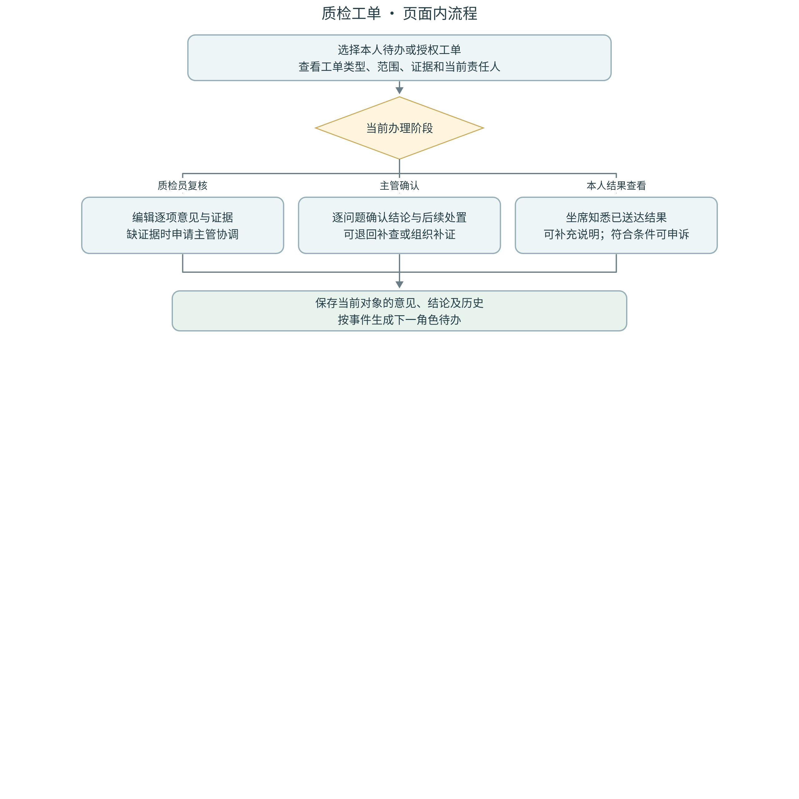

[可编辑 SVG](页面流程/workorders.svg) · [Mermaid 语义源](页面流程/workorders.mmd)

| 角色 | 本页或关联入口责任 | 交付与边界 |
| --- | --- | --- |
| 主管 | 分派、退回、补证协调；确认正式结论；逐问题决定整改 | 复核完成；需整改时同步创建关联整改 |
| 质检员 | 保存草稿、选择证据、申请补证、提交核查意见 | 通话结束后才能正式提交；申诉核查意见回裁定 |
| 坐席 | 查看本人通话提醒和已送达结果，已读、知悉、反馈、提出合规申诉 | 不能编辑结论；本人结果与复核操作分开呈现 |

**事件与去向：**普通复核提交 → 主管同页待确认；确认需整改 → 申诉与整改；申诉核查提交 → 原申诉待裁定；坐席提申诉 → 创建关联申诉。

**留在本页与回流：**逐项意见和主管确认共用案件上下文；不要求用户为了补证新建重复工单。

**配套说明：**7.5.1 主线、7.5.2 申诉：流程图与时序图。

**当前页面交互：**坐席的提醒与结果在同一模块内按类型筛选；已读后保留记录，正式结论不因提醒反馈而变化。

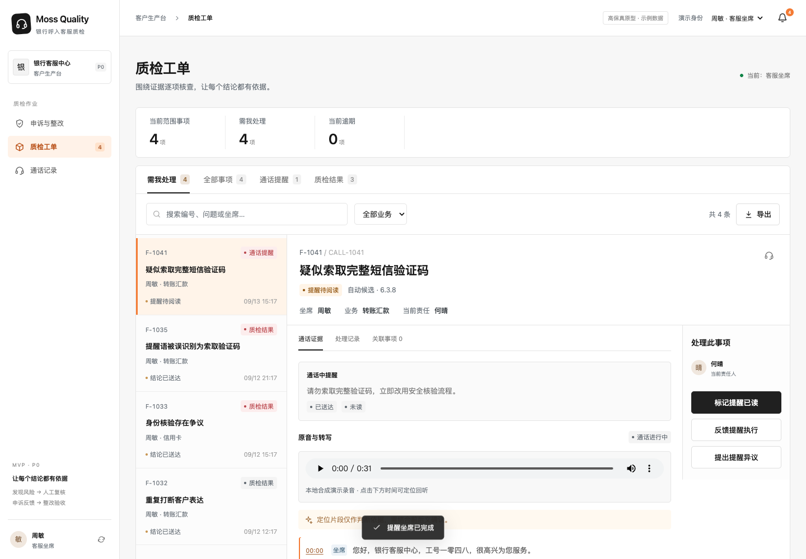

#### 7.18.4 申诉与整改

申诉与整改默认选择“全部类型”和“需我处理”，以一层状态页签浏览本人待办；申诉/整改是可选类型筛选，重置时一并清空。坐席发起申诉并执行本人整改；质检员在质检工单完成申诉核查，在本页验收整改；主管受理、分派、裁定申诉及处理整改要求、结案或退回。已有申诉详情不再提供跳回自身的“查看当前申诉”。原页面流程图中的“选择申诉或整改”表示按对象类型进入处理分支，不要求先选择类型才能看到待办。

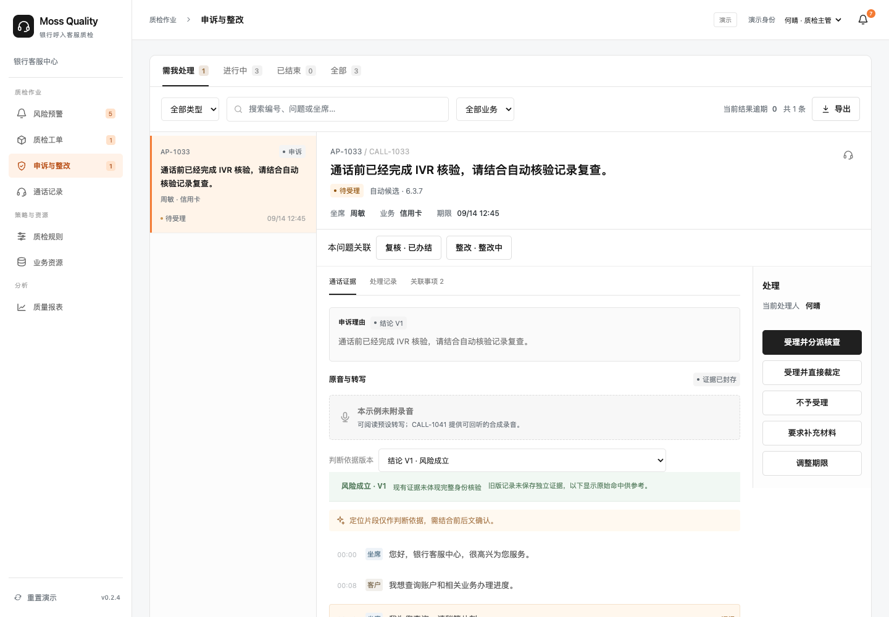

**目的：**在一个模块内分别办理申诉和整改，补件嵌入所属案件，交接责任清楚。

**入口：**本人对已送达不利结论提申诉；主管对成立问题下发整改；通知打开对应案件。

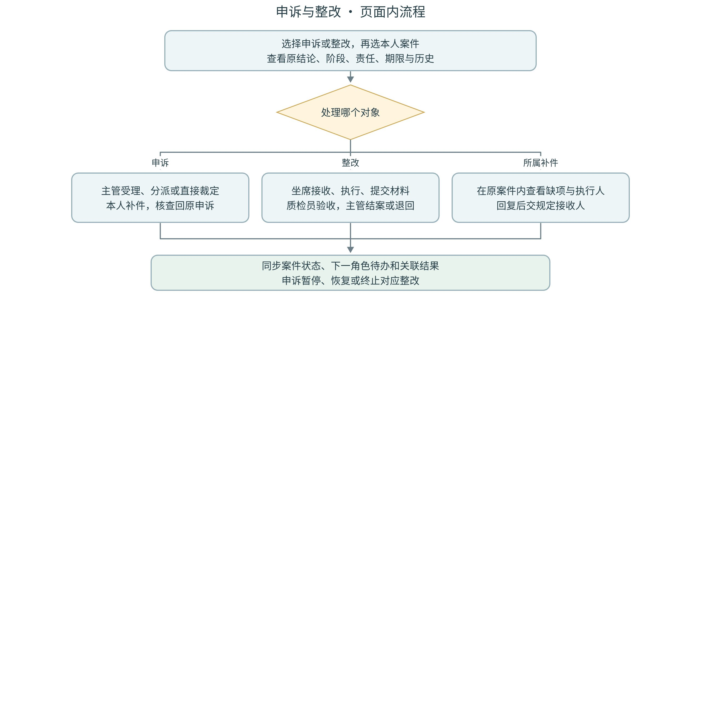

[可编辑 SVG](页面流程/improvement.svg) · [Mermaid 语义源](页面流程/improvement.mmd)

| 角色 | 本页或关联入口责任 | 交付与边界 |
| --- | --- | --- |
| 主管 | 受理及裁定申诉；协调申诉补件；调整整改要求；结案/退回 | 不绕过质检员把验收失败直接改通过 |
| 质检员 | 在工单页完成申诉核查；在本页验收整改与接收整改补件 | 材料不足回坐席补本轮；失败回主管 |
| 坐席 | 提交/撤回本人申诉；回复补件；接收与执行本人整改 | 仅本人对象；申诉未决期间可补材料 |

**事件与去向：**申诉分派 → 质检工单；核查提交 → 本页主管待裁定；整改补件回复 → 原质检员接收；裁定 → 结论版本及整改状态联动。

**留在本页与回流：**同一轮整改补件回原验收，不新开整改；申诉补件先回主管。规范中没有“坐席交给另一坐席”的路径。

**配套说明：**7.5.2 申诉、7.5.3 整改：流程图与时序图。

**当前页面交互：**验收处理在一个表单内保存和提交；旧稿需要核对时就近提示。补件显示当前交接阶段；随整改结束的补件保留材料与原因，并撤销操作入口。

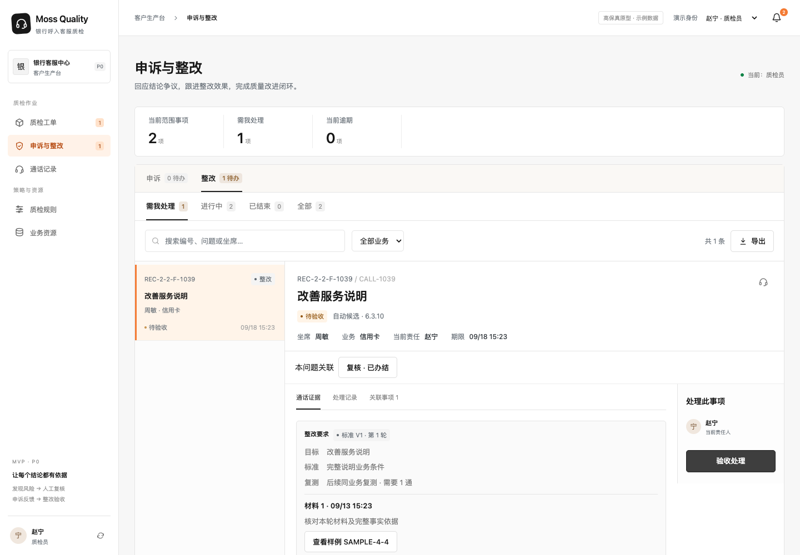

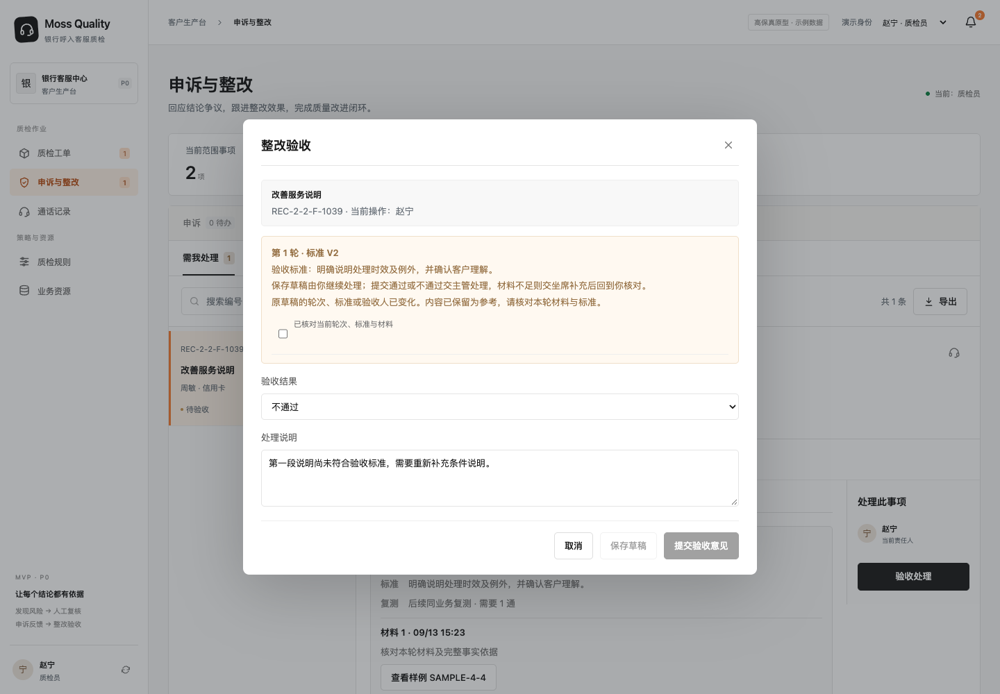

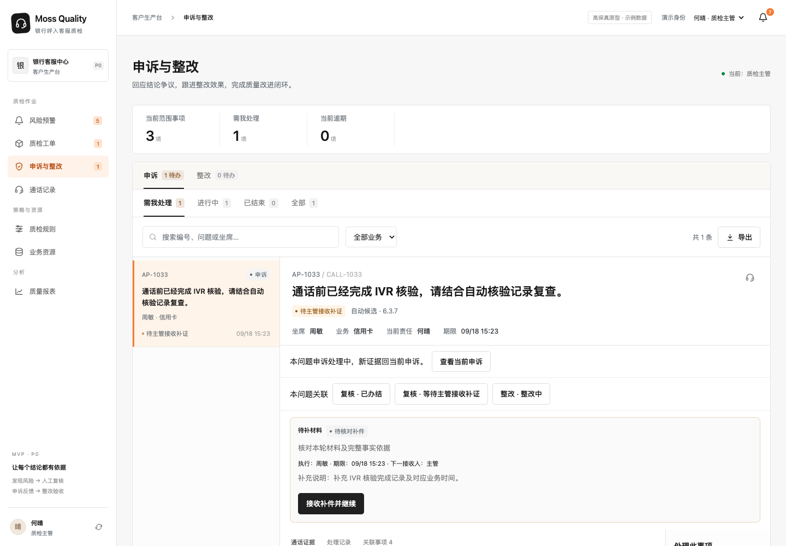

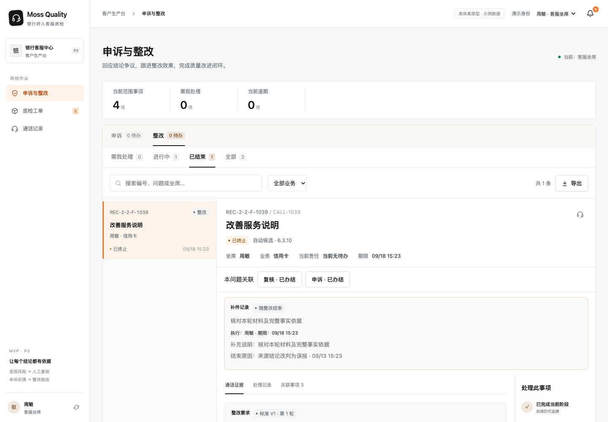

#### 7.18.5 通话记录

**目的：**作为统一证据入口查询通话、回听转写、查看检测及关联案件。

**入口：**按授权范围搜索；从风险/工单/申诉/整改样例/报表点击关联通话。

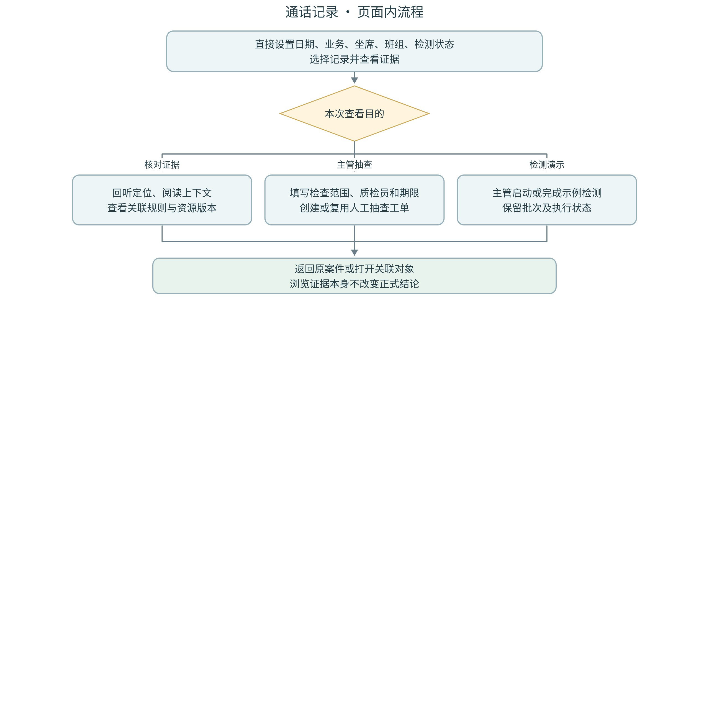

[可编辑 SVG](页面流程/calls.svg) · [Mermaid 语义源](页面流程/calls.mmd)

| 角色 | 本页或关联入口责任 | 交付与边界 |
| --- | --- | --- |
| 主管 | 管理范围查询、回听、人工抽查、检测演示 | 检测失败保持执行异常，不等同误报 |
| 质检员 | 查看本人任务相关通话及授权样例 | 从证据返回原核查或验收任务 |
| 坐席 | 查看本人通话和所需样例 | 无管理范围查询或分派权 |

**事件与去向：**人工抽查提交 → 质检工单；示例检测产生候选 → 风险预警。回听、筛选、导出、打开关联对象都是查看动作，不产生新任务。

**留在本页与回流：**打开通话使用独立详情视图，返回通话列表保留筛选和页码；跨页面打开的关联通话提供返回来源页面。原音、转写及判断依据在详情内直接可见，不在表格下方继续堆叠。

**配套说明：**7.5.1 主线流程及其时序；7.7 通话证据契约。

#### 7.18.6 质检规则

**目的：**理解固定规则口径并维护明确开放的少量参数，保证历史依据可追溯。

**入口：**主管/质检员进入固定规则列表；从案件点击其引用版本。

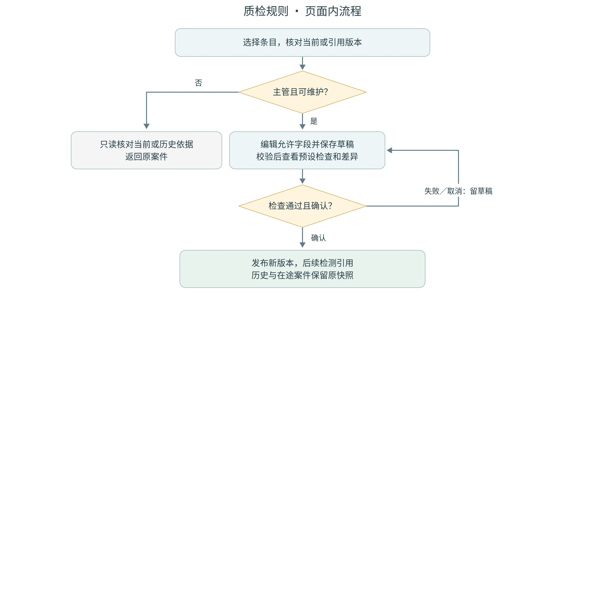

[可编辑 SVG](页面流程/rules.svg) · [Mermaid 语义源](页面流程/rules.mmd)

| 角色 | 本页或关联入口责任 | 交付与边界 |
| --- | --- | --- |
| 主管 | 修改三类开放参数；检查并确认模拟发布 | 只修改白名单字段；不新建规则结构 |
| 质检员 | 读取规则与任务引用版本 | 可以核对依据，不发布新版本 |
| 坐席 | 在本人案件中读取必要引用依据 | 无独立规则维护入口 |

**事件与去向：**参数发布 → 新规则版本供后续检测使用；本页没有自动创建复核或重写旧结论的事件。资源发布不改变引用；主管在业务资源页另行核对并选择切换规则引用。

**留在本页与回流：**在参数区域就地编辑，保存后展示新旧值对照，再检查与发布；未保存切换时保留输入并提示。检查失败留在草稿修正；历史版只读，用户明确返回当前版再维护。

**配套说明：**7.12 固定规则与版本生效契约。

#### 7.18.7 业务资源

**目的：**维护词库、业务知识和 SOP，为规则及人工判断提供可追溯依据。

**入口：**主管/质检员进入资源列表；从规则或案件打开实际引用版本。

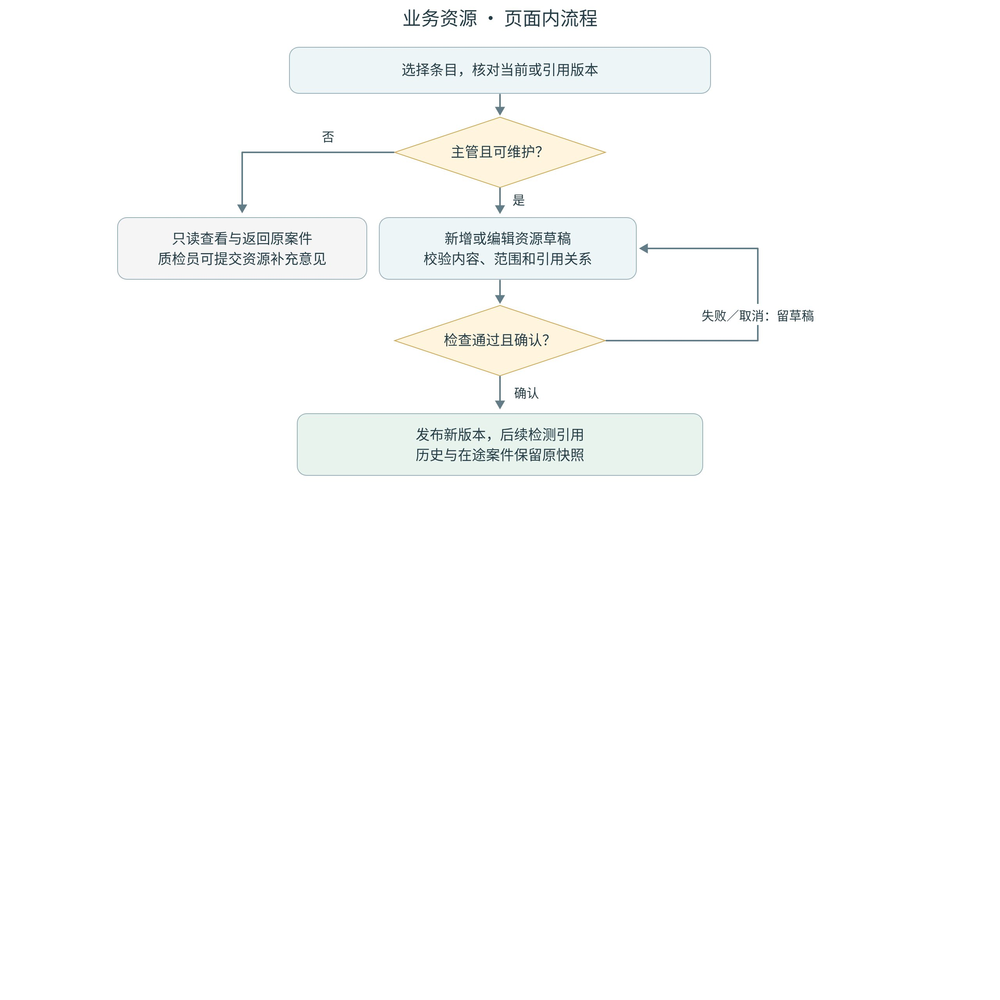

[可编辑 SVG](页面流程/resources.svg) · [Mermaid 语义源](页面流程/resources.mmd)

| 角色 | 本页或关联入口责任 | 交付与边界 |
| --- | --- | --- |
| 主管 | 创建、编辑、校验、检查、模拟发布资源 | 维护引用和生效范围，不改写旧快照 |
| 质检员 | 查看依据并提交资源补充意见 | 不能替主管发布 |
| 坐席 | 从本人任务读取必要资源依据 | 无独立业务资源导航或维护权 |

**事件与去向：**资源发布 → 资源新版本可用；主管另行核对并选择切换引用 → 所选规则产生新引用版本 → 后续检测使用；提出补充意见只追加反馈记录，未定义独立审批工单，不能画成已实现的发布待办。

**留在本页与回流：**新增入口直接可见，保存草稿后自动定位到新条目；编辑、对照、检查、发布均围绕当前资源。草稿错误就近修正，不引入多部门审批。

**配套说明：**7.13 业务资源与引用快照契约。

#### 7.18.8 质量报表

**目的：**主管理解质量现状并定位对应案件，统一统计口径与明细。

**入口：**主管进入报表；选择质检概览、问题分布、坐席/班组或申诉整改。

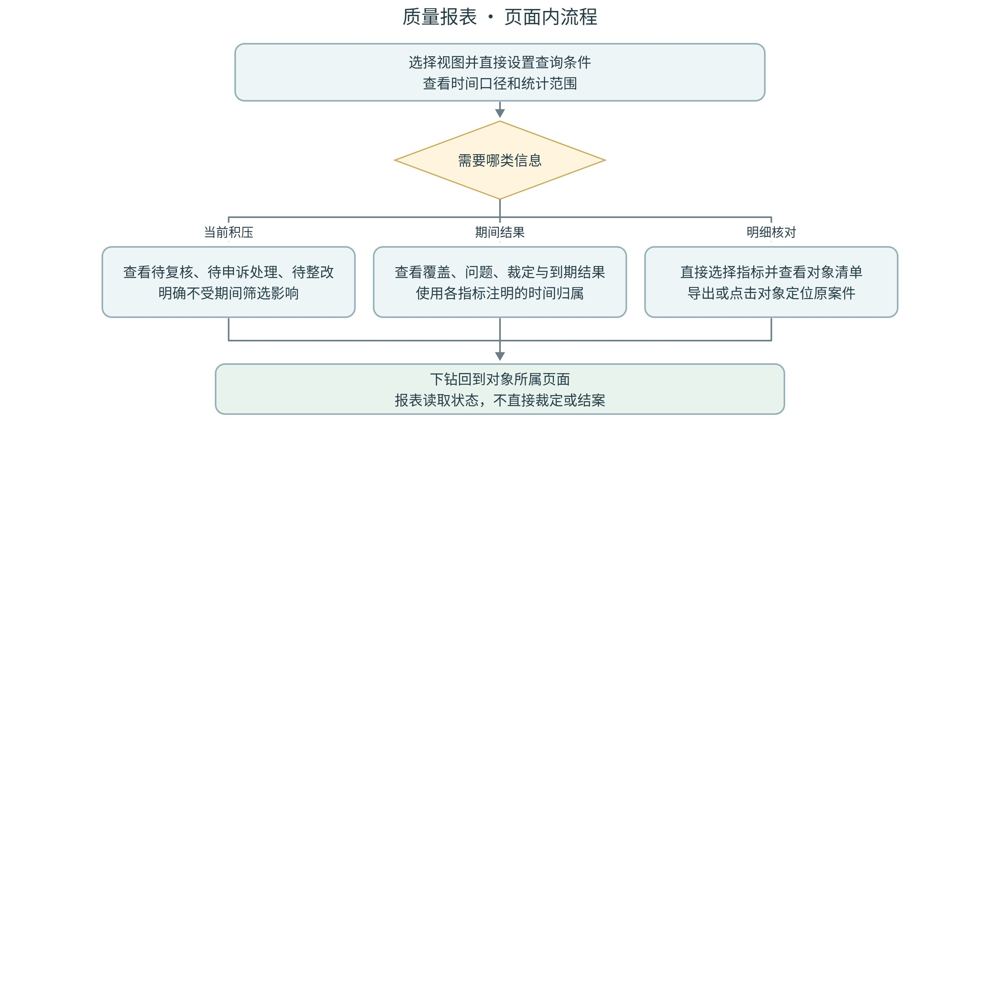

[可编辑 SVG](页面流程/reports.svg) · [Mermaid 语义源](页面流程/reports.mmd)

| 角色 | 本页或关联入口责任 | 交付与边界 |
| --- | --- | --- |
| 主管 | 筛选、查看指标口径、下钻、导出 | 进入业务页后按其阶段执行动作 |
| 质检员 | 不设独立报表入口，工作页看本人任务数 | 统计不扩张通话或案件范围 |
| 坐席 | 不设独立报表入口，查看本人结果和任务 | 不会从报表获得他人数据 |

**事件与去向：**风险、复核、申诉、整改状态变化 → 报表派生更新；指标、日期点、图例、坐席或矩阵格子点击 → 同范围明细；明细对象点击 → 通话/工单/申诉整改，属于用户导航，不额外创建业务任务。

**留在本页与回流：**摘要、图形和明细常显分区；期间与快照分区，不把待办数当已完成数。点击图表直接定位明细，进入事项后返回保留选择。刷新默认近 7 天概览；业务演示状态保留。

**当前页面（v0.2.4，独立浏览器的虚拟样例）：**

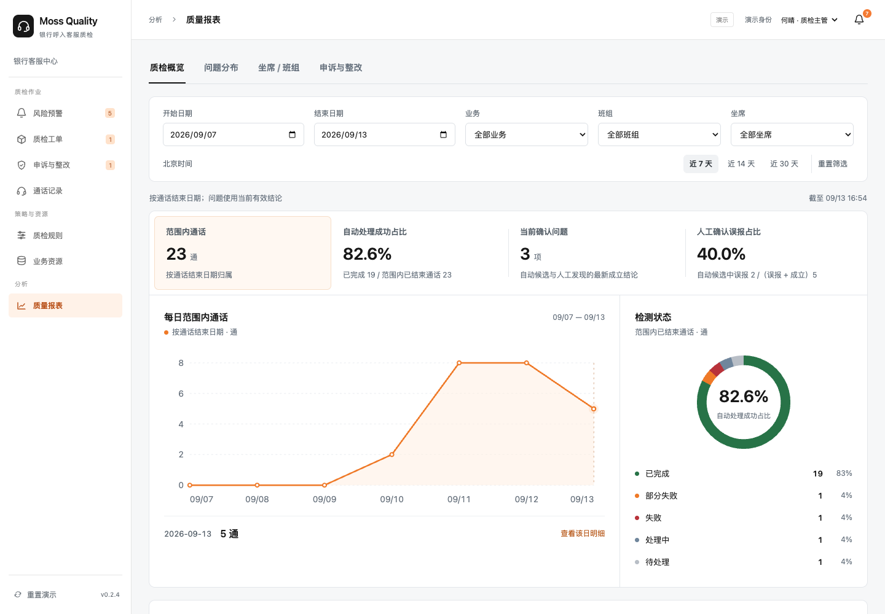

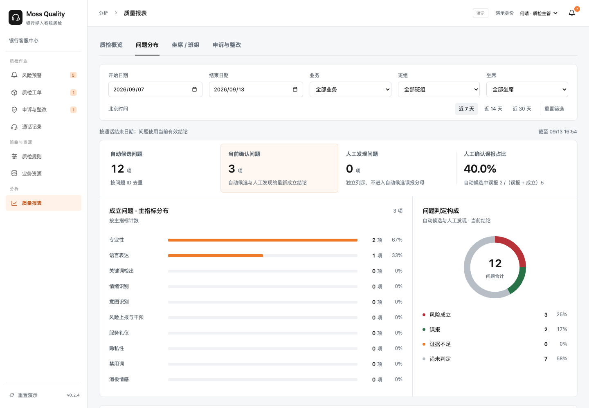

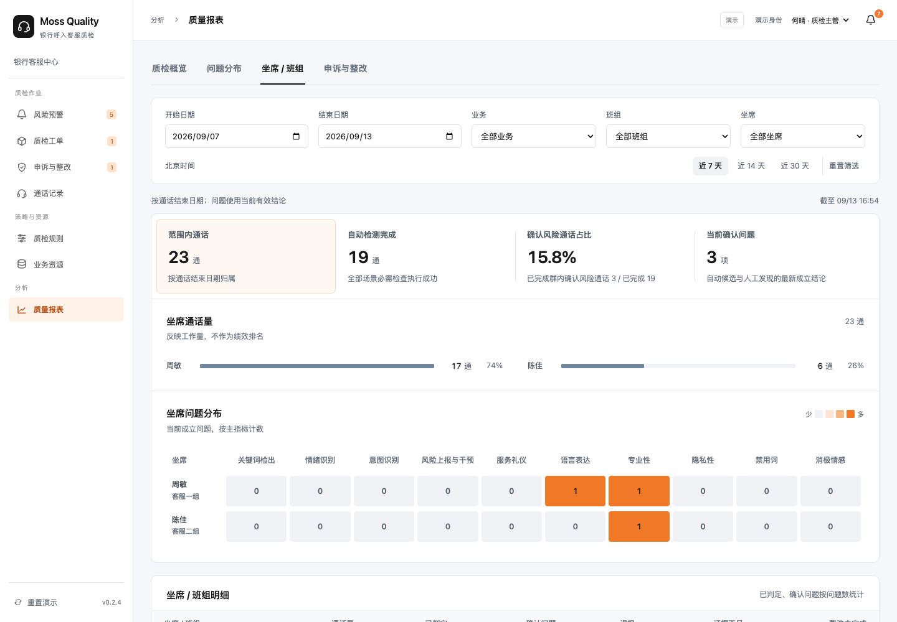

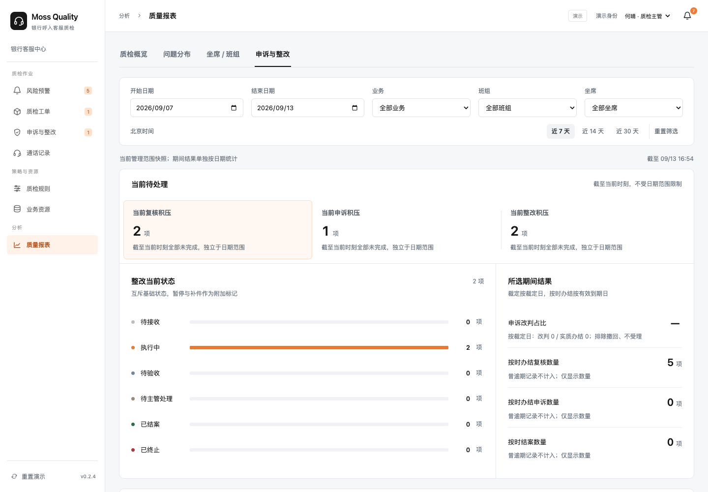

**配套说明：**7.14 质量报表口径与下钻契约。

## 8. 发布路径、验收与旧问题收敛

### 8.1 分阶段实施

| 阶段 | 交付内容 | 完成条件 |
| --- | --- | --- |
| 方案阶段（已完成） | 本地 PRD、流程图源、角色矩阵、功能清单、飞书 PRD | 内容与现行决定一致，可供用户逐项评审 |
| 实施第一步（已完成） | 新目录骨架、三角色、通话证据、风险与复核 | 主线、无需整改、误报/证据不足均可走通 |
| 实施第二步（已完成） | 申诉、整改、暂停恢复和完整通知 | 正常、退回、补件、改判、样例不足闭环 |
| 实施第三步（已完成） | 规则参数、三类资源、报表 | 版本关系及统计下钻可核对 |
| 原型交付（已完成） | 5001 演示、核心验证、文档与 Git 版本记录 | 全部 P0 场景验收后记录实际提交与标签 |

实施步骤是同一个 P0 的内部顺序，不把未完成的七模块拆成多个“已交付 P0”。排期不编造具体日期。文档版本 V1.0 不等于应用代码发布版本；应用 tag 仅在实际验证后创建。

### 8.2 必须覆盖的验收场景

| 编号 | 场景 | 关键检查 |
| --- | --- | --- |
| T01 | 通话中提醒→结束→事后复核 | 有效分派自动衔接，无效分派回主管，重复事件不重复建单 |
| T02 | 明确误报 | 候选关闭原因与统计一致，无整改 |
| T03 | 证据不足→补证→无法补足 | 责任人/期限明确，最终未知不计误报 |
| T04 | 风险成立但无需整改 | 成立保留、理由可查、可申诉、不建整改 |
| T05 | 成立→下发→坐席提交→验收通过→结案 | 单次下发、每轮一次验收、主管最终关闭 |
| T06 | 整改样例不足或不通过 | 不得直接结案，可补样或退回下一轮 |
| T07 | 受理前与核查中两类申诉补件 | 均先回主管，不重复建申诉 |
| T08 | 申诉维持/撤回/不受理 | 恢复整改阶段及计时，已有逾期保留 |
| T09 | 申诉改判或调整成立范围 | 新旧结论可追溯，关联整改终止或更新，报表同步 |
| T10 | 资源/参数草稿→失败检查→修正→发布 | 旧案件仍引用旧版，新样例引用新版 |
| T11 | 一通多风险、零分母、暂停、跨期与逾期报表 | 可手工复算、下钻与 CSV 同一组记录 |
| T12 | 角色切换、刷新、旧通知、越权链接、空状态 | 数据范围一致，过期动作不可执行，进度可恢复 |

为这些路径准备可复用样例，包含引用/否定、客户与坐席角色差异、失败/未知、长通话后段命中、暂停前已逾期等边界。样例只是演示素材，不作为独立金标或真实客户效果证明。

补充验收场景（不替代 T01—T12）：

| 编号 | 场景 | 关键检查 |
| --- | --- | --- |
| T13 | 人工抽查无问题及同通多问题 | 无问题不造误报；多问题逐项结论和整改可追溯 |
| T14 | 自动候选与人工发现混合 | 误报占比仅使用自动候选；同事实多来源不重复计数 |
| T15 | 申诉撤回时核查表单仍打开 | 关联任务取消、旧提交失效、历史意见保留、待办一致 |
| T16 | 整改待补材料、失败待退回、标准修改 | 主责任和补件人可各自行动；旧验收不能关闭新标准 |
| T17 | 检测中发布新资源，历史通话重检 | 在途结果用旧快照；新检测/显式重检用新批次与新版 |
| T18 | 已逾期再暂停、跨期导出、重叠暂停 | 首次逾期不消失，暂停不重复计时；D04 已采纳，首版不计算按时率 |

决策验收已冻结：D01 验证仅本人不利结论正式申诉、撤回/不受理可重提、同版实质办结限制；D02 验证依据不足终止旧整改及新补证出口；D03 验证其他质检员优先和同人原因；D04 验证数量、暂停并集及曾逾期保留；D05 验证固定字段、越界阻断、取消、发布与历史快照。

v0.2.2 增补验证 N01—N04：两种裁定 × 两种补件状态的终止清理、维持保留、旧状态恢复、补证三角色交接、提醒队列与阅读/反馈分离、草稿序列化恢复与轮次记录、变更标准/验收人及旧稿确认、暂停只存草稿。scripts/lifecycle.test.mjs 提供 12 项断言，与原有 38 项共 50 项；浏览器另核对保存刷新、旧稿核对、回件接收、提醒阅读和反馈、终止只读、390px 表单及键盘焦点。

本轮报表增补 V01—V07：每日数量与加权比例、北京时间零点、长区间无遗漏聚合、空分母与未来日期、分类/判定/矩阵守恒、业务坐席筛选与角色限制、日期钻取与导出分母。scripts/report-visuals.test.mjs 提供 7 项回归，与原有 50 项共 57 项；浏览器核对图表/矩阵点击、CSV、筛选联动、当前积压与期间结果、来源页返回、非主管直达和四视图 390px 布局。

### 8.3 对 reviews 旧问题的最终处理建议

| 原编号 | P0 处理 | 落点 |
| --- | --- | --- |
| A01 / U01 / F01 | 纳入：成立但无需整改 | 7.9、T04 |
| A02 / U02 / F04 | 纳入：补件均经主管；取消专家角色但保留待补专业依据 | 7.10、T07 |
| A03 / U03 | 纳入：核心操作保存后可连续演示 | 7.15、T12 |
| A04 / U04 | 撤回，不新增真实模型或双模式要求 | 1、5.2 |
| A05—A09 / U05—U09 | 未来交付参考，不作为原型修复；其中失败/未知区分保留为页面语义 | 3、5.2、7.4 |
| A10 / F05 | 简化纳入暂停恢复，取消未经确认的工作日窗口预设 | 7.10—7.11、T08 |
| A11 / F02 | 纳入误报/证据不足/补证跟进及出口 | 7.8、T02—T03 |
| A12 / F03 | 纳入有效分派复用、异常回主管和去重；自动策略后置 | 7.8、T01 |
| A13 / F06 / D05 | 纳入唯一验收、样例不足与退回；不固定 7 天/10 通，不要求真实生产样本才可演示通过 | 7.11、T05—T06 |
| A14 / D06 | 纳入到期任务分母、当前积压、暂停与终止说明 | 7.14、T11 |
| A15 / F07 / D07 | 维护本版一套图源与状态表，旧图归档不重绘 | 7.5、8.4 |
| 旧 D01 | 固定规则结构，白名单参数与资源维护有边界 | 7.12—7.13 |
| 旧 D02 | 预警、复核、申诉整改分模块，案件状态独立、主管回流 | 7.4—7.6 |
| 旧 D03—D04 | 完整 16 项、10 类规则不变，目录说明不代表客户可创建任意规则 | 7.16 |

本表保留旧问题处理方向。申诉范围、整改处置、核查分派、按时率与开放参数细则，已按用户确认的 D01—D05 建议收敛，旧提案中的其他示例值不自动成为制度。

### 8.4 文档来源、维护与实现状态

原项目当前专题是本方案的来源，不把历史归档视为当前功能承诺。本轮核对了产品需求、主管分诊、16 项指标、界面约束、统一问题清单、问题处理方案、版本现状、研发部署评审、三文档评审及开发/归档入口，并抽查原代码的角色、导航和申诉回流。历史全文阅读情况沿用原归档清单，不宣称本轮重新验收了全部历史图片或模型。

| 来源 | 用途 |
| --- | --- |
| [原项目 reviews 入口](/Users/hpl/Desktop/语音B端产品/语音质检-银行/docs/reviews/README.md) | 定位当前专题及历史来源 |
| [产品需求_当前评审版](sources/产品需求_当前评审版.md) | 角色、页面、固定规则与资源边界 |
| [主管分诊细化流程](sources/银行呼入客服质检主管分诊细化流程.md) | 三路分诊、主管回流、独立申诉整改 |
| [16 项指标](sources/16项指标与规则配置及验收.md) | 总目录与规则配置 10/6 分工 |
| [界面约束](sources/界面设计与交互约束.md) | 当前视觉与交互基线 |
| [统一评估](sources/统一评估与问题清单.md) | U / D 问题及范围纠正 |
| [问题处理方案](sources/问题处理方案_待采纳确认.md) | A01—A15 原提案及撤回项 |
| [版本与验证现状](sources/版本与验证现状.md) | 已实现事实与 F01—F07 差异 |
| [研发方案](sources/研发方案与部署评审.md) | 未来真实交付边界 |
| [三文档评审](sources/重要资料三文档评审_20260910.md) | 流程、指标与研发证据说明 |

sources 仅为冻结来源快照，内部旧相对链接可通过原项目 reviews 定位，不作为新项目实施口径。新项目仅维护本 PRD、图源与交付记录；修改业务行为时三者同步。飞书为本方案的共享副本，由交付记录保存链接和同步日期。

当前七模块原型运行于 5001，发布分支 codex/mvp-p0-ui-refinement，目标标签 v0.2.4-mvp-p0；旧标签保留。本轮移除重复页头和作业汇总卡，统一导航顺序并简化申诉整改队列。验证包括类型检查、lint、生产构建、57 项回归、七模块宽窄屏与三角色导航检查，证据见UI减法迭代与验收-v0.2.4.md。

## 9. PM 审查修订与已采纳决策

### 9.1 审查结论与已修改项

审查日期：2026-09-12；方法：pm-skills 的 PRD 红队审查与关键假设检验，结合角色—触发条件—状态—副作用—验收逐条核对。按本轮用户授权，确定的缺口与矛盾已直接修改；会改变业务权利、处理策略或首版深度的选择集中在 9.3，不擅自采纳。

| 编号 | 原问题及影响 | 修改意见与本轮处理 | 对应位置 |
| --- | --- | --- | --- |
| R01 | 人工抽查没有未发现问题出口，多问题也被一个工单结论覆盖 | 补检查范围、无发现/有发现/证据不足；逐问题记录，任务仅汇总 | 7.4、7.6、7.9、T13 |
| R02 | 一条风险一工单的关系无法容纳无风险人工抽查；防重复键不明确 | 区分三种任务类型，允许抽查先无 Finding，补充各对象去重边界 | 7.4、T13—T14 |
| R03 | 只允许当前责任人操作，坐席无法给质检员负责的整改补件；验收失败无主管状态 | 补主责任人与受限补件执行人；统一待主管处理并细分待结案/待退回 | 7.2、7.6、7.11、7.15、T16 |
| R04 | 申诉撤回后关联核查仍可提交；通用复核可能把申诉意见直接发布成结论 | 撤回/不受理/办结时取消未完成核查；申诉意见只能经申诉裁定发布，旧表单失效 | 7.4、7.9、T15 |
| R05 | AI 候选与人工发现混入误报分母；共享日期含义不一致 | 误报率限定自动候选来源；日期标明通话/裁定/到期/当前快照，人工发现单列 | 7.14、T14、T18 |
| R06 | 检测成功、部分失败、证据不足与未命中可能混用 | 定义互斥执行状态和必需检查项；业务不确定独立表达 | 7.7、T11 |
| R07 | 发布资源时“更新当前引用”可能改写已存在的 RuleVersion，污染在途和历史证据 | 新增资源及引用快照，检测开始时固定版本，重检另建批次 | 7.12—7.13、T17 |
| R08 | 标准变更后仍可能沿用旧验收；多次暂停计时可能重复 | 修改标准触发重新核对，旧验收留历史；暂停区间取并集，保留首次逾期 | 7.11、T16、T18 |
| R09 | 预设检查容易被写成实际模型运行；先前提案被写成默认已决定 | 区分字段校验与预设示例；D01—D05 显式待确认，未决验收不标通过 | 7.3、7.10—7.14、8.2 |
| R10 | 主线有效/无效分派画成连续动作；申诉系统暂停画在主管泳道 | 保留原画板位置修正互斥条件、系统动作和补件回流，并同步图源 | 7.5 |

### 9.2 保留的合理设计与评审边界

三个角色、七个入口、固定规则结构、完整 16 项/规则 10 类、申诉与整改分开、主管最终确认、沿用现有视觉风格均有上下文依据，本轮不重新要求决定这些边界。竞品仅支持流程参考，不能证明银行适配或真实效果。

本轮没有发现需要把高保真原型升级为真实后端、模型、金标或生产权限系统的理由。没有真实用户负载和操作记录，因此无法断言主管工作量已可接受、核查独立性已满足试点制度，或某种 SLA 统计就是客户要求。以下验证均可先用桌面案例演示，不以采购或真实生产数据作为前置条件。

### 9.3 已采纳：建议方案、影响与最小验证

以下保留 D01—D05 的审查问题、建议和替代方案，作为决策依据。用户于 2026-09-12 明确回复“可以，按照这个执行，迭代mvp-p0代码”，已采纳五项建议；替代方案未采用。旧 reviews 的 D 类问题在 8.3 标为“旧 D”，与本次决策区分。

#### 9.3.1 D01：哪些结果可以正式申诉，撤回和不受理后能否重提

**问题**：原文允许对误报、证据不足补充意见，但裁定选项主要面向成立风险；“每版一次”又没区分办结、撤回和不受理，可能把没有实质处理的案件永久挡在门外。

**原方案合理处与失效条件**：限制并行案件可以防重复；如果任何结论都能正式申诉但没有对应改判出口，或撤回也耗尽机会，则流程失效。

**建议**：正式申诉针对已送达且对本人不利的成立/部分成立结论；误报、证据不足通过补充说明与主管追加核查处理。限制同版本一件进行中案件；撤回、不受理不算实质裁定，可补齐后重提。实质办结后同版本不自助循环申诉，有新证据走主管补充核查；形成新的不利结论版本后可申诉该新版本。

**替代方案与影响**：允许所有结论正式申诉，但必须补齐各结论之间的改判、转核查和二次通知规则，范围更大。建议方案减少案件分支，同时保留补充事实的入口。

**最小验证与否决条件**：用成立、误报、证据不足、撤回、不受理、再次产生不利结论六个样例逐个走查；如果有本人合理异议找不到入口，或同版本能无限重复冻结，需调整方案。确认内容：是否采用以上正式申诉范围及重提规则。

#### 9.3.2 D02：申诉改判为证据不足时，关联整改如何处理

**问题**：原文把改判为误报和证据不足都自动终止整改；两者事实含义不同。终止可能中断仍需补证的事项，继续整改又可能将未确认问题当成坐席责任。

**原方案合理处与失效条件**：没有成立依据时不应继续要求人员整改；如果把终止整改显示成“已证实误报/无需继续核查”，则方案失效。

**建议**：终止基于原成立结论的本次人员整改，理由明确为“依据不足”，不计为整改完成或误报；如果主管认为可以补足证据，另建有责任人和期限的补充核查，后续重新确认成立再创建关联新整改，不复活旧验收结论。

**替代方案与影响**：保持原整改暂停，设置补证期限；证据补齐后恢复或终止，需持续管理暂停积压。建议方案状态更清楚，但可能多一件关联新整改；两种都需保留旧历史。

**最小验证与否决条件**：分别用“证据永久缺失”和“可补取另一段录音”走查；如果未确认责任仍被统计为坐席逾期，或旧失败验收被新结论覆盖，方案不通过。确认内容：终止原整改并另行补充核查，还是保留暂停。

#### 9.3.3 D03：申诉由谁重新核查，是否优先避开原质检员

**问题**：三角色不等于每个角色只有一个人。当前没有约束申诉是否继续分给原复核者，可能出现同一人重复确认自己的原意见。

**原方案合理处与失效条件**：原质检员熟悉证据、处理更快；如果演示的申诉必须由另一人核查才被业务认可，而界面只有一位质检员，就无法演示可信的纠错过程。该业务安排已按 D03 建议采纳，不构成新增的生产合规要求。

**建议**：角色仍为三个，质检员至少提供两个演示身份；申诉分派默认优先其他质检员，主管仍做最终裁定。无其他可用人员时允许原质检员补核，显示同人核查并要求主管写明选择理由，不默认强制新增专家角色。

**替代方案与影响**：允许任意质检员，不提供优先避让；交互更简单，但评审时需明确接受这一安排。建议方案只增加身份样例与分派提示，不增加导航。

**最小验证与否决条件**：用一次原结论错误的申诉让两位评审者走查；如果所有参与者仍看不出初检、重检和裁定由谁做，分派及历史展示需重做。确认内容：是否优先其他质检员，允许何种回退。

#### 9.3.4 D04：首版是否展示按时完成率，以及暂停如何进入分母

**问题**：按有效期限归期、暂停单列与保留历史逾期尚未形成一套可复算规则。例如昨天已逾期的任务今天申诉暂停，若直接移出到期群，按时率会无故上升。

**原方案合理处与失效条件**：有效期限能体现申诉暂停的公平性；如果延期/暂停使已发生的逾期从报告消失，或同一截止时刻无法手算复现，则统计失效。

已采纳建议：P0 保留任务总量、当前逾期、暂停、延期、按时结案数量与明细，不显示按时完成率。后续如需比例，先确认到期群、暂停、取消、跨期及零分母规则，再建立固定样例验证。

**替代方案与影响**：本轮就保留比例，但须同时选定到期群使用原期限还是调整后期限，并定义暂停、取消、跨期和零分母规则。建议方案保留质量报表价值，减少容易误导的比例；不会删掉报表模块。

**最小验证与否决条件**：准备按时完成、逾期未完成、到期前暂停、到期后暂停、跨期关闭、取消和零分母七条记录；如果仅执行暂停操作就抹去既有逾期，则比例口径不通过。确认内容：首版先展示数量，还是本轮补齐比例口径。

#### 9.3.5 D05：首版具体开放哪些规则参数，模拟发布做到多深

**问题**：原文只举“阈值、范围、提醒参数”等例子，没有逐条字段与范围，开发可能做成任意配置器；预设检查也容易被误解为参数变更后真实计算的效果。

**原方案合理处与失效条件**：少量可编辑参数能体现产品适配能力；如果无法列出固定字段、校验和展示结果，或修改任意值都显示相同的“效果提升”，则本轮演示失效。

**建议**：规则模块只开放静默规则的时长阈值、指定规则的适用业务、指定提醒规则的触发选项三类示例字段；各字段在实现前写明单位、示例默认值与上下界，其余只读。三类业务资源保留单条草稿、字段校验、差异与引用预览、确认模拟发布；检查结果明确为预设场景，不增加审批流或真实模型检查。

**替代方案与影响**：规则参数本轮全只读，资源仍可维护；更快但较难验证参数操作体验。建议方案保留可操作性，以固定字段清单限制范围，不影响 16 项/10 类目录。

**最小验证与否决条件**：用一个合法值、一个越界值、一次取消、一次发布和一条历史工单走查；如果越界仍能保存、取消改变版本或旧工单跟随新版变化，则不通过。确认内容：是否采用这三类开放字段与简化发布深度。

### 9.4 确认记录与后续更新

确认记录：D01—D05 的建议方案均已采纳，已启动并完成本轮独立 MVP 代码迭代。项目位于 /Users/hpl/Desktop/语音B端产品/质检-mvp-p0，运行于 5001；原项目不直接修改。本地 PRD、三份图源、飞书原文档和实现验收记录同步维护。后续变更更新对应权威章节，版本记录仅保留追溯入口。

## 版本与追溯

现行要求统一维护在第 7—9 节。阅读顺序为页面间事件 → 页面内流程 → 角色责任 → 核心分支与时序；业务变化同步更新两类图、页面说明、图源和飞书预览。当前三组流程与时序、事件总览及七页流程共 14 张图继续保留。

- [v0.2.3 报表 UI 迭代与验收](报表UI迭代与验收-v0.2.3.md)：图表交互、统计一致性、截图与交付。
- [v0.2.2 生命周期迭代与验收](生命周期迭代与验收-v0.2.2.md)：生命周期修复、测试、页面截图及边界。
- [v0.2.1 UI 交互优化与验收](UI交互优化与验收-v0.2.1.md)：规则参数、通话详情、资源与基础交互的历史验收。
- [流程迁移交付记录](交互直接展示与流程图补齐-20260913.md)与[历史时序来源](流程图/历史时序-v0.2.0/README.md)：仅用于来源追溯。

- [v0.2.4 UI 减法迭代与验收](UI减法迭代与验收-v0.2.4.md)：重复信息、统计范围、单层队列与角色导航。


## 6001 已采纳增补 · 2026-09-20

以新版为实现基础，旧版为信息表达参考；原七个模块之外新增轻量工作台。需求与 UI 对照资料见本目录两份“新版与旧版”文件。本增补优先于历史版本中“七入口”和“资源发布自动升级引用”的描述。

资源生命周期：保存草稿 → 预设检查 → 发布资源版本 → 核对并选择规则 → 切换引用。发布与采用分开；每次切换核对资源及所选规则 revision，并以单次不可分割动作追加规则版本和日志。规则有参数草稿时先处理草稿。历史通话检测批次及结论仍使用原版本。

当前用户工作面为三角色、八入口：工作台、风险预警、复核工单、申诉与整改、通话记录、质检规则、业务资源、质量报表。工作台的待办来自同一责任与通知源；业务资源改分类表格、抽屉预览及详情编辑；案件材料按用途与状态逐条展示，并显示责任后续去向。

本轮仍为本地高保真原型，不含真实后台授权、事务持久化、模型服务、审批或发布回归。班组、专家、项目交付工作面按后续阶段建设。
