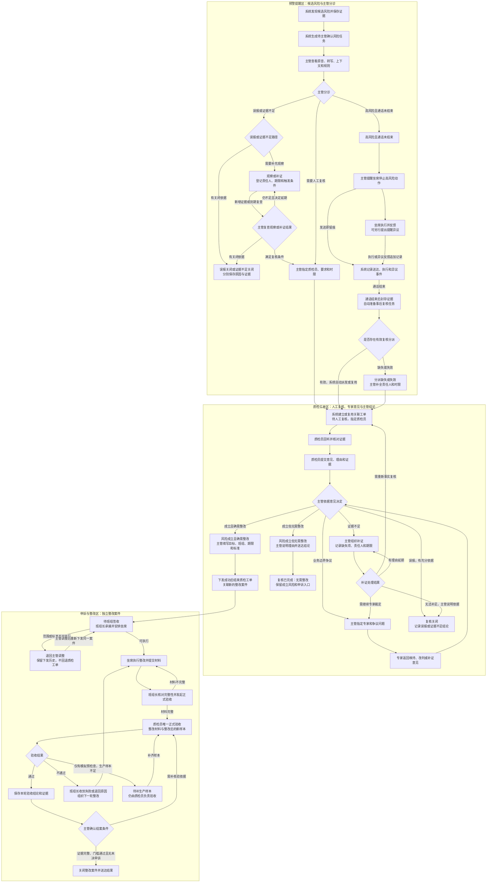

# 银行呼入客服质检主管分诊细化流程

> 修订日期：2026-09-10。原路径：`docs/流程图/银行呼入客服质检主管分诊细化流程.md`。
> 归档状态：流程说明已修订，作为后续 PRD、图表和实现同步的评审基线；不表示相关功能均已实现。
> 来源：[历史私有化 PRD](archive/docs/客服质检系统_PRD_V4.1_项目私有化资源闭环版.md)第 5、7.3、7.4 节及 V4.11 修订。当前产品口径已归入[产品需求_当前评审版](产品需求_当前评审版.md)，差异见第八节及[版本与验证现状](版本与验证现状.md)。旧图源及 SVG 保留历史版本，原 HTML 在当前 docs 中缺失，本次未重建。

## 一、先说结论

系统发现候选风险时，已经生成“待主管确认”的风险任务。主管在已有任务上确认、分诊和分派；需要人工复核时，由系统派生关联质检工单，不能要求主管重复录入同一风险。

主管仍只有三条一级分诊路径：

1. **误报或证据不足**：在路径内区分误报关闭、证据不足关闭、观察/补证。关闭必须分别记录原因；证据不足不能统计为已证实误报。
2. **需要人工复核**：主管指定质检员、复核要求和时限，系统生成对应待办。
3. **高风险且通话未结束**：先提醒坐席停止当前高风险动作，系统记录送达和执行反馈；通话结束后自动转事后复核。提醒不等于确认违规，提出提醒异议也不取消事后复核。

后续始终保持：质检员/专家返回意见 → 主管决定结论及后续去向。只有主管下发整改，系统才创建独立整改案件。

## 二、核心主流程图

主图展示三个独立业务区。补证、观察和申诉的细节见后文，不通过增加一级分诊按钮来承载。

### 三个业务区的边界

| 业务区 | 承接对象 | 结束与交接 |
| --- | --- | --- |
| 预警提醒 | 候选 Finding、Evidence 和主管分诊任务 | 关闭候选，或交接关联人工复核；提醒和观察保留各自记录 |
| 质检工单 | 人工复核、专家意见、主管结论 | 复核关闭、成立但无需整改结案，或下发成功后已转入整改 |
| 申诉与整改 | 独立申诉案件、独立整改案件 | 申诉结论送达关闭；整改在正式验收及主管确认后关闭 |

风险事实结论、任务状态和整改状态分开保存。一个关联整改被撤销或退回，不意味着重开已结束的质检工单；更不能修改原始 Finding 或证据。

## 三、三条分诊路径的执行细则

| 分诊路径 | 必填内容 | 当前责任与后续处理 |
| --- | --- | --- |
| 误报关闭 | 具体误报事实、证据引用、理由 | 主管关闭候选；不创建人工复核或整改任务 |
| 证据不足关闭 | 缺失证据、无法补足原因、关闭依据 | 主管关闭为“证据不足”，不认定风险成立，也不计为已证实误报 |
| 观察/补证 | 缺失项、责任人、复查期限、触发条件 | 主管持续负责；新增证据、通话结束或到期时生成复查待办，再选择关闭、复核或有依据地延期 |
| 需要人工复核 | 质检员、复核要求、时限、分派理由 | 系统给指定质检员生成待办；意见回主管 |
| 高风险即时提醒 | 提醒内容、接收坐席、关联证据、反馈要求 | 主管负责跟进提醒；通话结束后系统自动进入事后复核交接 |

上表前 3 行均是第一条一级路径的内部处理，不新增一级入口。现有“误报”按钮若承载证据不足处理，弹窗必须显示真实原因类型，不能默认保存为误报。

### 自动事后复核如何确定责任人

主管实时提醒时使用已登记的复核责任人，或经主管批准的项目分派策略；系统在通话结束时检查责任人的权限、在岗情况、复核要求和时限。有效则自动派发，不要求主管再点“事后质检”。若同一风险已有有效复核工单，追加通话封存事件并复用该工单，不重复创建。

分派缺失或失效时，任务进入“待主管补全分派”，主管收到待办，补全后才交给质检员。自动流转不等于可以产生无责任人的任务。实时提醒的送达失败、未反馈及超时应分别记录并通知主管跟进，不得把“已发送”自动记成“已执行”。即使提醒尚未送达或坐席未反馈，通话结束仍触发事后复核，不能等待提醒反馈才流转。

所有非终态均需责任人和期限；到期提醒当前责任人及主管。延期必须说明依据、保留旧期限并追加新期限，超期不自动判误报、认定违规或结案。

## 四、人工复核与补证回路

质检员完成回听后，提交确认风险、改判误报、建议专家裁定或要求补证意见，全部回到主管。专家只能由主管指定，并返回事实、条款和证据意见；专家意见不直接下发整改或关闭工单。

主管收到意见后分别处理：

1. **误报**：依据证据确认并关闭，保留自动结论和历次人工意见。
2. **证据不足**：主管组织补证，记录缺失项、责任人、期限及回流对象；补足后重新交质检员或原专家。确实无法补足时，主管说明依据，以证据不足关闭，不当作已证实误报或已成立风险。
3. **业务边界争议**：明确争议问题后转专家；新证据需要事实复核时，先返回质检员。
4. **风险成立但无需整改**：主管记录无需整改的具体理由、已采取措施和证据，送达坐席并开放申诉。保留成立风险，不创建虚假的整改案件，也不伪装为误报。
5. **风险成立且确需整改**：主管填写目标、责任班组、未来期限、完成与复测标准，系统在下发成功时创建待班组签收的整改案件，并结束原质检工单。创建失败不得将原工单提前标记为已转入整改。

第 4 类适用于确认无需后续改进的情况，例如经核验已完成有效纠正。是否确需整改由主管依据项目规则判断，不由系统默认免除；重大风险不能仅凭坐席“已改正”的自述结案。该出口是本次对原文“且确需整改”的闭合补充，现有 V4.11 尚未提供对应动作。

## 五、提醒异议、正式申诉与业务争议

两类流程的入口和影响范围不同。提醒异议在班组长处协调执行；对已送达质检结论的正式申诉由主管受理。

```mermaid
flowchart TB
    subgraph REMINDER[实时提醒异议]
        T1[坐席先停止当前高风险动作]
        T2[坐席提交提醒异议]
        T3[班组长核对业务背景]
        T4{是否属于执行理解问题}
        T5[班组长解释要求并记录反馈]
        T6[主管受理业务争议]
        T7{是否需要专家意见}
        T8[专家返回业务适用意见]
        T9[主管确认提醒处理意见]
        T10[关闭本次提醒异议并通知<br/>不代替通话后的正式复核]
        T1 --> T2 --> T3 --> T4
        T4 -->|是| T5 --> T10
        T4 -->|否| T6 --> T7
        T7 -->|是| T8 --> T9
        T7 -->|否| T9
        T9 --> T10
    end

    subgraph APPEAL[针对已送达结论的正式申诉]
        A1[坐席提交正式申诉<br/>班组长可以协助提供材料]
        A2[系统创建独立申诉案件<br/>暂停关联整改计时并禁止结案]
        A3{主管核对时限、材料与争议类型}
        A4[待坐席补充<br/>主管明确缺失项和期限]
        A5[主管记录不予受理或撤回依据]
        A6[质检员复核事实与原音证据]
        A7[主管转交专家处理业务边界]
        A8[专家返回维持、改判或补证意见]
        A9{主管确认后续处理}
        A10[维持原结论<br/>恢复关联整改或沿用无需整改结案]
        A11[改判或撤销结论<br/>取消或调整关联整改]
        A12[送达并关闭申诉<br/>保留历史结论与当前有效结论]
        A1 --> A2 --> A3
        A3 -->|可补正| A4
        A4 -->|补齐重提| A3
        A4 -->|撤回或到期仍未补齐| A5
        A3 -->|不予受理| A5
        A3 -->|事实或证据异议| A6 --> A9
        A3 -->|业务规则或边界争议| A7 --> A8 --> A9
        A9 -->|仍需补证| A4
        A9 -->|存在业务争议| A7
        A9 -->|维持| A10 --> A12
        A9 -->|改判或撤销| A11 --> A12
        A5 -->|恢复关联整改并送达理由| A12
    end
```

提醒异议只追加提醒反馈和业务意见，不自动创建、取消整改，也不取消通话结束后的正式复核。提醒被接受时正常记录执行反馈，无需另建异议案件。

正式申诉由坐席提交；班组长协助提供背景和材料，不默认拥有替坐席发起申诉的权限。若项目需要代办，必须另有明确授权与代办记录。事实问题通常由原质检员核验；原质检员不在岗或需回避时，由主管分派其他具备权限的质检员并留痕。

申诉补充材料重新提交后由主管核对再分派，不能让坐席直接决定专家路由。对不予受理、到期未补齐或撤回，均由主管确认理由并送达，不能因计时器到期自动认定申诉不成立。不存在关联整改时，不创建整改仅用于暂停或恢复。

维持结论不必然新建整改：原本无需整改的结案仍沿用原决定；需调整后续处置时，主管另行记录依据。改判只追加当前有效结论与调整记录，不覆盖原 Finding、原复核结论或已结束工单状态。

## 六、整改与唯一正式验收

班组长签收整改后，安排坐席执行，核对材料是否完整并发起正式验收。材料完整性检查不是第二道业务验收。

正式验收默认由原质检员承担，无法承担或需回避时由主管重新分派。每一轮只有一个正式验收任务，失败重做形成下一轮记录，不覆盖历史失败结果。

验收必须同时检查整改材料和整改后的新样本，并记录规则版本、场景、抽样窗口、样本数及通过标准。优先使用真实生产通话；仅有模拟录音时可做预检查，但不能据此宣称生产效果已通过。生产样本不足则保持待验收，由质检员跟踪样本、主管协调期限。

验收失败由系统将本轮结论送达主管并退回班组长组织下一轮，质检员不能直接指派坐席。验收通过后主管检查证据完整性、样本覆盖、遗留事项与送达情况，才可关闭；存在未决申诉或门槛未通过时不得关闭。主管不得把质检员“不通过”直接改成“通过”，需要重验时追加新的验收记录。

## 七、状态、责任与事件记录

下表使用业务状态名称，不将不同对象的状态拼成一套共用枚举。

| 对象与阶段 | 状态 | 当前责任人 | 允许的核心动作或出口 |
| --- | --- | --- | --- |
| 风险任务：自动发现 | 待主管确认 | 主管 | 三条一级分诊路径 |
| 风险任务：观察/补证 | 观察中/待补证 | 主管；登记补证执行人 | 关闭、分派复核、有依据地延期 |
| 风险任务：实时提醒 | 已提醒/待通话结束 | 主管跟进提醒 | 接收反馈、处理异议；通话结束自动交接 |
| 风险任务：分派异常 | 待主管补全分派 | 主管 | 补齐有效质检员、要求和时限 |
| 质检工单：复核 | 待人工复核/复核中 | 指定质检员 | 意见回主管，不直接下发整改 |
| 质检工单：主管处理 | 待主管决定 | 主管 | 关闭、补证、转专家、无需整改结案或下发整改 |
| 质检工单：补证 | 待主管补证 | 主管；登记补证执行人 | 重新复核/裁定、有依据地延期或证据不足关闭 |
| 质检工单：专家处理 | 待专家裁定 | 指定专家 | 维持、改判或补证意见回主管 |
| 质检工单：终态 | 复核关闭/已完成无需整改/已转入整改 | 无当前处理人 | 只读追溯；正式申诉走独立案件 |
| 整改案件：待签收 | 待班组签收 | 班组长 | 签收分派或退回主管调整 |
| 整改案件：调整 | 待主管调整 | 主管 | 修改可执行的标准与期限，再下发同一案件 |
| 整改案件：执行 | 整改中 | 坐席；班组长跟进 | 提交材料 |
| 整改案件：材料交接 | 待材料核对 | 班组长 | 补齐材料或发起正式验收 |
| 整改案件：正式验收 | 待整改验收/待补生产样本 | 指定质检员 | 通过回主管、失败回班组、补齐样本 |
| 整改案件：结案确认 | 验收通过待关闭 | 主管 | 确认关闭或退回补充核验 |
| 申诉案件 | 待主管受理/待补充/待事实复核/待专家裁定/待送达 | 与阶段对应的主管、坐席、质检员或专家 | 按第五节闭合回路处理 |

风险事实结论至少区分：待判断、误报、证据不足、风险成立。终态“复核关闭”必须同时保存结论与关闭原因，报表不得仅根据“已关闭”判断是不是误报。

事件记录包含来源对象、前后状态、操作者、时间、理由、证据版本、当前责任人及期限。通知中心只投影消息；打开通知不改变业务状态。工作流成功交接时，列表、详情、待办、通知和时间线同步变化。重复请求、通话结束事件重放不得创建重复工单或整改案件。

## 八、本次修订与落地边界

| 修订 | 原材料情况 | 本次处理 | 后续同步 |
| --- | --- | --- | --- |
| 三个模块分界 | 文字区分整改，主图却将整改画在质检工单内 | 主图拆为预警、质检工单、申诉与整改三个区 | 后续更新 HTML/SVG；原件本次保留 |
| 提醒异议与正式申诉 | 原 Markdown 已有，单独 SVG 未包含 | 保留独立流程；限定影响范围、提交人与回流路径 | 不再将“完全没有申诉设计”列为缺陷 |
| 误报与证据不足 | 共用路径但原因与统计不清 | 保留三条一级路径，明确关闭原因、观察期限及回流 | reviews 产品口径已同步；实现状态与结果统计待同步 |
| 事后自动复核 | 原文已明确自动进入，但分派来源未说明 | 优先有效分派，异常交主管补全，同一风险不重复建单 | 分派策略、异常待办与后端幂等需落地 |
| 专家/质检员补证 | PRD 已有状态；原图缺少明确回流 | 主图与正文补齐责任人、期限、回流及无法补足的出口 | 图表与实现按同一路径核对 |
| 成立但无需整改 | 原文“且确需整改”与 PRD 仅两种工单终态不闭合 | 增加保留风险结论的无需整改结案出口 | reviews 产品口径已同步；页面动作与后端待实现，历史 PRD 保留 |
| 模拟录音验收 | 原图将新通话和模拟录音并列，容易误读 | 按 PRD 区分模拟预检查与生产效果复测 | 验收表单、通过门槛和样本状态需一致 |

此次完成流程说明的修订与归档；2026-09-11 已将当前产品口径整合到 reviews 主文档。应用代码、历史 PRD 与旧图源未修改。该文档用于同步下一轮设计与实现，不能用文档归档状态替代产品验收。
